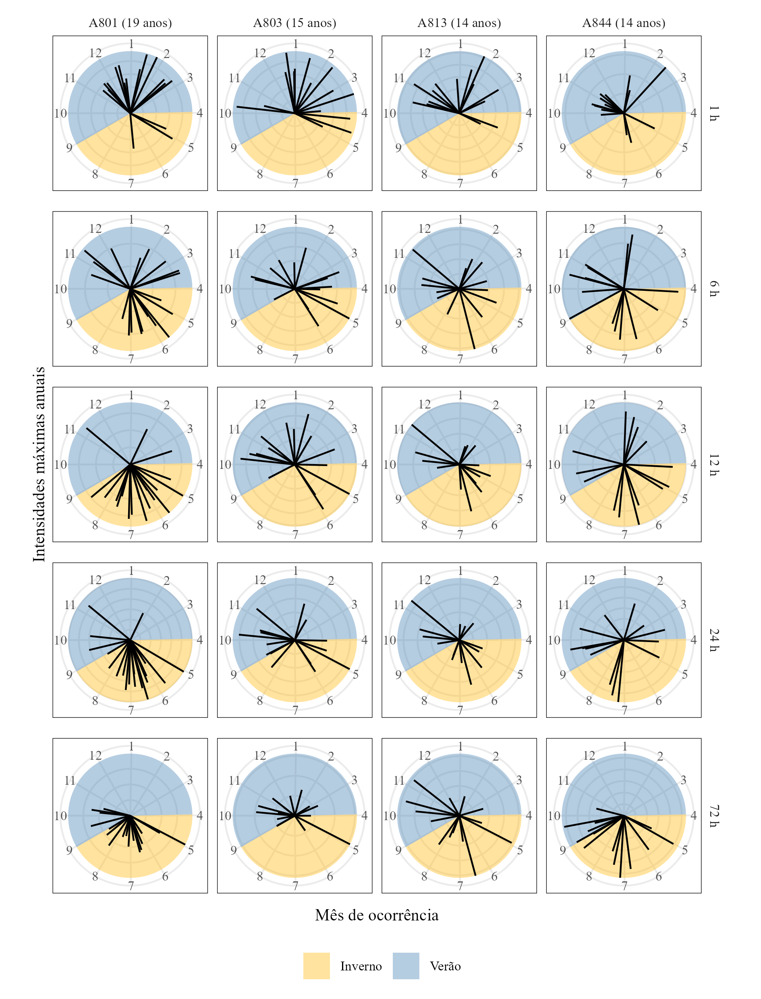
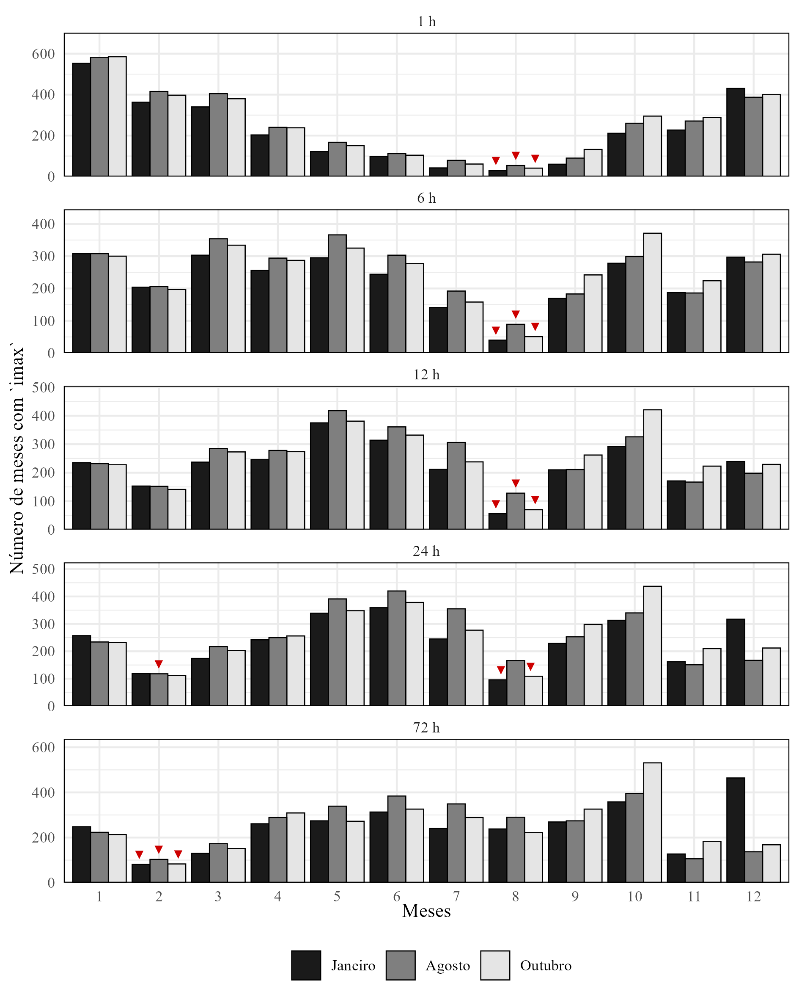

## Ano hidrológico

Uma das primeiras coisas que devem ser feitas antes de extrair uma série de máximos anuais é avaliar a existência de um ano hidrológico na região em análise. Isso nos ajuda a garantir que a hipótese de independência entre observações seja preservada, pois estamos mais certos de que a correlação entre eventos consecutivos seja baixa --- em outras palavras, não percençam ao mesmo evento.

No Rio Grande do Sul, é comum que seja utilizado o ano civil como o ano hidrológico, mas nossas avaliações permitiram identificar que isso pode não ser verdade. A @fig-polar mostra como, para diferentes durações das séries de intensidades máximas anuais das estações mais longas que temos no conjunto, não há efetivamente uma pausa no mês de janeiro. Isso pode indicar que podemos estar extraindo máximos de um mesmo evento, mas que um deles ocorre em dezembro, enquanto outro em janeiro, quebrando a independência, e que, além disso, o ano hidrológico não seja o mesmo para todas as durações.

{#fig-polar fig-align="center" width="500"}

Por esse motivo, passamos a identificar qual mês seria mais adequado para começar o ano hidrológico — inicialmente mantendo somente um mês para todas as durações. O mês idealmente deveria ser o com a menor incidência de máximos. A função `imax.wateryear()` foi introduzida como sucessora para `fun_imax_agg()`, permitindo agora a divisão do ano hidrológico conforme informado em seus argumentos. Com essa nova função, podemos escolher, a partir do vetor informado `which.mon`, qual o mês que deverá iniciar o ano hidrológico e testando inicialmente com os meses de **janeiro**, **outubro**, a frequência de máximos distribuída ao longo dos meses apontava para o mês de **agosto** como o de menor incidência. E de fato, como pode ser visto na @fig-wateryear, agosto (ao menos até 12 h) aparenta ser o mês com menor frequênicia. A partir de 24 h, porém, a situação já muda e os resultados passam a apontar **fevereiro** como o mês de menor incidência.

{#fig-wateryear fig-align="center" width="500"}

## Considerações finais

Esses resultados preliminares mostram também que pode ser necessário adotar anos hidrológicos diferentes para diferentes durações. Apesar disso, a versão mais recente das séries de máximos considera o mês de agosto como o mês de quebra para todas as durações.

Adicionalmente, como consequência da adoção de um ano hidrológico, o primeiro e o último ano das séries serão menores, já que consideram o início e fim do ano civil. Em teoria deveriam ser desconsiderados.
