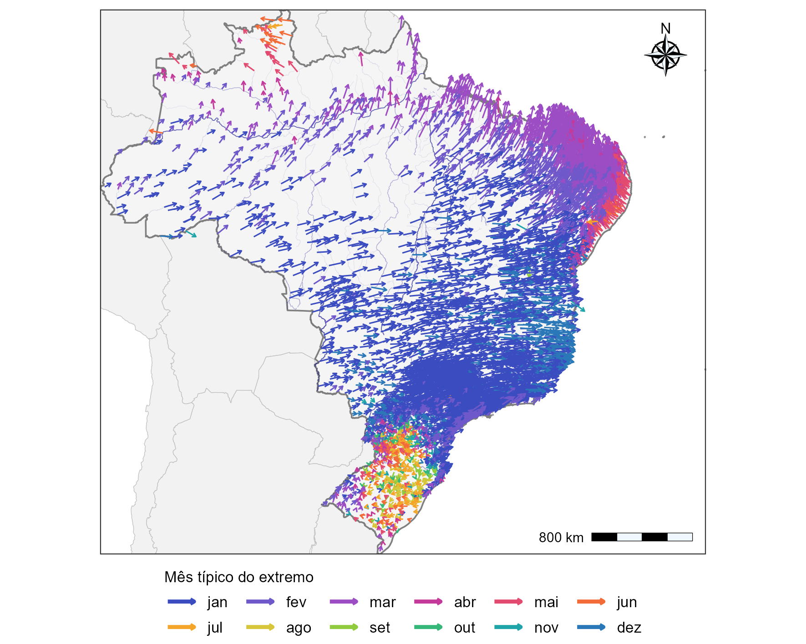
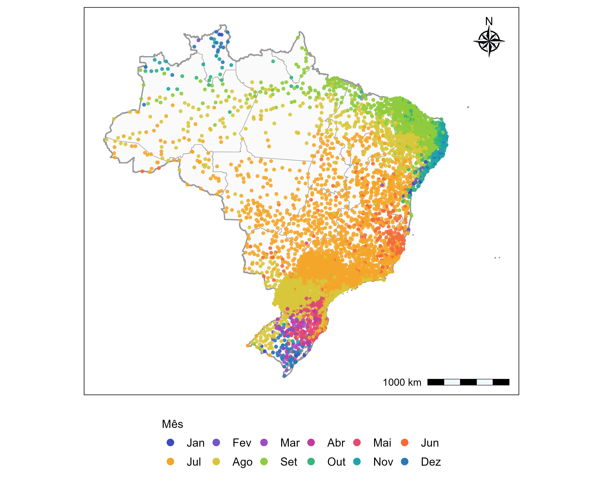
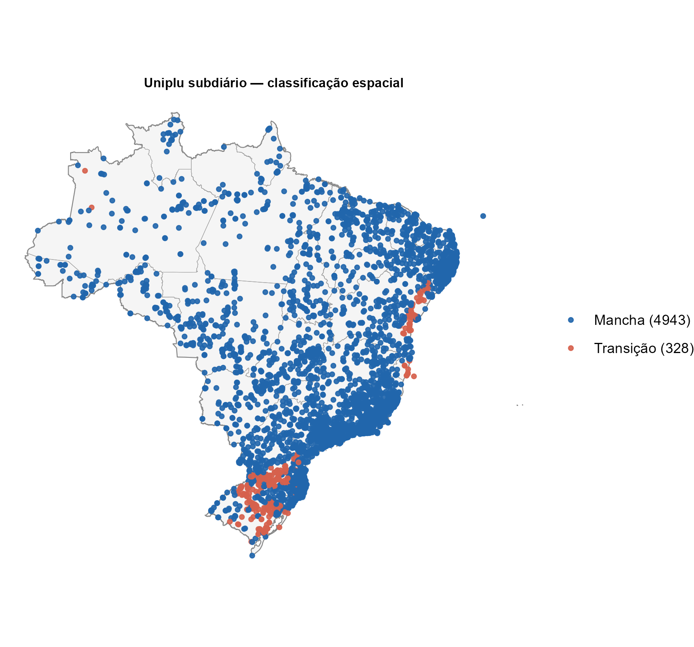
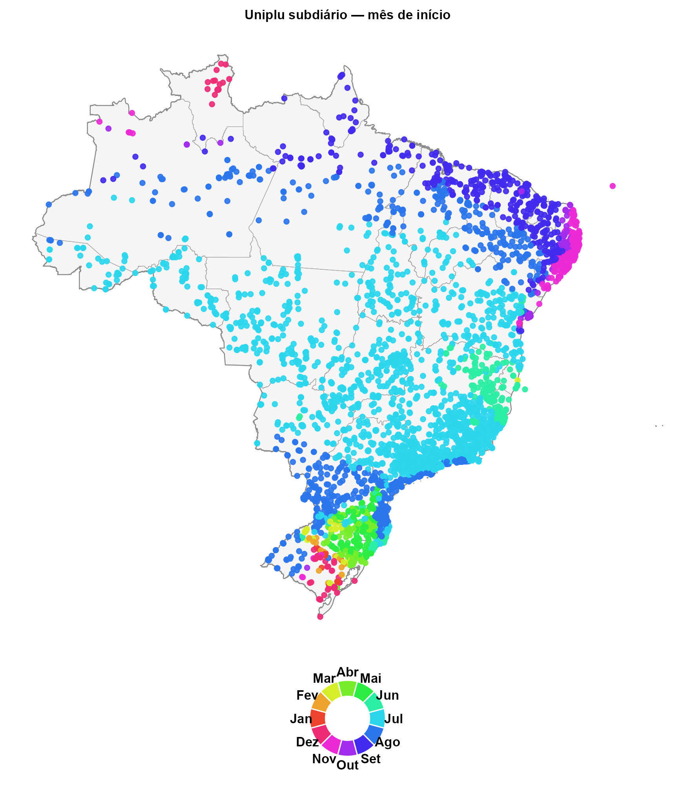

## Definição do ano hidrológico

A definição do ano hidrológico buscou estabelecer, para cada estação pluviométrica, um intervalo anual coerente com a sazonalidade local de ocorrência dos eventos extremos de precipitação. A utilização de um calendário hidrológico adequado reduz a possibilidade de que eventos de uma mesma estação chuvosa sejam separados artificialmente pelo limite entre dois anos civis. A metodologia foi inspirada na análise de sazonalidade de eventos extremos de Bayliss e Jones (1993), empregada no relatório da ANA/UFMG sobre regionalização de vazões máximas anuais no Rio Grande do Sul [@bayliss1993; @anaUFMG2025]. No presente trabalho, a abordagem foi adaptada às séries diárias de precipitação em escala nacional e complementada por critérios de climatologia mensal e transferência espacial do mês inicial às estações subdiárias.

### Preparação e seleção das séries diárias de referência

Para a definição do ano hidrológico, foram utilizadas séries diárias de precipitação provenientes da base UNIPLU, abrangendo estações pluviométricas distribuídas pelo território brasileiro. A seleção das séries considerou critérios de disponibilidade temporal, completude e consistência dos registros, buscando assegurar a representatividade das informações utilizadas na caracterização da sazonalidade dos eventos extremos.

Foram selecionadas estações com pelo menos 30 anos de observações válidas, admitindo-se um percentual máximo de 20% de falhas por ano. Adicionalmente, foram aplicados critérios de consistência para identificar registros potencialmente inconsistentes e séries com baixa variabilidade pluviométrica. Valores diários de precipitação superiores a 1.500 mm foram tratados como ausentes, enquanto aqueles superiores a 700 mm foram sinalizados para verificação. Também foram excluídas séries com menos de 15 valores distintos de precipitação ou nas quais pelo menos 99,5% dos dias apresentavam precipitação inferior a 0,5 mm, caracterizando registros com ocorrência praticamente inexistente de precipitação significativa. Esses procedimentos buscaram reduzir a influência de inconsistências e de séries pouco informativas na caracterização da sazonalidade dos eventos extremos, utilizada posteriormente para definir o mês de início do ano hidrológico.

### Identificação de eventos extremos e análise de sazonalidade

Para caracterizar a sazonalidade dos eventos extremos de precipitação, foi adotada a abordagem de séries de duração parcial (*Peaks Over Threshold* – POT), na qual são identificados os eventos que excedem um determinado limiar de precipitação. Diferentemente da seleção de um único máximo anual, essa abordagem permite considerar múltiplos eventos extremos ao longo de cada ano, proporcionando uma representação mais abrangente de sua distribuição sazonal. O limiar de excedência foi determinado individualmente para cada estação, utilizando o procedimento adaptativo proposto por Durrieu et al. [-@durrieu2015; -@durrieu2018], seguido da identificação de picos representativos de eventos distintos .

A época de ocorrência de cada pico $i$, na estação $j$, foi representada pelo dia ordinal do ano $D_{j,i}$, convertido em ângulo no ciclo anual conforme o procedimento circular apresentado no relatório ANA/UFMG [@anaUFMG2025], pela @eq-angulo-evento:

$$
\phi_{j,i}=\frac{2\pi D_{j,i}}{365}.
$$ {#eq-angulo-evento}

As componentes médias do vetor circular foram calculadas por @eq-componentes-circulares

$$
\bar x_j=\frac{1}{n_j}\sum_{i=1}^{n_j}\cos(\phi_{j,i}),\qquad
\bar y_j=\frac{1}{n_j}\sum_{i=1}^{n_j}\sin(\phi_{j,i}),
$$ {#eq-componentes-circulares}

em que $n_j$ é a quantidade de eventos POT identificados na estação. A direção média da ocorrência dos extremos foi obtida a partir de $\bar x_j$ e $\bar y_j$, com ajuste do quadrante, de forma equivalente à função $\operatorname{atan2}(\bar y_j,\bar x_j)$. A concentração sazonal foi quantificada pelo comprimento do vetor resultante médio, conforme a @eq-concentracao-circular:

$$
\bar r_j=\sqrt{\bar x_j^2+\bar y_j^2},\qquad 0\leq\bar r_j\leq1.
$$ {#eq-concentracao-circular}

Valores próximos de um indicam concentração dos eventos em uma época semelhante do ano, enquanto valores próximos de zero indicam maior dispersão circular ou compensação de concentrações em épocas opostas.

### Critério para a determinação do mês inicial do ano hidrológico

Como a sazonalidade dos extremos varia entre regiões brasileiras, a definição do mês inicial foi realizada por um procedimento híbrido, combinando a direção média dos eventos POT com a climatologia mensal de precipitação. O limiar de concentração $\bar r_j=0{,}30$ foi adotado como critério operacional de decisão.

Para estações com $\bar r_j\geq0{,}30$, o mês de início foi definido a partir da direção diametralmente oposta à ocorrência média dos eventos extremos, conforme a @eq-inicio-oposto:

$$
\phi^{\mathrm{ini}}_j=(\bar\phi_j+\pi)\bmod 2\pi.
$$ {#eq-inicio-oposto}

A direção resultante foi convertida em mês do calendário. Esse procedimento buscou posicionar a transição entre anos hidrológicos aproximadamente no período oposto à época predominante dos extremos, reduzindo a possibilidade de fragmentação da estação de eventos intensos.

Para estações com $\bar r_j<0{,}30$, considerou-se a sazonalidade dos totais mensais de precipitação. Foram inicialmente calculados os totais para cada combinação de ano civil e mês. Para cada mês do calendário, foi então obtida a mediana dos totais mensais válidos, $P_{j,m}^{\mathrm{med}}$. Definiram-se como meses relativamente secos aqueles que satisfizeram a @eq-meses-secos:

$$
P_{j,m}^{\mathrm{med}}\leq P_{j,\min}^{\mathrm{med}}+0{,}15\left(P_{j,\max}^{\mathrm{med}}-P_{j,\min}^{\mathrm{med}}\right).
$$ {#eq-meses-secos}

Os meses classificados como secos foram examinados como uma sequência circular de 12 meses, permitindo que um mesmo intervalo seco atravessasse dezembro e janeiro. O mês adotado como referência foi o último mês do maior bloco consecutivo de meses secos. Em situações particulares sem amplitude sazonal positiva, ou nas quais todos os meses foram classificados como secos, a rotina recorreu ao mês de menor mediana mensal. O procedimento forneceu um mês inicial para cada estação diária de referência e registrou o critério responsável por sua escolha, permitindo distinguir os casos definidos pela direção oposta dos extremos daqueles definidos pela climatologia mensal.

### Transferência espacial do mês inicial do ano hidrológico às estações subdiárias

Para atribuir um ano hidrológico às estações subdiárias, os meses iniciais definidos nas séries diárias de referência foram transferidos espacialmente por vizinhança. O inventário de estações subdiárias contemplou resoluções temporais inferiores a 1.440 minutos e selecionou postos presentes em pelo menos oito anos distintos de arquivos da base, com coordenadas geográficas válidas. Esse critério de oito anos foi aplicado à presença nos arquivos de inventário.

Para cada estação subdiária foram identificadas as dez estações diárias de referência mais próximas pelo algoritmo de k-vizinhos mais próximos ($k=10$). Em cada vizinhança foram calculadas a proporção da classe modal dos meses de início, $f_{\mathrm{moda}}$, e uma medida de concentração circular desses meses, $R_{\mathrm{loc}}$. A estação subdiária foi classificada como pertencente a uma área de predominância local (*mancha*) quando $f_{\mathrm{moda}}\geq0{,}70$ ou $R_{\mathrm{loc}}\geq0{,}75$. Nesse caso, o mês inicial atribuído foi a moda não ponderada dos dez meses vizinhos. Nas demais situações, interpretadas operacionalmente como áreas de transição, aplicou-se a média circular ponderada dos meses dos vizinhos.

Para esse cálculo, o mês $m_l$ de cada vizinho $l$ foi convertido em ângulo $\gamma_l=2\pi(m_l-1)/12$. Os pesos foram definidos por @eq-pesos-vizinhos

$$
w_l=\frac{\max(\bar r_l,0{,}05)}{\max(\widetilde d_l,0{,}1)},
$$ {#eq-pesos-vizinhos}

em que $\widetilde d_l$ representa a distância aproximada em quilômetros entre a estação subdiária e a estação diária vizinha. O ângulo médio ponderado foi obtido pela @eq-media-circular-ponderada

$$
\bar\gamma=\operatorname{atan2}\!\left(\sum_{l=1}^{10}w_l\sin\gamma_l,\sum_{l=1}^{10}w_l\cos\gamma_l\right),
$$ {#eq-media-circular-ponderada}

posteriormente convertido em mês do calendário . O uso de pesos combinando proximidade espacial e concentração sazonal buscou dar maior influência às estações mais próximas e com sinal sazonal mais definido.

## Resultados

### Sazonalidade circular dos eventos extremos

A análise circular dos eventos extremos de precipitação revelou padrões espaciais distintos na época predominante de sua ocorrência ao longo do território brasileiro (@fig-vetores-rbar). A direção dos vetores representa a época típica dos extremos, enquanto seu comprimento é proporcional ao índice de concentração sazonal, $\bar{r}$. Em grande parte do Brasil Central, Sudeste e interior do país, predominaram eventos associados aos meses de novembro a janeiro. No Nordeste setentrional e na faixa litorânea oriental, destacaram-se ocorrências entre março e maio, enquanto na porção norte do país foram identificadas direções médias associadas principalmente aos meses de março a junho. A Região Sul, por sua vez, apresentou maior heterogeneidade direcional, com menor definição de uma época predominante de ocorrência dos extremos.

::: {#fig-vetores-rbar}

Vetores resultantes médios da análise circular dos eventos extremos de precipitação.
:::

Essa diferenciação regional também foi evidenciada pela distribuição de $\bar{r}$ (@fig-distribuicao-rbar). Nas estações situadas fora da Região Sul, os valores concentraram-se predominantemente entre 0,50 e 0,75, com frequência máxima próxima de 0,65, indicando maior concentração temporal dos eventos extremos. Em contraste, as estações do Rio Grande do Sul, Santa Catarina e Paraná apresentaram, em sua maioria, valores inferiores a 0,30, com maior frequência entre 0,05 e 0,15. Esse comportamento evidencia uma sazonalidade menos definida dos extremos na Região Sul, em comparação com grande parte do restante do território nacional.

{#fig-distribuicao-rbar width="95%" fig-align="center"}

As diferenças identificadas na concentração sazonal fundamentaram a utilização de um procedimento híbrido para estabelecer o início do ano hidrológico. Nas estações com $\bar{r}\geq0{,}30$, adotou-se a direção oposta à ocorrência média dos extremos ($\bar{\phi}+\pi$), enquanto nos demais casos o mês inicial foi definido a partir da climatologia mensal de precipitação. A distribuição espacial desses critérios (@fig-fonte-ano-hidro) mostrou predominância da primeira abordagem nas regiões Norte, Nordeste, Centro-Oeste e Sudeste. Na Região Sul, especialmente no Rio Grande do Sul e em porções de Santa Catarina e Paraná, prevaleceu o critério baseado no último mês do maior período climatologicamente seco. A distribuição observada evidencia a necessidade de considerar diferentes características de sazonalidade na definição dos limites anuais das séries pluviométricas.

{#fig-fonte-ano-hidro width="95%" fig-align="center"}

A aplicação do procedimento híbrido permitiu determinar o mês de início do ano hidrológico para 5.659 estações pluviométricas diárias (@fig-ano-hidro-diario). Em grande parte do Brasil Central e do interior do Sudeste, predominaram os meses de junho e julho, com ocorrência de agosto em áreas de transição. No Nordeste, observou-se maior diversidade espacial, com meses iniciais entre agosto e setembro em áreas interiores e entre setembro e novembro em porções do norte e do leste da região. Na Região Norte, os meses de início variaram espacialmente, com predomínio de junho a setembro em extensas áreas do território.

{#fig-ano-hidro-diario width="95%" fig-align="center"}

Na Região Sul, a distribuição dos meses iniciais apresentou maior heterogeneidade, com predominância de agosto em partes do Paraná e de Santa Catarina e ocorrência de meses entre março e julho em diferentes áreas do Rio Grande do Sul. Esse padrão reflete a maior participação do critério climatológico na definição do ano hidrológico nessa região. Em conjunto, os resultados permitiram estabelecer uma referência temporal espacialmente diferenciada para a organização das séries de máximos anuais, considerando tanto a época predominante dos eventos extremos quanto a sazonalidade dos totais mensais de precipitação.

### Definição do ano hidrológico nas estações subdiárias

A partir dos meses de início determinados para as estações diárias de referência, realizou-se sua transferência espacial para as estações subdiárias da base UNIPLU. A aplicação do procedimento permitiu atribuir o mês inicial do ano hidrológico, preservando, em linhas gerais, os padrões regionais identificados na análise das séries diárias.

A classificação espacial indicou predominância de estações situadas em áreas de concordância local, denominadas *manchas*, que compreenderam 4.943 postos (93,8% do total). As demais 328 estações (6,2%) foram classificadas como áreas de transição, caracterizadas por menor concordância entre os meses de início das estações diárias vizinhas (@fig-classificacao-subdiario). A distribuição espacial dessas classes mostrou que as áreas de transição se concentraram principalmente na Região Sul, especialmente no Rio Grande do Sul, além de ocorrências localizadas no litoral oriental do Nordeste e em outras regiões do território nacional.

{#fig-classificacao-subdiario width="95%" fig-align="center"}

A maior concentração de áreas de transição no Sul é coerente com a heterogeneidade dos meses de início identificada anteriormente nas estações diárias, onde a menor concentração sazonal dos extremos favoreceu a utilização do critério climatológico. Nessas regiões, a existência de diferentes meses de início entre postos próximos reduz a predominância de uma única classe na vizinhança, justificando a aplicação da média circular ponderada. Em contrapartida, a predominância de *manchas* em grande parte do país indica maior concordância espacial dos meses atribuídos às estações diárias de referência.

A distribuição espacial dos meses de início transferidos às estações subdiárias apresentou padrões semelhantes aos observados na base diária (@fig-mes-inicio-subdiario). No Brasil Central e em extensas áreas do Sudeste, predominaram meses próximos de junho e julho, enquanto no Nordeste foram observados meses mais tardios, especialmente entre agosto e outubro, com variações nas áreas litorâneas. Na Região Norte, verificou-se maior diversidade de meses, acompanhando as diferenças regionais de sazonalidade. Já na Região Sul, os meses atribuídos apresentaram maior heterogeneidade espacial, sobretudo no Rio Grande do Sul, onde foram identificadas diferentes épocas de início em localidades relativamente próximas.

{#fig-mes-inicio-subdiario width="95%" fig-align="center"}

A correspondência entre os padrões observados nas bases diária e subdiária decorre da própria estrutura de transferência espacial adotada, não constituindo uma validação independente dos meses atribuídos. Entretanto, a predominância de áreas com concordância local indica que, para a maior parte das estações subdiárias, a atribuição do mês inicial foi baseada em informações espacialmente consistentes entre os postos diários vizinhos. Nas áreas de transição, o uso da média circular ponderada permitiu considerar simultaneamente diferentes referências sazonais, evitando a imposição de uma única classe modal em regiões com maior heterogeneidade.

Dessa forma, o procedimento estabeleceu uma referência temporal individualizada para as estações subdiárias, incorporando as diferenças regionais de sazonalidade e permitindo organizar os registros de precipitação segundo anos hidrológicos específicos. Os meses de início obtidos foram posteriormente utilizados na consolidação das séries de máximos anuais de precipitação para as diferentes durações subdiárias, constituindo uma etapa preparatória para o controle de qualidade e a análise de frequência dos eventos extremos.
