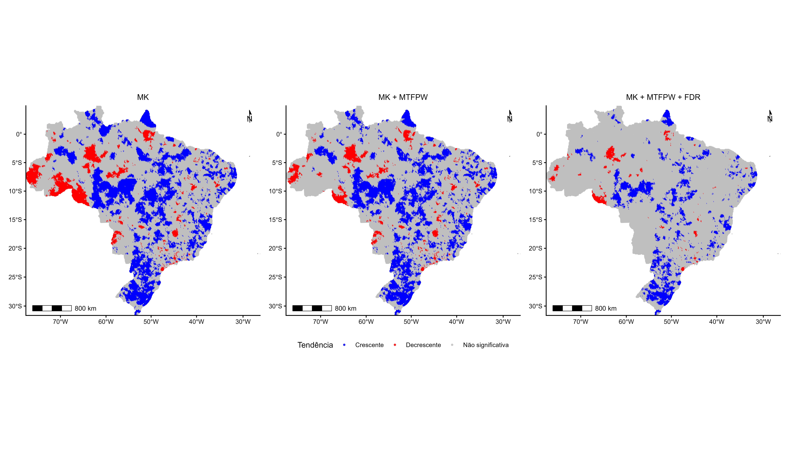
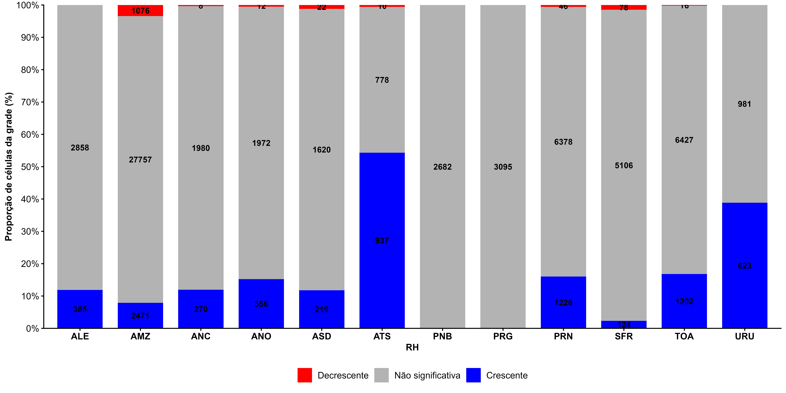
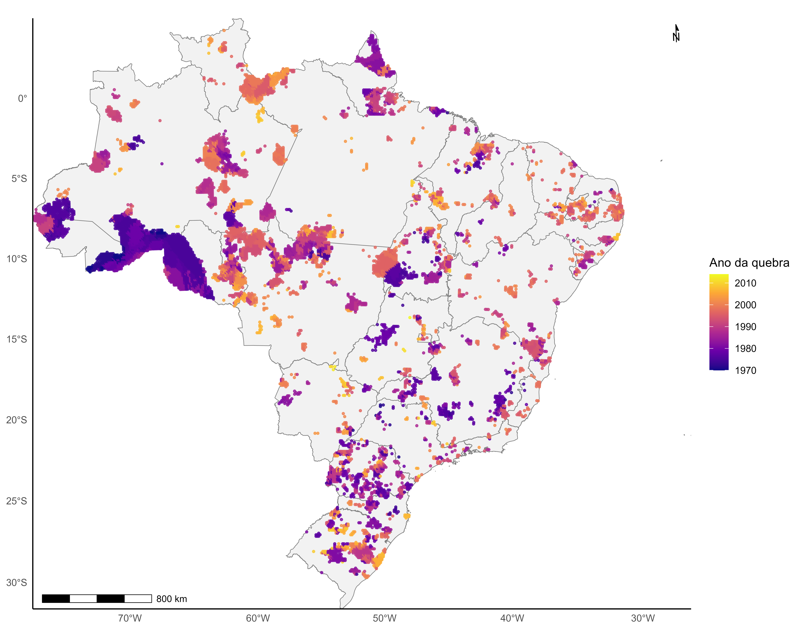
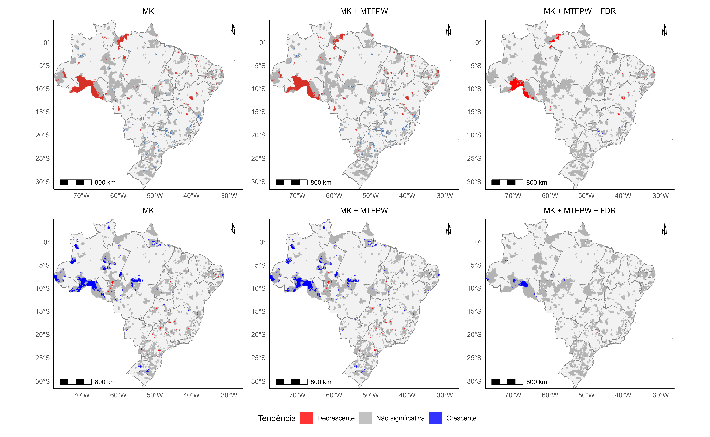
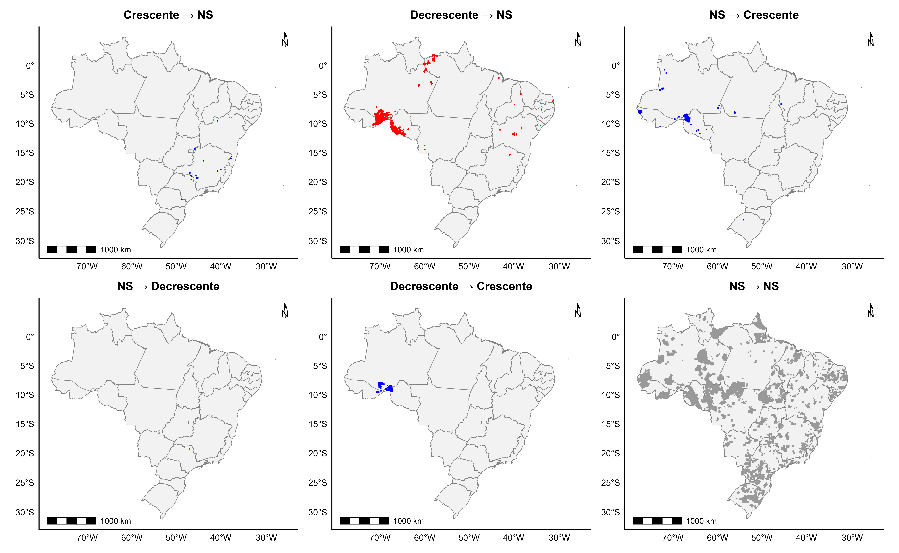

Esta meta avalia a existência de mudanças temporais nas séries de precipitação extrema, incluindo tendências graduais. As análises abrangem pluviômetros e pluviógrafos.

#8.1 Dados utilizados

Organização dos dados por Região Hidrográfica

-   estações foram espacialmente associadas às RHs;
-   células do Xavier também foram espacialmente associadas às RHs;
-   as análises foram realizadas individualmente para cada RH.

#8.1.1 Dados de pluviómetros e pluviógrafos

Foram utilizados os postos pluviométricos e pluviómetros disponíveis na base de dados do *Unified Brazilian Rainfall Dataset* (UNIPLU) (Das Neves Almeida et al., 2025) para calcular as precipitações máximas anuais. Na etapa de preparação dos dados, foram selecionados os registros com intervalo temporal de 24 horas (1440 minutos) para os dados diários e de 1hora (60 min) para os dados subdiários.

Para cada posto, foi calculado o número de dias com observações e calculada a razão entre os dias observados e o número de dias esperados no respectivo ano, considerando-se 365 dias para anos comuns e 366 dias para anos bissextos.

Para os dados diários, como etapa de controle de qualidade, foram removidos os valores inferiores ou iguais a 1 mm e valores superiores a 650 mm. Foram considerados válidos apenas os anos que apresentaram cobertura temporal igual ou superior a 80% e com no mínimo 30 anos de dados. Os subdiários cobertura temporal igual ou superior a 80% e com no mínimo 8 anos de dados.

Ao final do processamento, foi obtida uma série temporal anual para cada estação selecionada, contendo os valores das precipitações máximas diárias e subdiárias, acompanhados das informações de identificação e localização das estações.

-   fonte dos dados;
-   período;
-   número de estações;
-   localização;
-   critérios de seleção;
-   variável/índice analisado;
-   tratamento dos dados;
-   associação das estações às RHs por localização espacial.

obs: colocar um mapa da distribuição das estações sobre as 12 RHs?

#8.1.2 Dados em grade - Xavier

-   Xavier (falar sobre a base/pubicação);
-   período 1961–2025;
-   resolução espacial;
-   resolução temporal mensal;
-   variável utilizada;
-   tratamento do NetCDF;
-   cobertura espacial.

#8.2 Metodologia

#8.2.1

-   tratamento de valores ausentes;
-   organização das séries temporais;
-   período analisado;
-   critérios de validade das séries;
-   espacialização dos dados.

#8.2.2 Teste de Mann-Kendall

-   finalidade do teste;
-   hipótese nula;
-   estatística Z;
-   p-valor;
-   nível de significância;
-   classificação da tendência em crescente, decrescente ou não significativa.
-   equações

#8.2.3 Mann-Kendall (MK) + *Modified Trend-Free Pre-Whitening* (MTFPW)

Série temporal -\> identificação da autocorrelação -\> MTFPW -\> série corrigida -\> MK -\> tendência - EQUAÇÕES

#8.2.4 Controle da *False Discovery Rate* – FDR

Série -\> MTFPW -\> MK -\> p-valores -\> FDR -\> significância espacial - EQUAÇÕES

#8.3 Resultados Pluviómetros e pluviógrafos

#8.3.1 Caracterização dos dados Estações: - número de estações; - distribuição espacial; - quantidade por RH; - período das séries; - estatísticas descritivas.

 Figura 1. Distribuição espacial das estações pluviométricas no território brasileiro segundo a extensão das séries históricas

 Figura 2. Distribuição percentual das estações pluviométricas segundo a extensão das séries históricas, por região hidrográfica

 Figura 3.

#8.3.2 MK; MK+MTFPW; MK+MTFPW+FDR

máxima diária

 Figura 4.

 Figura 5.

#8.4 Resultados Xavier

#8.4.1 Caracterização dos dados - número de células; - cobertura espacial; - estatísticas da precipitação máxima mensal anual; - distribuição espacial dos valores.

 Figura 6

 Figura 7

#8.5 Teste de Pettit nos dados de Xavier  Figura 8

 Figura 8

 Figura 8

#8.6 Considerações Finais
