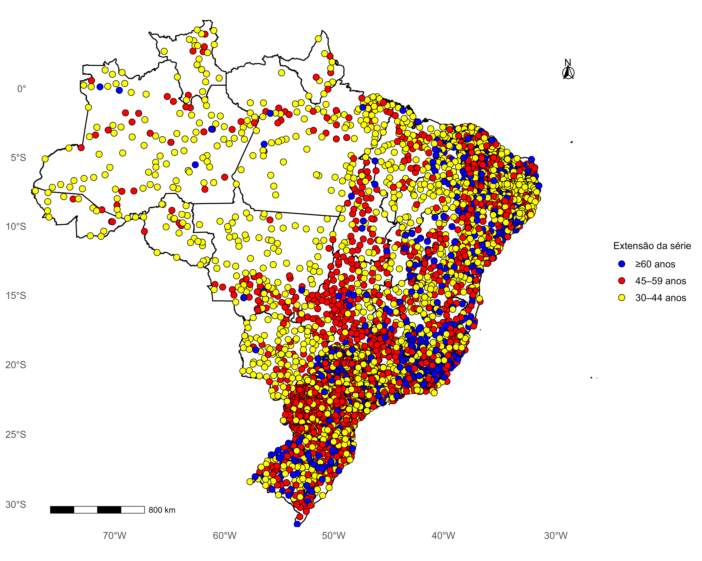
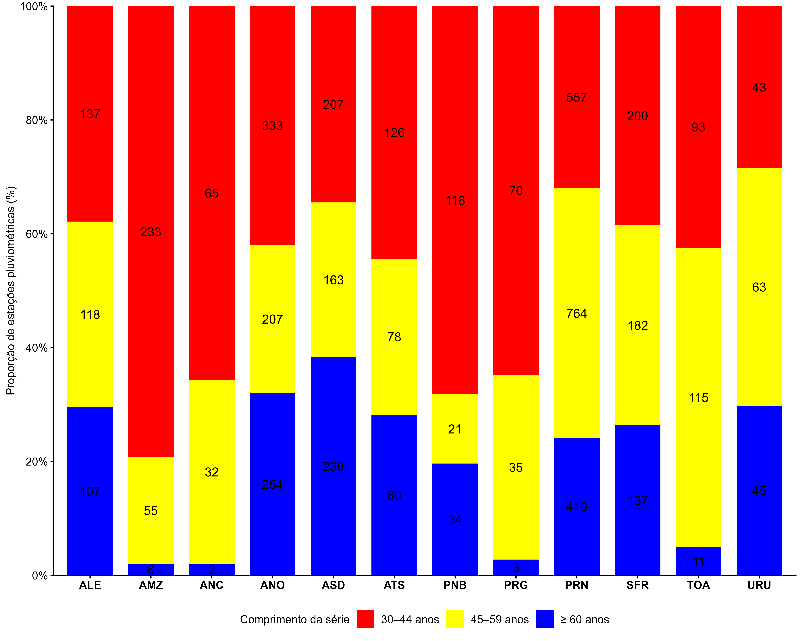
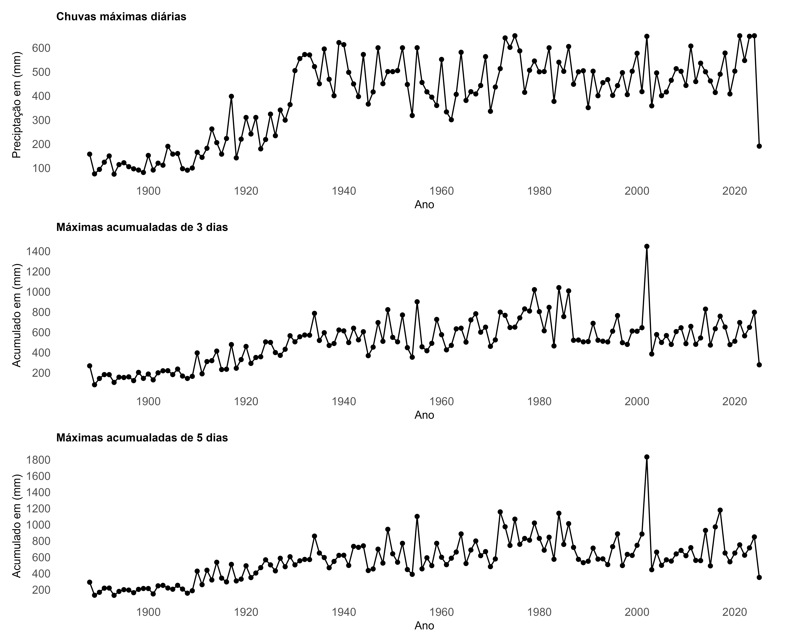
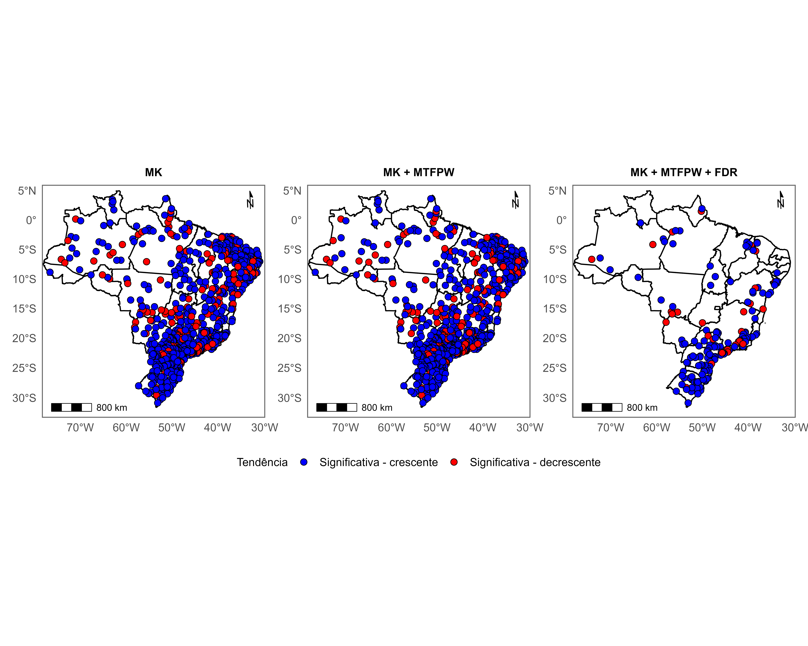
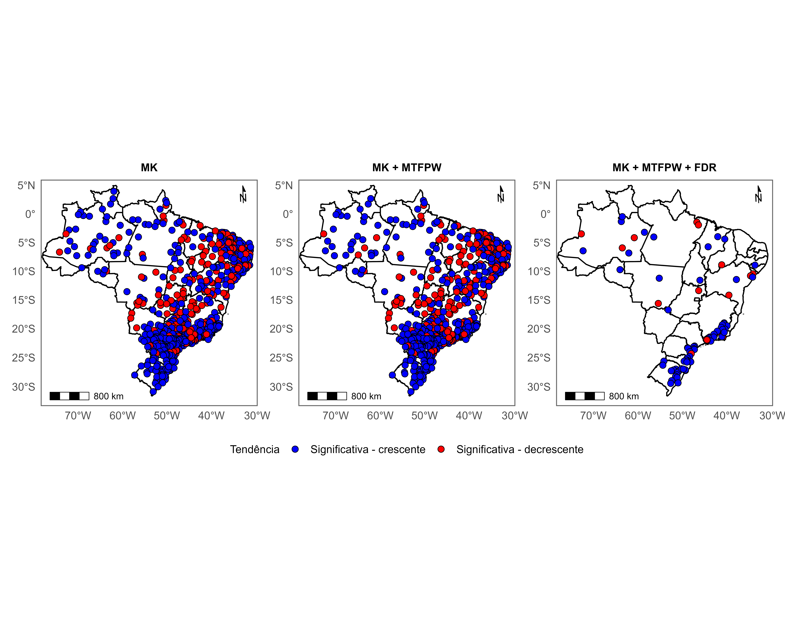
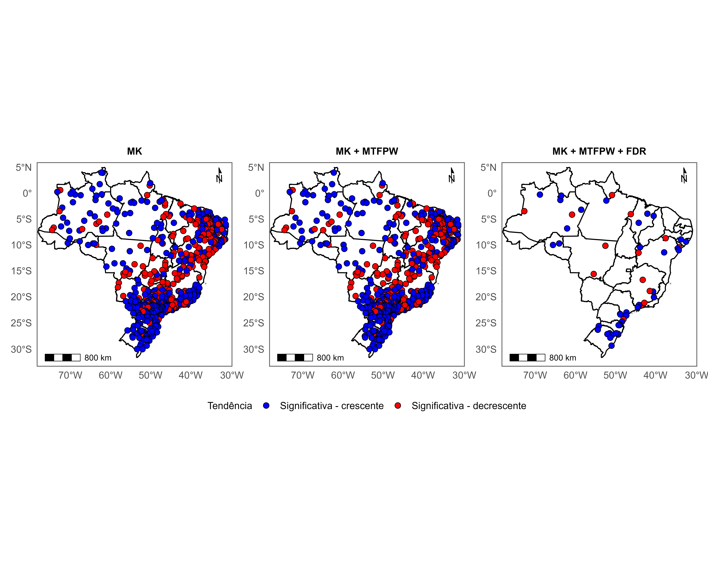
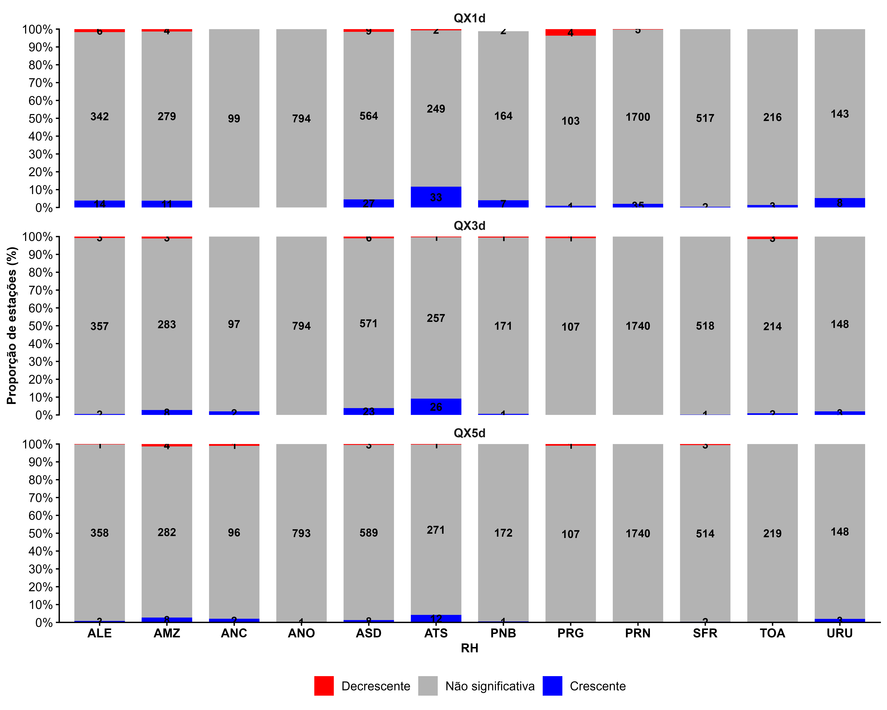
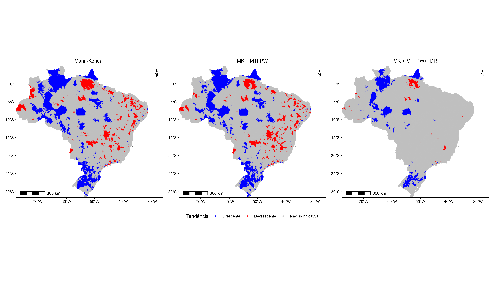
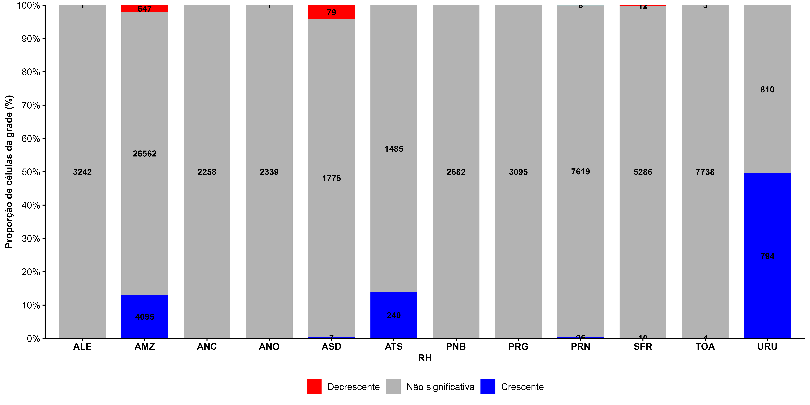

Esta meta avalia a existência de mudanças temporais nas séries de precipitação extrema, incluindo tendências graduais. As análises abrangem pluviômetros e pluviógrafos.

#8.1 Dados utilizados

Organização dos dados por Região Hidrográfica

-   estações foram espacialmente associadas às RHs;
-   células do Xavier também foram espacialmente associadas às RHs;
-   as análises foram realizadas individualmente para cada RH.

#8.1.1 Dados de postos pluviométricos e pluviógrafos

-   fonte dos dados;
-   período;
-   número de estações;
-   localização;
-   critérios de seleção;
-   variável/índice analisado;
-   tratamento dos dados;
-   associação das estações às RHs por localização espacial.

obs: colocar um mapa da distribuição das estações sobre as 12 RHs?

#8.1.2 Dados em grade - Xavier

-   Xavier (falar sobre a base/pubicação);
-   período 1961–2025;
-   resolução espacial;
-   resolução temporal mensal;
-   variável utilizada;
-   tratamento do NetCDF;
-   cobertura espacial.

#8.2 Metodologia

#8.2.1

-   tratamento de valores ausentes;
-   organização das séries temporais;
-   período analisado;
-   critérios de validade das séries;
-   espacialização dos dados.

#8.2.2 Teste de Mann-Kendall

-   finalidade do teste;
-   hipótese nula;
-   estatística Z;
-   p-valor;
-   nível de significância;
-   classificação da tendência em crescente, decrescente ou não significativa.
-   equações

#8.2.3 Mann-Kendall (MK) + *Modified Trend-Free Pre-Whitening* (MTFPW)

Série temporal -\> identificação da autocorrelação -\> MTFPW -\> série corrigida -\> MK -\> tendência - EQUAÇÕES

#8.2.4 Controle da *False Discovery Rate* – FDR

Série -\> MTFPW -\> MK -\> p-valores -\> FDR -\> significância espacial - EQUAÇÕES

#8.3 Resultados Pluviómetros e pluviógrafos

#8.3.1 Caracterização dos dados Estações: - número de estações; - distribuição espacial; - quantidade por RH; - período das séries; - estatísticas descritivas.

 Figura 1. Distribuição espacial das estações pluviométricas no território brasileiro segundo a extensão das séries históricas

 Figura 2. Distribuição percentual das estações pluviométricas segundo a extensão das séries históricas, por região hidrográfica

 Figura 3.

#8.3.2 MK; MK+MTFPW; MK+MTFPW+FDR

máxima diária

 Figura 4.

acumulado de 3 dias

 Figura 5.

acumulado de 5 dias

 Figura 6.

 Figura 7.

#8.4 Resultados Xavier

#8.4.1 Caracterização dos dados - número de células; - cobertura espacial; - estatísticas da precipitação máxima mensal anual; - distribuição espacial dos valores.

 Figura 8

 Figura 9

#8.4.2 MK #8.4.3 MK+MTFPW #8.4.4 MK+MTFPW+FDR

#8.5 Considerações Finais
