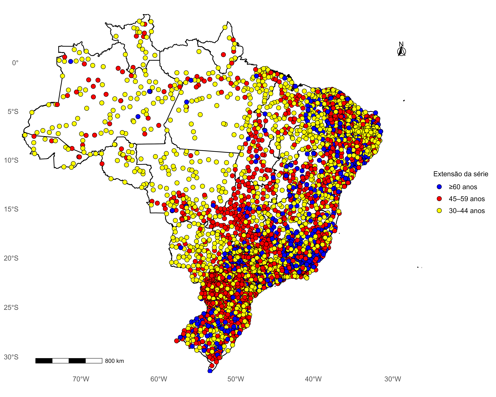
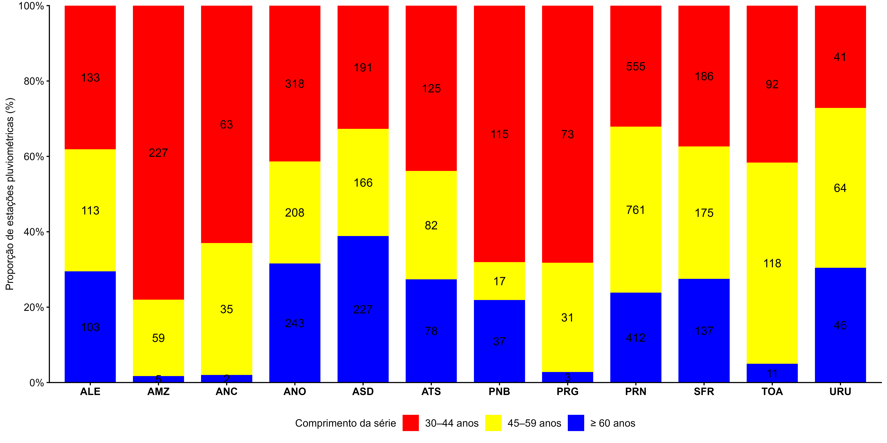
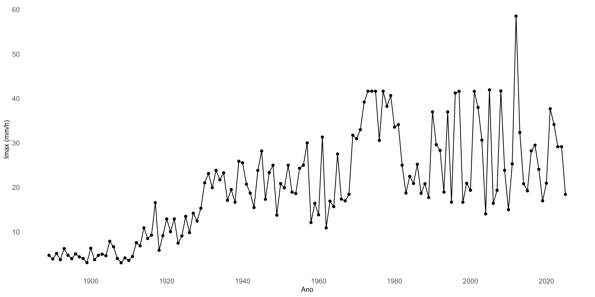
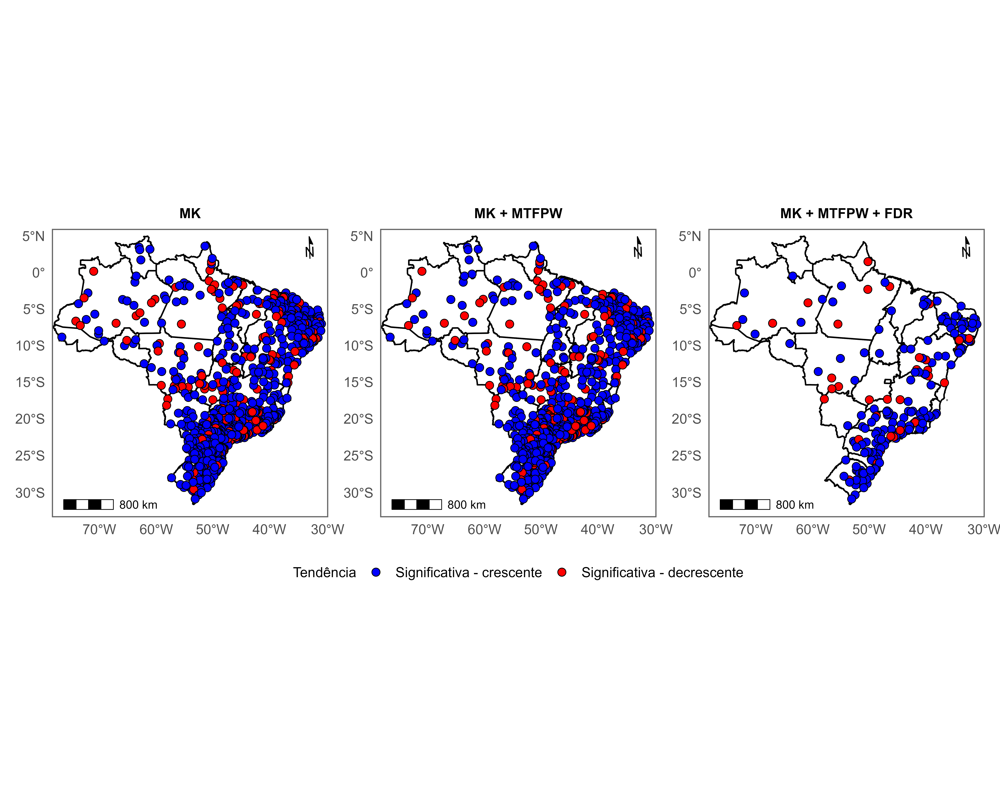
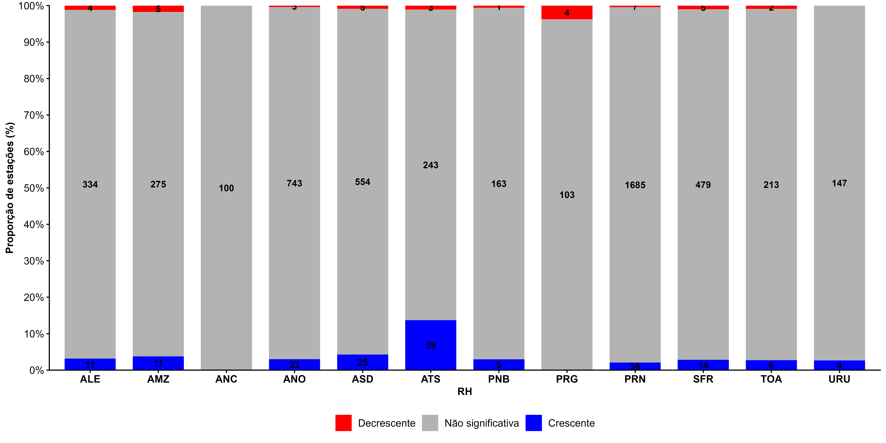
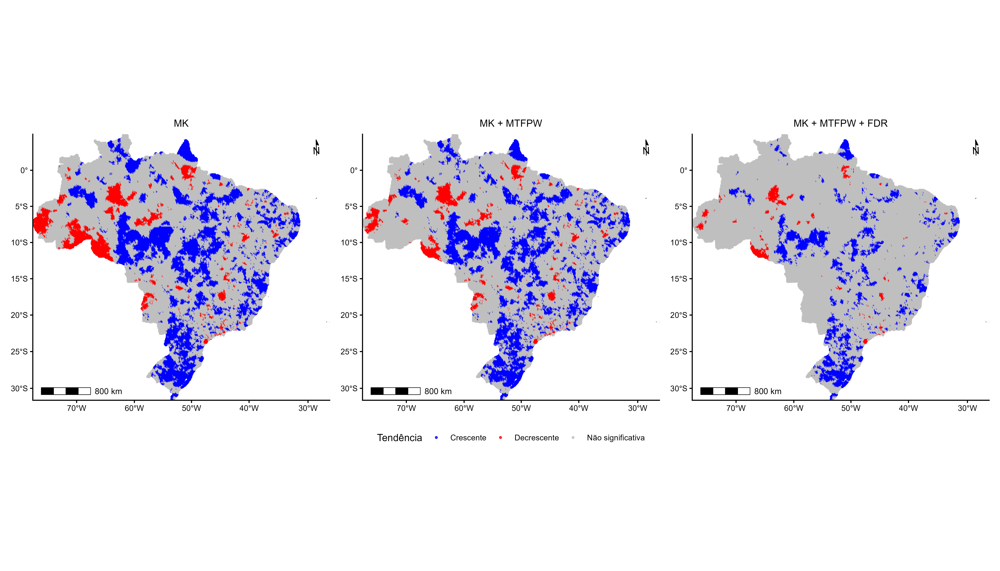
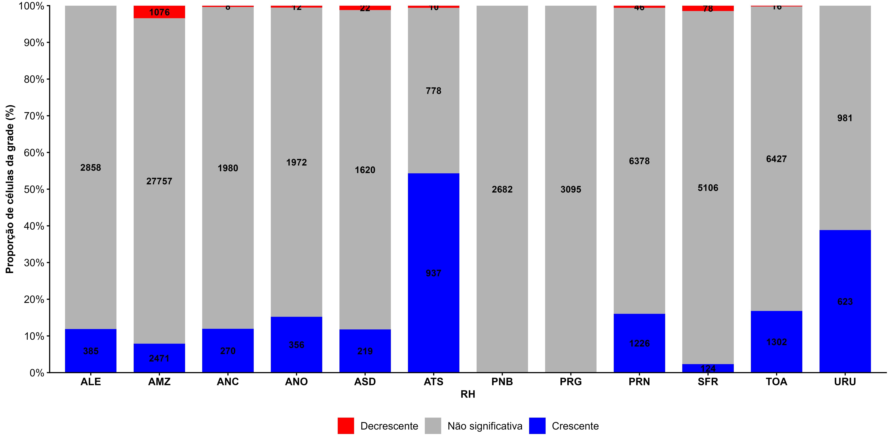
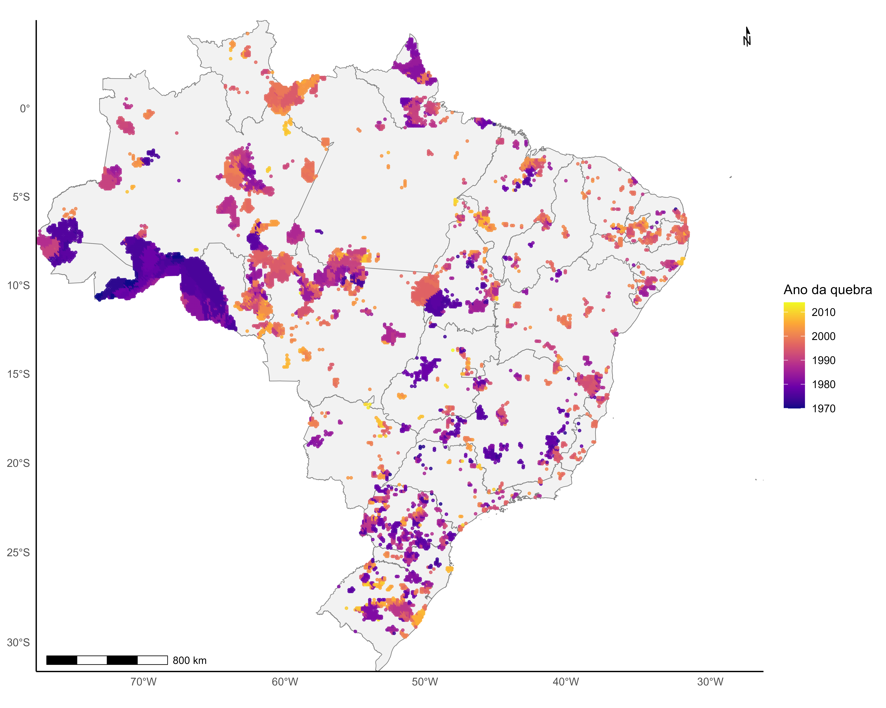
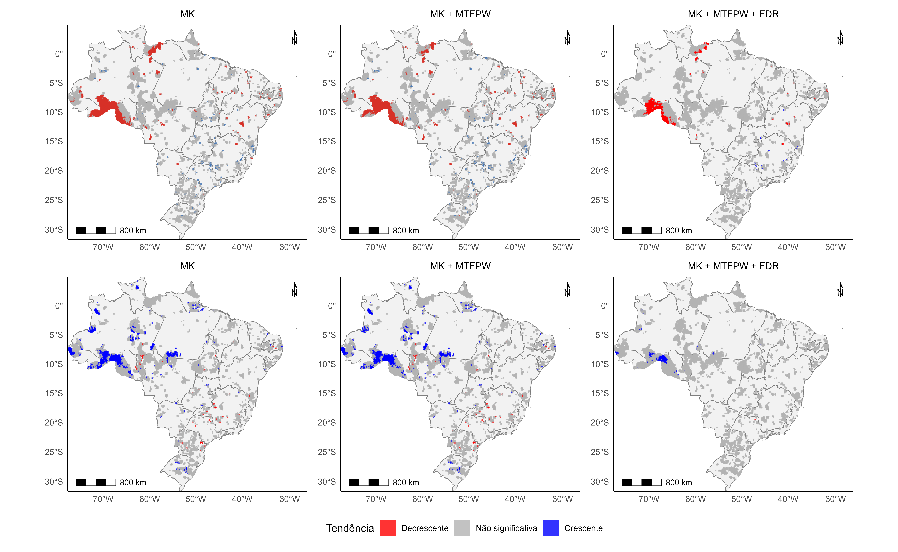
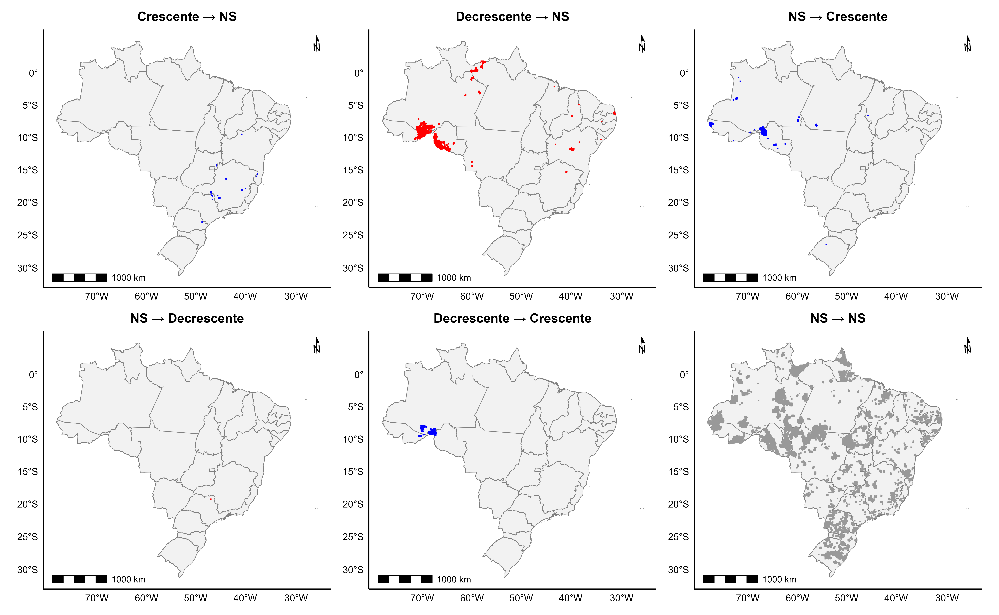

Esta meta avalia a existência de mudanças temporais nas séries de precipitação extrema, incluindo tendências graduais. As análises abrangem pluviômetros e pluviógrafos.

#8.1 Dados utilizados

Para o realização da análise de tendência, foram utilizadas diferentes fontes de dados de precipitação, contemplando informações provenientes de postos pluviométricos e pluviógrafos, bem como dados espacialmente distribuídos em grade.

Foram utilizados os postos pluviométricos e pluviómetros disponíveis na base de dados do UNIPLU (Das Neves Almeida et al., 2025). Na etapa de preparação dos dados, foram selecionados os registros com intervalo temporal de 24 horas (1440 minutos) para os dados diários e de 1hora (60 min) para os dados subdiários.

Também foi utilizada a base de dados em grade do *Brazilian Daily Gridded Weather Dataset* (BR-DWGD), elaborada por Xavier et al. e disponibilizada em formato NetCDF. A série temporal utilizada compreende o período de 1961 a 2025, totalizando 65 anos de dados diários. Para cada célula da grade espacial e para cada ano, foi identificado o maior valor de precipitação diária registrado, obtendo-se, assim, a série de precipitação máxima diária anual para cada célula.

Para a organização espacial dos dados e a realização das análises, tanto os postos pluviométricos e pluviógrafos quanto as células da base de dados em grade de Xavier et al. foram associadas às respectivas Regiões Hidrográficas (RHs). Essa associação foi realizada por meio da localização espacial de cada posto e de cada célula da grade, permitindo identificar a Região Hidrográfica à qual cada ponto de observação ou célula pertence.

Após essa classificação espacial, os dados foram organizados de acordo com as RHs, de modo que as análises estatísticas e de tendência fossem realizadas individualmente para cada RH. Essa abordagem permitiu avaliar a distribuição espacial dos resultados e identificar possíveis diferenças no comportamento das séries de precipitação entre as diferentes Regiões Hidrográficas.

Após a construção das séries, foi realizada a análise de tendência em três etapas: (i) teste de Mann–Kendall (MK); (ii) teste de Mann–Kendall associado ao *Modified Trend-Free Pre-Whitening* (MK + MTFPW); e (iii) aplicação da correção para múltiplos testes pelo método *False Discovery Rate* (MK + MTFPW + FDR). A análise de tendência foi aplicada individualmente a cada base de dados.

#8.2 Metodologia

A metodologia foi estruturada em etapas sucessivas, com o objetivo de identificar as tendências nas séries temporais, considerando tanto os dados provenientes dos postos pluviométricos e pluviógrafos do UNIPLU quanto os dados em grade de Xavier et al. Inicialmente, foi aplicado o teste não paramétrico de MK para verificar a existência de tendências monotônicas estatisticamente significativas nas séries analisadas. Em seguida, foi avaliada a presença de autocorrelação nas séries temporais e aplicada a técnica MTFPW, com o objetivo de reduzir a influência da autocorrelação sobre a identificação das tendências. Posteriormente, o teste de Mann–Kendall foi aplicado às séries corrigidas pelo procedimento de MTFPW, KM+MTFPW. Por fim, considerando a realização simultânea de testes para diferentes postos e células da grade, foi aplicado o procedimento de controle de FDR, visando controlar a proporção esperada de resultados falsamente significativos.

#8.2.2 Teste de Mann-Kendall

Inicialmente, foi aplicado o teste não paramétrico de MK às séries anuais de Rx1day e subdiárias. O objetivo foi verificar a existência de uma tendência monotônica estatisticamente significativa ao longo do período analisado.

Para cada série temporal ((X_1,X_2,\ldots,X_n)), as observações foram inicialmente transformadas em postos, considerando os valores empatados pelo método do menor posto. Em seguida, a estatística (S) foi calculada pela comparação entre todos os pares de observações:

$$
S =
\sum_{i=1}^{n-1}
\sum_{j=i+1}^{n}
\operatorname{sgn}(R_j-R_i)
$$

em que (R_i) e (R_j) representam os postos das observações (X_i) e (X_j), respectivamente, e:

$$
\operatorname{sgn}(R_j-R_i)=
\begin{cases}
+1, & R_j-R_i>0\\
0, & R_j-R_i=0\\
-1, & R_j-R_i<0
\end{cases}
$$

Valores positivos de (S) indicam predominância de aumentos da variável ao longo do tempo, enquanto valores negativos indicam predominância de reduções.

Os empates entre observações foram considerados no cálculo da variância de (S). A variância foi calculada por:

$$
\operatorname{Var}(S)=
\frac{
n(n-1)(2n+5)
-
\displaystyle\sum_{p=1}^{g}
t_p(t_p-1)(2t_p+5)
}{18}
$$

em que (t_p) representa o número de observações pertencentes ao (p)-ésimo grupo de valores empatados e (g) corresponde ao número de grupos de valores empatados.

A estatística padronizada (Z) foi calculada por:

$$
Z=
\begin{cases}
\dfrac{S-1}{\sqrt{\operatorname{Var}(S)}}, & S>0\\[8pt]
0, & S=0\\[8pt]
\dfrac{S+1}{\sqrt{\operatorname{Var}(S)}}, & S<0
\end{cases}
$$

O *p-value* bilateral foi obtido por:

$$
p=2\left[1-\Phi(|Z|)\right]
$$

em que (\Phi) representa a função de distribuição acumulada da distribuição normal padrão.

Foi adotado nível de significância de 5% ((\alpha=0,05)). Assim, uma série foi considerada estatisticamente significativa quando: $$
p<0,05
$$ A direção da tendência foi determinada pelo sinal da estatística (Z). Valores positivos de (Z) foram classificados como tendência crescente e os valores negativos foram classificados como tendência decrescente.

O teste MK foi aplicado individualmente às séries correspondentes às células da grade Xavier e às séries correspondentes aos postos pluviométricos e pluviográficos do UNIPLU. Dessa forma, cada unidade espacial de análise apresentou seu próprio valor de (Z), *p-value* e classificação da direção da tendência.

-   finalidade do teste;
-   hipótese nula;
-   estatística Z;
-   p-valor;
-   nível de significância;
-   classificação da tendência em crescente, decrescente ou não significativa.
-   equações

#8.2.3 Mann-Kendall (MK) + *Modified Trend-Free Pre-Whitening* (MTFPW)

A presença de autocorrelação serial em séries temporais pode influenciar a avaliação de tendências, uma vez que a dependência entre observações sucessivas pode aumentar a probabilidade de identificação de uma tendência como estatisticamente significativa quando, na realidade, ela não existe. Para reduzir esse efeito, foi aplicado o procedimento MTFPW, conforme o procedimento descrito por @Souza e Reis Jr. (2022).

O método foi aplicado individualmente a cada série temporal e estruturado em etapas sucessivas:

(i) estimativa da tendência por meio da inclinação de Sen;

(ii) remoção da tendência da série;

(iii) estimativa da autocorrelação de primeira ordem ((r_1));

(iv) correção do viés da estimativa de (r_1);

(v) verificação da significância da autocorrelação; e

(vi) aplicação do procedimento de *pre-whitening* quando a autocorrelação foi considerada estatisticamente significativa.

### Estimativa da tendência

Inicialmente, foi estimada a magnitude da tendência da série por meio da inclinação de Sen. Para uma série temporal com (n) observações, foram calculadas as inclinações entre todos os pares de observações:

$$
\beta_{ij} =
\frac{X_j-X_i}{j-i},
\qquad j>i
$$

em que \(X_i\) e \(X_j\) representam os valores da série nos instantes \(i\) e \(j\), respectivamente. A inclinação de Sen (\(\beta\)) foi obtida pela mediana de todas as inclinações \(\beta_{ij}\):

$$
\beta =
\operatorname{mediana}
\left(
\beta_{ij}
\right)
$$

Essa estimativa foi utilizada para remover a tendência da série antes da avaliação da autocorrelação.

### Remoção da tendência

Após a estimativa da inclinação de Sen, a tendência foi removida da série original. Para isso, foi utilizada a expressão:

$$
X_t^{d}=X_t-\beta t
$$

em que \(X_t^{d}\) representa o valor da série sem tendência no instante \(t\), \(X_t\) corresponde ao valor original da série, \(\beta\) é a inclinação de Sen e \(t\) representa a posição temporal da observação.

A série sem tendência foi utilizada exclusivamente para a estimativa da autocorrelação de primeira ordem. A aplicação posterior do procedimento de *pre-whitening*, quando necessária, foi realizada sobre a série original.

### Estimativa da autocorrelação de primeira ordem

A autocorrelação de primeira ordem (\(r_1\)) foi estimada a partir da série sem tendência. Inicialmente, foi calculada a média da série por:

$$
\overline{X^d}
=
\frac{1}{n}
\sum_{t=1}^{n}X_t^d
$$

Em seguida, o coeficiente de autocorrelação de primeira ordem foi obtido por:

$$
r_1=
\frac{
\displaystyle\sum_{t=1}^{n-1}
\left(X_t^d-\overline{X^d}\right)
\left(X_{t+1}^d-\overline{X^d}\right)
}{
\displaystyle\sum_{t=1}^{n}
\left(X_t^d-\overline{X^d}\right)^2
}
$$

em que \(r_1\) representa a correlação entre observações consecutivas da série sem tendência.

### Correção do viés da autocorrelação

A estimativa de \(r_1\) foi posteriormente corrigida para reduzir o viés associado à estimativa da autocorrelação em séries finitas. A autocorrelação corrigida foi calculada por:

$$
r_1^{*}
=
\frac{nr_1+2}{n-4}
$$

em que \(r_1^{*}\) representa a autocorrelação de primeira ordem corrigida e \(n\) corresponde ao número de observações da série.

### Identificação da autocorrelação significativa

Para determinar se a autocorrelação de primeira ordem era estatisticamente significativa, foi utilizado um intervalo de confiança de 95%. Os limites inferior e superior foram calculados por:

$$
\rho_{1,\mathrm{inf}}
=
\frac{-1-1,96\sqrt{n-2}}{n-1}
$$

e

$$
\rho_{1,\mathrm{sup}}
=
\frac{-1+1,96\sqrt{n-2}}{n-1}
$$

A série foi considerada sem autocorrelação significativa quando o valor de \(r_1\) permaneceu dentro desse intervalo:

$$
\rho_{1,\mathrm{inf}}
\leq r_1
\leq
\rho_{1,\mathrm{sup}}
$$

Quando \(r_1\) permaneceu dentro dos limites estabelecidos, a série foi considerada independente para fins da análise de tendência, não sendo aplicado o procedimento de *pre-whitening*. Nesse caso, a série original foi mantida para a aplicação do teste de Mann–Kendall.

Por outro lado, quando \(r_1\) apresentou valor inferior ao limite inferior ou superior ao limite superior, a autocorrelação foi considerada significativa:

$$
r_1 < \rho_{1,\mathrm{inf}}
\quad\text{ou}\quad
r_1 > \rho_{1,\mathrm{sup}}
$$

Nessa situação, foi aplicado o procedimento MTFPW.

### Aplicação do *pre-whitening*

Quando identificada autocorrelação significativa, o procedimento de *pre-whitening* foi aplicado à série temporal original, utilizando a autocorrelação corrigida \(r_1^{*}\). A série corrigida foi obtida por:

$$
Y_t=
X_t-r_1^{*}X_{t-1},
\qquad t=2,\ldots,n
$$

em que \(Y_t\) representa a série após a aplicação do *pre-whitening*, \(X_t\) corresponde à série original e \(r_1^{*}\) representa a estimativa corrigida da autocorrelação de primeira ordem.

Dessa forma, a série sem tendência foi utilizada para estimar e avaliar a autocorrelação, enquanto o *pre-whitening* foi aplicado diretamente à série original. Quando a autocorrelação não foi significativa, nenhuma transformação foi aplicada e a série original foi mantida.

Após a aplicação do procedimento MTFPW, quando necessário, o teste de Mann–Kendall foi aplicado à série resultante. Assim, para cada unidade espacial de análise, foram obtidos a estimativa da inclinação de Sen, o coeficiente de autocorrelação de primeira ordem, o coeficiente corrigido, a indicação da presença ou ausência de autocorrelação significativa e a série utilizada na etapa subsequente do teste de tendência.

#8.2.4 Controle da *False Discovery Rate* – FDR

Considerando que a análise de tendência foi realizada simultaneamente para diversas séries temporais, correspondentes aos postos pluviométricos e pluviógrafos e às células da grade de Xavier et al., foi aplicado o procedimento de Benjamini–Hochberg (@colocar a ref) para o controle da *False Discovery Rate*. A aplicação desse procedimento teve como objetivo controlar a proporção esperada de resultados falsamente significativos entre as hipóteses rejeitadas, reduzindo a ocorrência de falsos positivos decorrentes da realização simultânea de múltiplos testes estatísticos.

O procedimento foi aplicado ao conjunto de *p-values* obtidos nas análises de tendência. Inicialmente, foram considerados apenas os valores de *p* válidos, ou seja, aqueles que não apresentavam valores ausentes ou infinitos. Em seguida, os *p-values* foram ordenados em ordem crescente:

$$
p_{(1)} \leq p_{(2)} \leq \ldots \leq p_{(m)}
$$

em que \(p_{(j)}\) representa o \(j\)-ésimo menor *p-value* e \(m\) corresponde ao número total de *p-values* válidos considerados na análise.

Para cada posição \(j\), foi calculado um valor crítico de acordo com:

$$
d_{(j)} =
\frac{j\alpha}{m}
$$

em que \(j\) representa a posição do *p-value* ordenado, \(\alpha\) corresponde ao nível de significância adotado e \(m\) representa o número total de testes considerados.

Foi então identificado o maior valor de \(j\) que satisfazia a condição:

$$
p_{(j)} < \frac{j\alpha}{m}
$$

O maior índice que atende a essa condição foi denominado \(j^*\). Quando não houve nenhum *p-value* que satisfizesse a condição estabelecida, nenhuma hipótese foi considerada significativa após o controle da FDR. Quando \(j^*\) foi identificado, todas as hipóteses correspondentes aos *p-values* ordenados de \(p_{(1)}\) até \(p_{(j^*)}\) foram consideradas estatisticamente significativas.

Assim, a regra de decisão do procedimento pode ser expressa por:

$$
p_{(j)} < \frac{j\alpha}{m},
\qquad j=j^*
$$

sendo \(j^*\) o maior índice que satisfaz essa condição.

Foi adotado nível de significância de 5% \((\alpha=0,05)\). Após a identificação das hipóteses significativas na ordem crescente dos *p-values*, os resultados foram novamente associados às respectivas unidades espaciais, preservando a correspondência original entre cada *p-value* e sua estação ou célula da grade.

Dessa forma, o procedimento permitiu obter a significância estatística final das tendências considerando simultaneamente os múltiplos testes realizados. Para cada unidade espacial, o resultado após o controle da FDR foi classificado como significativo ou não significativo, permitindo a representação e a avaliação da distribuição espacial das tendências.

#8.3 Resultados Pluviómetros e pluviógrafos

#8.3.1 Caracterização dos dados Estações: - número de estações; - distribuição espacial; - quantidade por RH; - período das séries; - estatísticas descritivas.

 Figura 1. Distribuição espacial das estações pluviométricas no território brasileiro segundo a extensão das séries históricas

 Figura 2. Distribuição percentual das estações pluviométricas segundo a extensão das séries históricas, por região hidrográfica

 Figura 3.

#8.3.2 MK; MK+MTFPW; MK+MTFPW+FDR

máxima diária

 Figura 4.

 Figura 5.

#8.4 Resultados Xavier

#8.4.1 Caracterização dos dados - número de células; - cobertura espacial; - estatísticas da precipitação máxima mensal anual; - distribuição espacial dos valores.

 Figura 6

 Figura 7

#8.5 Teste de Pettit nos dados de Xavier  Figura 8

 Figura 8

 Figura 8

#8.6 Considerações Finais
