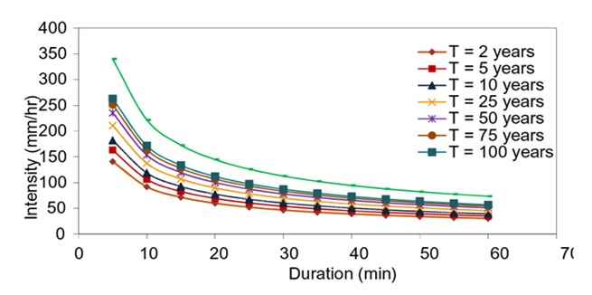

::: {style="text-align: justify;"}
As precipitações extremas referem-se aos altos valores de precipitações que desviam dos valores médios, são manifestados como aleatoriedade, baixa frequência e alta intensidade com grandes danos [@Ghebreyesus.2021].

O sexto relatório do *Intergovernmental Panel on Climate Change* (IPCC) observou que a temperatura da superfície global durante o período de 2011 a 2020 teve um acréscimo de 1,1 ºC relacionado aos anos de 1850 a 1900 [@IPCC.2023], pressupondo que a tendência e frequência dos eventos extremos de precipitação tendem a aumentar ao decorrer dos anos [@Liang.2025].

No contexto das mudanças climáticas nas últimas décadas, os eventos temporais vêm alterando gradativamente em diversas partes do mundo e vem se tornando cada vez mais frequentes, destacando-se a precipitações extremas [@IPCC.2023], como na China [@Zhang.2022; @Deng.2023; @Dai.2023], Europa [@Tuel.2022], África [@Marra.2022], Brasil [@Rao.2016] e Asia [@Mondal.2022].

Nas últimas décadas, o Brasil vem sofrendo com eventos extremos como inundações e secas prolongadas, resultando em grandes perdas de infraestruturas, agropecuárias e econômicas [@Alvala.2024; @Marengo.2023]. Grande parte dos centros urbanos brasileiros são resultados da expansão desordenada da população [@Lima.2019], o que pode alavancar os impactos da precipitação extrema, deixando cada vez mais a população exposta e vulnerável, destacando-se áreas com uma alta densidade de pessoas [@Cortez.2022].

Na década de 1990 os primeiros artigos apareceram registrando um evento extremo de precipitação nos anos de 1988 e 1977 na Lagoa dos Patos, Rio Grande do Sul, Brasil, consequência do El Niño - Oscilação Sul [@Ciotti.1995]. E com o passar dos anos a intensidade e a frequência de chuvas extremas aumentou no Brasil [@Westra.2014; @Reboita.2024]. Como ocorreu no litoral de São Paulo, apresentando volume de precipitação de 683 mm em menos de 15 horas, no ano de 2023, sendo uma das precipitações extremas com maior volume já registrado no Brasil [@Reboita.2024; @Marengo.2024].

Com o aumento dos registros de precipitações extremas nos últimos anos, vale ressaltar que os padrões espaciais de mudanças de precipitações não são homogêneos, podendo variar de região para região [@Yao.2021].

A avaliação das ocorrências de eventos extremos só pode ser realizada através da análise de dados estacionários de longo tempo [@Blanchet.2016]. Assim, os dados observacionais tornam-se cruciais para a compreensão das mudanças climáticas globais e regionais, e essenciais para a identificação de suas variabilidades e impactos relacionados [@Sun.2018]. Geralmente, as séries de precipitação de longo prazo estão disponíveis em escalas locais e em produtos diários ou em períodos de observações mais longos, o que dificulta a análise direta da frequência de eventos subdiários, tornando-se necessário o uso de diferentes métodos para mensurar e estimar a precipitação em todo o mundo [@Blanchet.2016; @Gu.2022].

No entanto, as medições realizadas por medidores *in situ*, como os pluviômetros, são afetados por erros sistemáticos através da superestimativa por capturas induzidas pelo vento, a falta de disponibilidade de medidores historicamente longos, alta resolução espaço-temporal e de dados subdiários [@Hosseinzadehtalaei.2020]. A ausência dos dados de precipitações subdiárias dificultam a captura e futuras avaliações de eventos extremos. A ausência de dados pluviométricos e pluviográficos de alta resolução temporal e espacial constitui uma barreira significativa para o desenvolvimento de curvas IDF precisas e acuradas. [@Noor.2021].

As relações de curvas IDF são tipicamente projetadas para um local específico com base na série histórica de precipitação líquidas [@Hosseinzadehtalaei.2020]. Com o impacto das mudanças climáticas nos ciclos hidrológicos torna-se necessário a atualização das curvas IDF para dimensionar estruturas hidráulicas mais resilientes e resistentes aos impactos recorrentes aos eventos extremos de precipitação [@Hosseinzadehtalaei.2020]. Convencionalmente, o processo de desenvolvimento de curvas IDF são através de dados históricos de estações meteorológicas convencionais ajustadas a distribuição usando o método de séries máximas anuais ou séries de duração parcial [@Ghebreyesus.2021].

O estudo de @Overeem.2009 é amplamente reconhecido como um dos pioneiros na estimativa de curvas IDF a partir de dados de radar na Holanda. O trabalho utilizou um registro de 11 anos, com durações que variam de 15 minutos a 24 horas. Os autores identificaram uma concordância razoável entre os parâmetros de valores extremos generalizados (GEV) obtidos a partir das medições de radar e dos pluviômetros. No entanto, para durações mais longas, como 24 horas, o comprimento da série temporal foi relativamente curto para estimar a GEV. Além disso, a falta de séries máximas anuais aumentou as incertezas em relação às curvas IDF em áreas menores, em comparação com as curvas IDF para toda a Holanda.

@Peleg.2018 realizaram um estudo onde qualificaram a variabilidade do subpixel de radar meteorológico utilizando o modelo STREAP (*Space-Time Realizations of A real Precipitation*) para reduzir a escala da precipitação de radar registrada em um determinado pixel. A análise foi realizada utilizando dados de um único pixel (1,4° × 1 km) de um radar de banda C não Doppler, com dados obtidos no período de 1990 a 2013, em uma área monitorada por uma rede de pluviômetros de alta densidade, em Kibbutz Galed, Israel. Para a construção das curvas IDF para os pontos que representam a variabilidade subpixels foi utilizado a distribuição (GEV) foram ajustadas aos máximos anuais de precipitação, seguindo as distribuições de Gumbel, Fréchet e Weibull. Os autores relatam que o radar subestima as precipitações extremas estimadas em grande parte dos subpixels do radar. Em períodos de retornos mais longos e com curtas durações a variabilidade subpixel é maior. Além disso, a incerteza no cálculo da variabilidade do subpixel aumenta quando se leva em consideração a variabilidade climática natural [@Peleg.2018].

O conceito de curvas de Intensidade-Duração-Frequência (IDF) da precipitação é baseado na gestão de águas pluviais e nos projetos de infraestrutura urbanas e hidráulicas, com o intuito de resistir ou prevenir a inundações e eventos extremos de precipitação [@Kawara.2022]. Sua metodologia baseia-se na seleção de maiores chuvas de duração (como por exemplo: 30 minutos) em cada série de dados. E ajustadas as séries máximas anuais históricas (número de anos) de diferentes durações (5 minutos, 10 minutos, 1 hora, 12 horas, 24 horas, 5 dias), e seus resultados são plotadas em formas de gráficos ou equações, com as seguintes variáveis: Intensidade, Duração e Frequência [@Martel.2021].

 Figura 1. de um posto pluviômetro em Curitiba e São José dos Pinhais (Fonte: [@Mora.2024]). ::::

Diante disso, a utilização de modelos de mudanças climáticas para a atualização das curvas IDF, vem se tornando um grande aliado. @Shrestha.2017 realizaram um estudo onde utilizaram métodos de desagregação temporal de redução espacial de chuva, para desenvolver IDF futuras sob cenários de mudanças climáticas, na região da Tailândia. Para estimar as curvas de IDF futuras os autores utilizaram dados de precipitação de 3 e 24 horas, nos anos de 1981 a 2010. As curvas IDF projetadas foram para o período de 2011 a 2030 e 2046 a 2065, onde as IDF atuais e futuras mostraram que a intensidade da chuva aumentou sob as mudanças climáticas na maioria das durações das chuvas.

A inferência estatística é uma das principais ferramentas utilizadas atualmente (e há muitos anos) para descrever e fazer previsões sobre precipitações extremas e muitos outros fenômenos hidroclimáticos. Uma vez coletada uma amostra desses eventos, é possível avaliar seu comportamento avaliando várias distribuições de probabilidade diferentes e escolhendo aquela que melhor o representa, ajustando-as aos dados e estimando seus parâmetros. A maneira como o conjunto de extremos é organizado, no entanto, leva a diferentes distribuições possíveis.

Os modelos probabilísticos que seguem a abordagem dos máximos anuais baseiam-se geralmente na Teoria dos Valores Extremos, ETV [@Fisher.1928; @Gnedenko.1943], que afirma que, quando a dimensão de uma amostra utilizada para extrair máximos tende para o infinito e as suas variáveis aleatórias são independentes e distribuídas de forma idêntica, a distribuição da variável aleatória normalizada Y\* = (Y - b)/a converge para uma das três formas assintóticas das distribuições de Valores Extremos, posteriormente combinadas em uma única forma paramétrica chamada distribuição de Valores Extremos Generalizados (GEV) [@vonmises.1936; @Jenkinson.1955] com parâmetros de localização $(\mu)$, escala $(\sigma)$ e forma $(\xi)$.

A ETV é uma das razões pelas quais a distribuição GEV é tão popular para extremos hidrológicos. Distribuições parentais desconhecidas de diferentes tipos convergirão para a GEV, dependendo do seu tipo de cauda, afetando, em última instância, qual das três leis limitantes com base no valor do parâmetro de forma (REFs?). Para $\xi = 0$, a GEV se transformará em uma distribuição de Gumbel, para $\xi > 0$, GEV torna-se uma distribuição de Fréchet, e para $\xi < 0$, torna-se uma Weibull inversa. As principais questões relacionadas ao uso dos GEVs baseiam-se em $\xi$.

A interpolação espacial é o método mais tradicional de transformar chuvas pontuais em chuvas das áreas [@Hu.2019]. Recomenda-se estações meteorológicas da mesma região ecoclimática e com altitudes semelhantes, sendo caracterizadas como hidrologicamente homogêneas. Assim, quanto mais semelhantes os dados pluviométricos das regiões, mais precisa será os dados de precipitação das lacunas existentes. Geralmente, os métodos de interpolação da precipitação são divididos em duas categorias, na quais são: método de interpolação global, onde utilizam métodos de superfície de tendência e de regressão múltipla, e o métodos de interpolação regional, tendo em sua metodologia a ponderação de distância inversa e o método de krigagem [@Zhang.2018].

A partir da década de 80, a estimativa da precipitação passou a ter avanço com uso do sensoriamento remoto. Inicialmente, as técnicas de sensoriamento remoto e os modelos atmosféricos se mostraram promissores, porém, ainda apresentavam incertezas. Já na década de 90, a estimativa da precipitação pluvial evoluiu, integrando dados de variadas fontes para aprimorar essas estimativas. Recentemente, se tornou umas das técnicas mais importantes para a meteorologia e hidrologia, podendo ser utilizado para as estimativas de precipitações através de integrações de informações de medidores terrestres, recuperação por sensoriamento remoto e estimativas de reanálises da atmosfera [@Hu.2019; @Beck.2017; @Goudenhoofdt.2009].

Os radares meteorológicos são capazes de detectar precipitação em um curto período e de forma instantânea. No entanto, é difícil realizar uma análise em uma escala maior, devido ao seu alcance limitado e alto custo [@Yu.2022]. Já os satélites fornecem um monitoramento em uma boa resolução espacial e temporal, em diferentes pontos geográficos e em altas altitudes [@Tang.2021].

Com o intuito de reduzir a falta de dados de precipitação em determinadas regiões, fontes alternativas são buscadas para a obtenção das curvas IDF [@Courty.2019]. O sensoriamento remoto mostra-se uma tecnologia promissora por permitir um monitoramento extensivo da precipitação, haja vista que há sensores que prometem aquisição de dados em alta resolução temporal de pluviosidade. Essas bases de dados são oriundas de reanálises integradas, sensores de satélites e combinações com dados terrestres [@Papa.2025]. Dentre esses bancos de dados estão a *Tropical Rainfall Measuring Mission* (TRMM) [@Chen.2002] e atualmente a *Global Precipitation Measurement Mission* (GPM) [@Rodrigues.2021].

A missão GPM foi desenvolvida recentemente com o intuito de recuperar os dados de precipitação [@Arshad.2021]. O GPM foi lançado em 2014 com base na missão TRMM lançada em 1997 [@Arshad.2021]. Até o momento o GPM usou o algoritmo de *Integrated Multi-satellite Retrievals for GPM* (IMERG), projetado para intercalar, mesclar e interpolar todas as estimativas de micro-ondas e infravermelho das redes de satélites GPM e observação com outros auxiliadores [@Huffman.2020; @Aksu.2023]. O avanço das técnicas de sensoriamento remoto possibilitou o desenvolvimento de curvas IDF com maior precisão e acurácia [@Ghebreyesus.2021].

A missão TRMM gerava estimativas de precipitação a partir de uma análise da precipitação por multissatélite. Esta análise combinava dados de três sensores a bordo: o Radar de Precipitação (PR), o Gerador de Imagens de Micro-ondas (TMI) e o Sensor Visível e Infravermelho (VIRS) [@Liu.2012]. Seus dados estão disponíveis para o período de novembro de 1997 a abril de 2015. Vale ressaltar que o produto TRMM 3B42 v7 foi desenvolvido com o objetivo de aprimorar a qualidade das estimativas de precipitação para sua aplicação em pesquisas nas áreas de meteorologia e hidrologia, e está disponível para o período de janeiro de 1998 a dezembro de 2019 [@Pedreira.2021].

O GPM é considerado um sucessor do TRMM com observação aprimorada para a chuva e neve. O GPM utiliza o seu algoritmo *Integrated Multi-Satellite Retrievals* (IMERG) para gerar o produto CORRA-G, resultado da combinação e calibração de 6 radiômetros de microondas passivos e 5 sensores infravermelhos geossíncronos [@Pan.2023]. Especialmente neste estudo será utilizado a versão IMERG v06, que inclui IMERG-E (early), IMERG-L (late) e IMERG-F (final). Os dados de precipitação a serem utilizados serão nas datas de 2014 (data de início da missão) a 2027.

A missão CHIRPS tem seu banco de dados disponibilizado desde janeiro de 1981 até a atualidade, no entanto, com diferentes etapas de tempo e resoluções espaciais [@Musie.2019]. Para a construção do produto CHIRPS, são utilizados múltiplos conjuntos de dados, que incluem o campo de precipitação da versão 2 do Modelo Atmosférico do Sistema de Previsão Climática da NOAA (CFSv2), dados do TRMM-3B42V7, informações da climatologia mensal de precipitação (CHPclim) e dados de estações pluviométricas [@Duan.2016]. Seus produtos são entregues em duas resoluções espaciais de 0,05º e 0,25º. Nesse estudo será utilizado a resolução de 0,05º.

O GSMaP é um produto de precipitação multissatélite desenvolvido a partir da combinação de observações de micro-ondas e infravermelho, o que lhe confere alta resolução temporal e espacial [@Kubota.2007]. O GSMaP fornece três versões dos seus produtos, nas quais são: produtos de quase tempo real (GSMaP_N), produtos padrão (GSMaP_M) e produtos padrão calibrados por medidores (GSMaP_G). Nos seus produtos padrões as estimativas de precipitação são geradas em três etapas: 1) recuperar as taxas de precipitação a partir de dados de micro-ondas passivos (PMW); 2) propagar os pixels de chuva utilizando vetores de movimento atmosférico em processos de interpolação para frente e para trás; e 3) refinar os dados com base na temperatura de brilho infravermelho (IR) e nas taxas de precipitação da superfície [@Zhou.2020].

A TRMM foi um projeto lançado com o intuito de melhorar a compreensão da precipitação dentro dos trópicos em base subdiária, lançado em 1997 e encerrado em 2015. A missão TRMM é uma missão espacial conjunta entre a NASA e a *Japan Aerospace Exploration Agency* (JAXA), foi importante na para a previsão e análise de precipitação, onde seus sensores possibilitavam a avaliação das nuvens, chuva, fluxo de calor, raios e outros aspectos do ciclo da água.

Uma das vantagens dos produtos TRMM são os fornecimentos de frequência, duração e intensidade nas regiões tropicais, o que auxiliou na utilização do TRMM nas atualizações de curvas IDF [@Shukla.2019], sendo avaliadas em regiões como na Malásia [@Noor.2021], Índia [@Shukla.2019] e Oceania [@Zoysa.2024].

A missão *Global Precipitation Measurement* (GPM) foi lançada em 2014, com o objetivo de dar continuidade a missão TRMM [@Pan.2023]. A GPM foi iniciada pela NASA e pela JAXA e compreende uma rede de agências espaciais internacionais, incluindo o *Centre National d'Études Spatiales* (CNES), a *Indian Space Research Organisation* (ISRO), a *National Oceanic and Atmospheric Administration* (NOAA), a *European Organisation for the Exploitation of Meteorological Satellites* (EUMETSAT) e outras.

Dentre os algoritmos do GPM, o mais utilizado é o de *Integrated Multi-satellitE Retrievals for the Global Precipitation Measurement* (IMERG), projetado para intercalar, mesclar e interpolar todas as estimativas de micro-ondas e infravermelho das redes de satélites GPM e observação com outros auxiliadores [@Huffman.2020]. O algoritmo IMERG oferece estimativas de precipitação global mais precisas e detalhadas do que as missões anteriores, com resolução espacial de 0,1° x 0,1° e intervalos de tempo de 30 minutos.

Em relação as mudanças climáticas no Brasil, segundo o Painel Brasileiro de Mudanças Climáticas (PBMC), os impactos no Brasil tendem a acontecer em escala regional e em regiões mais pobres, o que agrava os efeitos negativos nas questões socioambientais das cidades brasileiras, como o Nordeste, o Noroeste de Minas Gerais e as regiões metropolitanas de São Paulo, Rio de Janeiro, Belo Horizonte, Brasília, Manaus e Salvador, como mais afetadas aos efeitos das mudanças climáticas [@PBMC.2016].

Em estudo realizado em Minas Gerais, no período de 1961 a 2010, foi registrado um aumento de precipitação diária, precipitação máxima, intensidade diária e precipitação total anual acima de 10, 20, 30 e 40 mm [@Oliveiro.2020]. Além disso, em um estudo realizado por @Sondermann.2022, os autores observaram tendências nas projeções a aumento de dias e noites quentes, e redução de dias e noites frias, com aumento no período seco, na Região Sudeste de Minas Gerais. A redução de precipitação projetada por @Santos.2017, demonstrou um decaimento na precipitação no leste do estado, exceto nos meses de janeiro a março, e aumento na precipitação na região sul.

Outros estudos colaboram com este cenário. @Costa.2024 avaliaram os efeitos das mudanças climáticas e eventos extremos na Mata Atlântica e notaram que 2015 foi o ano que mais marcou as piores secas da região, ao contrário de 2016 que registrou o maior fluxo de vazão nos anos de 2008 a 2023, com um pico de vazão de 186,39m³/s. Os autores também estimaram um aumento no valor da temperatura de 2,6 ºC e uma redução na precipitação em até 12,5% [@Costa.2024].

Já na região Amazônica foi reportada tendências extremas na precipitação e na temperatura, onde os autores reportam que anomalias do Atlantico e Pacífico, como o Niño 4, TNAI, TSAI e ONI, podem afetar negativamente a precipitação e a temperatura na Amazônia [@Santos.2023]. Com o aumento das anomalias negativas de chuvas nos últimos anos, destacando na região Sudeste brasileira, ocorreu um avanço da seca, sendo considerada grave nas regiões Maranhão e Pernambuco [@Ana.2024]. No entanto, devido ao aumento de precipitações extremas teve uma atenuação da seca no norte do Ceará e no sul do Piauí [@Ana.2024].

Nas últimas décadas, fatores que alteram a precipitação têm sido amplamente estudados. As simulações de modelos climáticos apontam que a precipitação extrema tende a aumentar à medida que os gases de efeito estufa presentes na atmosfera aumentam [@Allen.2002].
:::
