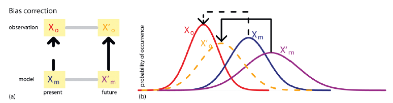

## Metodologias para Correção de Viés dos Dados Climáticos

Para a etapa de remoção de viés, a metodologia de mapeamento de quantil-quantil (*Quantile Mapping* QM) proposta por Bárdossy & Pegram (2011) é forte candidata a ser empregada. O método é baseado na comparação das funções cumulativas de probabilidade da variável observada e da variável estimada por um modelo climático no período atual e futuro. Nesse caso, a variável analisada será a precipitação diária ou os valores resultantes das séries de máximos anuais.

Entretanto, existem outras possibilidades metodológicas para a correção de viés, as quais vêm sendo amplamente discutidas e aprimoradas na literatura. Entre as abordagens estatísticas destaca-se o *Delta Change*, que constitue, junto com o QM, a base conceitual de muitos procedimentos modernos de *downscaling* e ajuste de viés. O método *Delta Change* aplica fatores de variação obtidos a partir da diferença ou razão entre o clima futuro e o histórico do modelo, transferindo essas alterações às séries observadas para gerar projeções ajustadas.

### *Equidistant Quantile Matching* (EQM)

Baseado no QM o método EQM [@Srivastav.2014; @Simonovic.2016; @Simonovic.2017] é um método de correção de viés que ajusta projeções climáticas preservando o sinal de mudança previsto pelo modelo. o EQM aplica a diferença entre os quantis simulados futuros e históricos à distribuição observada histórica. Desta forma, ele corrige o viés mantendo as tendências e variações projetadas pelo modelo.

Abaixo está a descrição do método:

(i) Extrair máximos subdiários dos dados observados em um determinado local:

$$
X_{\max}^{STN} =
\begin{bmatrix}
x_{1,\max}^{STN,5\min} & x_{1,\max}^{STN,10\min} & \cdots & x_{1,\max}^{STN,24hr} \\
x_{2,\max}^{STN,5\min} & x_{2,\max}^{STN,10\min} & \cdots & x_{2,\max}^{STN,24hr} \\
x_{3,\max}^{STN,5\min} & x_{3,\max}^{STN,10\min} & \cdots & x_{3,\max}^{STN,24hr} \\
\vdots & \vdots & \ddots & \vdots \\
x_{N,\max}^{STN,5\min} & x_{N,\max}^{STN,10\min} & \cdots & x_{N,\max}^{STN,24hr}
\end{bmatrix}
\tag{1}
$$

Onde, $x_{i,\max}^{STN,j}$ é a precipitação máxima subdiária em uma estação (STN)para a j-ésima duração no i-ésimo ano; e N é o número total de anos.

(ii) Extrair os máximos diários (24 horas) para o período base histórico do modelo GCM selecionado:

$$
X^{GCM}_{\text{max}} =
\begin{bmatrix}
X^{GCM}_{1,\text{max}} \\
X^{GCM}_{2,\text{max}} \\
X^{GCM}_{3,\text{max}} \\
\vdots \\
X^{GCM}_{N,\text{max}}
\end{bmatrix}
\tag{2}
$$

Onde, $X_{i,\max}^{GCM}$ representa a precipitação diária máxima do modelo GCM no i-ésimo ano e $N$ é o número total de anos (é utilizado o mesmo intervalo de tempo dos dados históricos/observados).

(iii) Extrair máximos diários dos Cenários RCP (i, (iii) Extrair máximos diários dos Cenários RCP para o modelo GCM selecionado:

$$
X^{GCM,Fut}_{\text{max}} =
\begin{bmatrix}
X^{GCM,RCP26}_{1,\text{max}} & X^{GCM,RCP45}_{1,\text{max}} & X^{GCM,RCP85}_{1,\text{max}} \\
X^{GCM,RCP26}_{2,\text{max}} & X^{GCM,RCP45}_{2,\text{max}} & X^{GCM,RCP85}_{2,\text{max}} \\
X^{GCM,RCP26}_{3,\text{max}} & X^{GCM,RCP45}_{3,\text{max}} & X^{GCM,RCP85}_{3,\text{max}} \\
\vdots & \vdots & \vdots \\
X^{GCM,RCP26}_{N_F,\text{max}} & X^{GCM,RCP45}_{N_F,\text{max}} & X^{GCM,RCP85}_{N_F,\text{max}}
\end{bmatrix}
\tag{3}
$$

Onde, $X_{\max}^{GCM,Fut}$ representa a precipitação diária máxima para os cenários futuros considerados; e $N_F$ é o número total de anos considerados para o período futuro.

(iv) Ajustar uma distribuição de probabilidade aos máximos diários do modelo GCM (cada uma das séries de máximos subdiários para os dados observados e máximos diários para os cenários futuros).

$$
PDF^{GCM} = f(\theta^{GCM}/X_{max}^{GCM})
\tag{4}
$$

$$
PDF_{j}^{STN} = f(\theta^{STN_,j}/X_{max}^{STN_,j})
\tag{5}
$$

$$
PDF^{GCM_,Fut} = f(\theta^{GCM}/X_{max}^{GCM_,Fut})
\tag{6}
$$

Onde, $PDF$ representa a função de distribuição de probabilidade, \$f()% é a função, $\theta$ é o parâmetro da distribuição ajustada.

(v) A distribuição de probabilidade cumulativa do GCM e da série subdiária são equiparadas para estabelecer uma relação estatística entre elas e obter a série subdiária modelada pelo GCM $Y_{max,j}^{GCM}$ usando o princípio do mapeamento baseado em quantis. Trata-se de um *downscalig* espacial dos dados dos máximos diários do GCM para os máximos subdiários observados:

$$
Y_{max,j}^{STN} = CDF((invCDF(X_{max}^{GCM}/\theta^{GCM}))/\theta^{STN,j})
\tag{7}
$$

Onde, $Y_{max,j}^{STN}$ é uma série máxima subdiária estatisticamente reduzida para a j-ésima duração; $CDF$ significa função de distribuição de probabilidade cumulativa; e $invCDF$ significa CDF inversa.

(vi) Estabelecer uma relação estatística semelhante de mapeamento quantílico que modele a mudança entre os máximos atuais do GCM e os máximos futuros do GCM. Trata-se de um *downscaling* temporal dos dados das simulações projetadas do GCM dos máximos diários para o GCM diário de referência:

$$
Y_{max}^{GCM,Fut} = CDF((invCDF(X_{max}^{GCM}/\theta^{GCM}))/\theta^{GCM,Fut})
\tag{8}
$$

Onde, $Y_{max}^{GCM,Fut}$ é a correspondência quantílica entre o período de referência e o período de projeção.

(vii) Encontrar uma função apropriada para relacionar $Y_{max,j}^{STN}$ e $X_{max}^{GCM}$. A literatura sugere que, na maioria dos casos, a relação observada é linear. É evidente a partir da CDF de Gumbel que isso resulta em uma equação linear quando se igualam as duas CDFs. É importante observar que não há garantia de que o uso de outras funções de distribuição resultaria em equações lineares de primeira ordem semelhantes:

$$
Y_{max,j}^{STN} = f(X_{max}^{GCM})
\tag{9}
$$

$$
Y_{max,j}^{STN} = a_{1} \times X_{max}^{GCM} +b_{1}
\tag{10}
$$

(viii) Encontrar uma função apropriada para relacionar $Y_{max}^{GCM,Fut}$ e $X_{max}^{GCM}$:

$$
Y_{max}^{GCM,Fut} = f(X_{max}^{GCM})
\tag{11}
$$

$$
Y_{max}^{GCM,Fut} = a_{2} \times X_{max}^{GCM} +b_{2}
\tag{12}
$$

(ix) Para gerar dados subdiários máximos futuros, combinar as equações acima em:

$$
X^{STN, future}_{\max,j} 
= a_{1} \times 
\left[ 
\frac{X^{GCM, future}_{\max} - b_{2}}{a_{2}} 
\right] 
+ b_{1} 
\tag{13}
$$

(x) Gerar curvas IDF para os dados subdiários futuros e comparar as mesmas com as curvas IDF observadas historicamente para obter a variação nas intensidades.

### *Equidistant Quantile Matching non-stationary*

O EQM também possui uma versão não estacionária que integra modelagem estatística, correção de viés e reavaliação da não estacionariedade para o período projetado [@Silva.2021; @Silva.2021b]. Para a GEV não estacionária, os parâmetros variantes ($\mu$ e $\sigma$ - localização e escala) no tempo são derivados calculando o percentil 95 do valor do parâmetro de tendência pelas Equações $\hat{\mu}_{95} = Q_{95}(\hat{\mu}_1, \hat{\mu}_2, \ldots, \hat{\mu}_n)$ e $\hat{\sigma}_{95} = Q_{95}(\hat{\sigma}_1, \hat{\sigma}_2, \ldots, \hat{\sigma}_n)$. Os parâmetros do modelo calculados são então substituídos na Equação (14) e a intensidade ou profundidade da precipitação não estacionária é estimada.

$$
z_p = \mu - \frac{\sigma}{\xi} \left[\, 1 - \left\{ -\ln\!\left(1 - \frac{1}{T}\right)^{-\xi} \right\} \right]
\tag{14}
$$

No EQM original, a função de mapeamento de quantis realiza o *donwscaling* espacial transferindo o quantil da distribuição historicamente observada para a distribuição historicamente modelada. Utilizando o princípio do mapeamento de quantis, a distribuição de probabilidade cumulativa do GCM ($F_{m,h}$) e a série subdiária ($x_{j,o,h}$) são igualadas para estabelecer uma relação estatística entre elas e para obter valores subdiários modelados pelo GCM ($\hat{x}_{j,o,h}$) conforme mostrado na Equação (15):

$$
\hat{x}_{j,o,h} = F_{j,o,h}^{-1}\left[ F_{m,h}(x_{m,h}) \right]
\tag{15}
$$

onde $\hat{x}$ é o quantil máximo anual na escala da estação, $F$ é a função de distribuição cumulativa e $F^{-1}$ é sua inversa. $j,o,h$ correspondem a cada dado de precipitação observado subdiário ($‘j’$) ($‘o’$) no período histórico-base ($‘h’$), enquanto $‘m’$ permanece como os dados modelados. Os quantis extraídos de cada par \hat{x}\_{j,o,h} e $x_{m,h}$ são igualados para estabelecer uma relação funcional na forma da Equação (16):

$$
\hat{x}_{j,o,h} = \frac{a_j + x_{m,h}}{b_j + c_j x_{m,h}} + \frac{d_j}{x_{m,h}}
\tag{16}
$$

onde $a_j$, $b_j$, $c_j$ e $d_j$ são os coeficientes ajustados. Um algoritmo de otimização por Evolução Diferencial é usado para ajustar os coeficientes. O método dos Mínimos Quadrados Ordinários é usado como função objetivo a ser otimizada (minimizada) para obter o conjunto ótimo de coeficientes. Ao contrário do EQM original, no qual o *downscaling* espacial é aplicado assumindo que não há padrão de tendência nos parâmetros de distribuição GEV do período histórico, o novo $EQM_{NS}$ introduz os efeitos da não estacionariedade nas séries temporais históricas de AMPs, adotando os valores do percentil 95 dos parâmetros variáveis, como explicado anteriormente. Esta etapa garante que a não estacionariedade presente mesmo no período histórico seja considerada gerando IDFs para condições futuras.

Semelhante ao EQM, o $EQM_{NS}$ utiliza o mapeamento delta de quantis, uma vez que preserva as mudanças relativas na média e nos quantis de precipitação obtidos a partir dos modelos climáticos. A distribuição de probabilidade cumulativa da precipitação gerada pelo GCM no período futuro ($F_{m,f}$ ) e a precipitação gerada pelo GCM no período de referência ($X_{m,h}$) são igualadas para estabelecer uma relação estatística (Equação (17)). Além disso, a mudança relativa entre o período histórico e o período futuro é dada pela Equação (18):

$$
\hat{x}_{m,h} = F_{m,h}^{-1}\left[ F_{m,f}(x_{m,f}) \right]
\tag{17}
$$

$$
\Delta_m = \frac{x_{m,f}}{\hat{x}_{m,h}}
\tag{18}
$$

onde $m,f$ corresponde aos dados modelados ($‘m’$) no período de projeção futuro ($‘f’$), e $\Delta_m$ é a mudança relativa. A série subdiária máxima futura projetada ($X_j,f$ )) na escala da estação é então gerada usando a Equação (16) substituindo $x_{m,h}$ por $\hat{x}_{m,h}$ e multiplicando-a pela mudança relativa Dm da Equação (18), conforme dado pela Equação (19):

$$
x_{j,f} = \Delta_m \cdot \hat{x}_{j,o,h}
\tag{19}
$$

### *Quantile–Quantile Downscaling*

Outro método baseado no QM é o *Quantile–Quantile Downscaling* (QQD) [@Hassanzadeh.2014; @Hassanzadeh.2019] que é um método estatístico que combina *downscaling* e correção de viés ao ajustar quantil a quantil a distribuição simulada por modelos climáticos para coincidir com a distribuição observada em uma escala local. Em vez de apenas reduzir a escala espacial, o QQD também corrige sistematicamente as diferenças entre o clima simulado e o real, garantindo que a série resultante apresente características estatísticas (como média, variabilidade e extremos) mais próximas das observações históricas.

O método é uma forma não linear e simbólica de Quantile Mapping, desenvolvida via Programação Genética (GP). O GP é uma técnica geral orientada por dados inspirada no conceito de evolução biológica.Uma forma especial de GP, a regressão genética simbólica (GSR), visa encontrar equações ótimas que possam relacionar o preditor ao predito por meio da busca aleatória adaptativa [@Hassanzadeh.2014].

O GP cria equações que relacionam o quantil do GCM $(Q_{GCM}(X))$ com o quantil local ajustado $(Q_{Local}(X))$. Assim, a estutrutra geral do mapeamento é:

$$
Q_{Local}(x) = aQ_{GCM}(x) + f[Q_{GCM}(x)]
\tag{20}
$$

Onde $aQ_{GCM}(x)$ pode ser considerado a parte principal das relações extraídas que descrevem a maior parte da variância. O termo $a$ em cada relação é um coeficiente numérico; $f[Q_{GCM}(x)]$ é uma função não linear gerada automaticamente pelo algoritmo GP.

### *Bias Correction Quantile Mapping* (BCQM)

O método BCQM corrige diretamente as funções de distribuição cumulativa (CDFs) [@Lanzante.2018; @Lanzante.2021]. Ele é calculado como:

$$
F_{DF}(x) = F_{Oh}[F^{-1}_{Mh}(x)]
\tag{21}
$$

Onde $F$ é a função de distribuição cumulativa; $F^{−1}$ sua inversa; $x$ o valor de $M_f$ (Modelo futuro) a ser reduzido e $M_h$ refere-se ao Modelo histórico;$O_h$ são as observações históricas e $D_f$ refere-se a saída futura em escala reduzida.

Os autores afiram que equação (21) não é aplicável a valores novos, ou seja, para valores de $M_f$ fora do intervalo de valores de $M_h$. Quando isso ocorre, usa-se uma modificação da extrapolação padrão [@deque.2007]:

Lanzante et al. [-@Lanzante.2018] afirmam que se referem ao BCQM inspirados pelo trabalho de Ho et al. [-@Ho.2012] em que a estratégia de correção de viés pressupõe que as discrepâncias do modelo permanecem constantes ao longo do tempo (ou seja, a relação entre as distribuições de $X_o$ e $X_m$ é a mesma que a relação entre as distribuições de $X^{′}_o$ e $X^{′}_m$), ver Figs. 1a,b. Isso permite que previsões de observáveis futuros sejam obtidas mapeando de simulações futuras do modelo, $X^{′}_o = B(X^{′}_m)$, com uma função de transferência dada por $B(X^{′}_m) = F^{-1}_o[F_{m}(X^{′}_m)]$, onde $F_m$(.) é a função de distribuição cumulativa (CDF) de $X_m$ e $F^{-1}_o$(.) é a CDF inversa (a “função quantil”) de $X_o$.

 Figura 1. (a) mostra o diagrama esquemático para calibração das projetoões do modelo climático: correção de viés; (b) mostra um exemplo da função de densidade de probabilidade (PDF) das variávei envolvidas.

Onde, <!-- ainda falta terminar essa parte-->

### *Kernel Density Distribution Mapping* (KDDM)

utiliza densidades suavizadas por meio de funções kernel[@Lanzante.2021]

O KDDM utiliza um algoritmo complexo de múltiplas etapas que envolve estimativa de densidade de kernel para suavizar $O_h$ e $M_h$. A subsequente integração das funções de distribuição geradas, seguida pela padronização inversa, produz as funções de transferência desejadas. Lanzante et al. [-@Lanzante.2021], na aplicação do método, utilizaram o código R fornecido pelos autores do KDDM (https://github.com/sethmcg/climod).

<!--vale a pena descrever por completo esse método?-->

### *Quantile Delta Mapping* (QDM)

Por sua vez, o QDM preserva o sinal de mudança climática aplicando ajustes aditivos ou multiplicativos às distribuições [@Lanzante.2021].

A forma aditiva é:

$$
D_f(x) = x + \left[ F_{Oh}^{-1}\big(F_{Mf}(x)\big) - F_{Mh}^{-1}\big(F_{Mf}(x)\big) \right]
\tag{22}
$$ 

E a forma multiplicativa é:

$$
D_f(x) = x X \left[ F_{Oh}^{-1}\big(F_{Mf}(x)\big)/F_{Mh}^{-1}\big(F_{Mf}(x)\big) \right]
\tag{23}
$$ C código R disponibilizado pelos autores do QDM está em: (https://github.com/cran/MBC).

### PresRat (PRAT)

O método PresRat estende o QDM incluindo um fator de correção médio [@Lanzante.2021]. Cada valor de $D_f$ calculado a partir de (23) é multiplicado por um fator de correção $K$ específico para o mês do calendário:

$$
K=(\bar M_f/ \bar M_h)(\bar D_f/ \bar O_h)
\tag{24}
$$ 

Onde as barras indicam as médias climatológicas ao longo de um mês.

### *Quantile Perturbation Downscaling* (QPD)

O método aplica fatores de perturbação específicos por quantil e duração às projeções dos modelos regionais (RCMs), preservando a estrutura de variabilidade dos extremos. Os fatores de correção são estimados para cada célula de grade reamostrada, usualmente por interpolação bilinear, garantindo consistência espacial e coerência estatística entre as projeções ajustadas [@Willems.2013; @Hosseinzadehtalaei.2020].

Willems [-@Willems.2013] afirma que o fator de perturbação é calculado nos quantis de intensidade de precipitação em dias chuvosos como a razão entre a intensidade de precipitação da simulação de cenário sobre a intensidade de precipitação da simulação de controle para a mesma probabilidade de excedência empírica $(p)$ ou período de retorno:

$$
\varphi({p}) = \frac{I_s({p})}{I_c({p})}
\tag{25}
$$
onde $\varphi({p})$ é o fator de perturbação quantílica; $I_c({p})$ o quantil de precipitação da simulação de controle; $I_s({p})$ o quantil de precipitação da simulação de cenário. Eles podem ser calculados com base nos valores empíricos de intensidade e período de retorno da precipitação. Dados os extremos empíricos de precipitação classificados, $I(1)\geq I(2)\geq...\geq I(n_g)$, a probabilidade de excedência $p$ de qualquer intensidade de precipitação diária $I(k_g)$ é calculada empiricamente como a razão $(\frac{kg} {ng})$ do número de classificação $k_g$ sobre o número total de dias $n_g$ do período completo da série temporal do qual os extremos foram extraídos. Se o número de dias chuvosos for diferente nas simulações de controle e de cenário, o conjunto de valores empíricos de período de retorno pode diferir. Nesse caso, interpolações são necessárias ou o período de retorno empírico mais próximo é selecionado.

Para períodos de retorno elevados, devido à aleatoriedade nos dados empíricos, os períodos de retorno empíricos podem diferir significativamente dos períodos de retorno teóricos derivados das distribuições de probabilidade calibradas. Por essa razão, Willems [-@Willems.2013] aplica distribuições teóricas exponenciais de dois componentes para valores extremos.

Essas distribuições são calibradas aos dados empíricos e aplicadas, conforme abaixo, para derivar os fatores de perturbação dos quantis:

$$
\varphi({p}) = \frac{G^{-1}_s({p})}{G^{-1}_c({p})}
\tag{26}
$$
onde $G_s_$ é a função de sobrevivência da distribuição exponencial de dois componentes valores extremos calibrada para as intensidades de precipitação da simulação de cenário; $G_c$ calibrada para as intensidades de precipitação da simulação de controle. Para quantis acima do limiar da distribuição de valores extremos,
os fatores de perturbação quantílica foram baseados na distribuição de valores extremos, Eq. (26), enquanto para quantis abaixo desse limiar, eles foram baseados nos dados empíricos, Eq. (25).

::: {#refs}
:::
