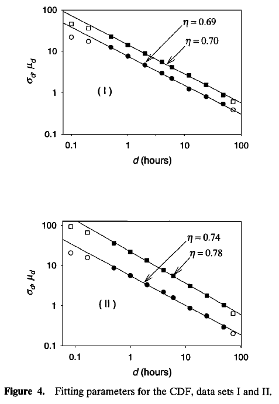

## Desagregação Temporal {#sec-desagregacao}

As relações Intensidade–Duração–Frequência (IDF) são centrais na engenharia de recursos hídricos, pois orientam o dimensionamento seguro e econômico de drenagem, bueiros, pontes e barragens. Em termos simples, uma curva IDF define $(i=f(d,T)$, relacionando a intensidade média máxima $i$, a duração $d$ e a frequência (período de retorno $T$, ou probabilidade anual de excedência). A partir dessas curvas, estimam-se as chuvas de projeto, isto é, eventos de magnitude e raridade específicas que a infraestrutura deve suportar [@Vyver.2018].

É útil distinguir IDF (intensidades), DDF (profundidade–duração–frequência) e hietogramas de projeto. As curvas IDF/DDF fornecem valores agregados por duração, mas não especificam o padrão temporal intradiário, que geralmente é obtido por desagregação ou por perfis de projeto. Na prática, as IDFs são frequentemente ajustadas com Distribuição Generalizada de Valores Extremos (GEV) ou com a distribuição de Gumbel sob hipótese de estacionariedade [@Baldassarre.2006; @Courty.2019; @Yeo.2021].

Um desafio recorrente é a assimetria de resolução. Projetos podem exigir intensidades subdiárias (minutos–horas), enquanto grande parte das observações históricas está em escala diária. Além disso, as redes pluviográficas costumam ser esparsas e curtas, o que dificulta a caracterização de picos intradiários sem incorrer em subdimensionamento ou sobrecustos.

A desagregação temporal é a principal resposta a essa assimetria. O objetivo não é apenas “quebrar” um total diário em partes, mas reconstruir uma dinâmica subdiária plausível, preservando: (i) a massa diária (quando aplicável), (ii) a intermitência (sequência seco–úmido), (iii) a variabilidade intradiária e (iv) as propriedades de extremos. Em outras palavras, busca-se gerar séries subdiárias estatisticamente consistentes com a observação e adequadas ao uso em modelos hidrológicos.

Para organizar o vasto campo de metodologias, esta revisão as classifica em cinco famílias principais, seguindo uma progressão lógica que parte de abordagens empíricas diretas em direção a modelos estocásticos e estatísticos cada vez mais abrangentes. A classificação inicia-se com (i) Fórmulas Empíricas e Regionais, a base histórica e prática da engenharia. Em seguida, avança para os (ii) Modelos de Processos Pontuais, que buscam simular a microestrutura geradora da chuva. Uma perspectiva alternativa é apresentada pelos (iii) Modelos Baseados em Invariância de Escala, que exploram simetrias estatísticas fundamentais do processo chuvoso. A revisão aborda também as (iv) Técnicas Não Paramétricas, que se libertam de premissas distributivas por meio de reamostragem, e finaliza com a (v) Modelagem Hierárquica de Extremos, que representa o arcabouço mais moderno para a síntese de informação e a quantificação da incerteza.

### Fórmulas/ajustes empíricos e regionais (equações IDF/DDF, isozonas, coeficientes) {#subsec-empirico}

Uma das abordagens mais diretas e difundidas na desagregação temporal baseia-se em relações empíricas que traduzem totais de chuva de longa duração em durações mais curtas por meio de fatores de ajuste ou equações regionalizadas [@Abreu.2022].

#### Coeficientes empíricos

O método de desagregação por coeficientes empíricos permite converter dados de durações maiores (tipicamente diárias) para durações menores (subdiárias). O processo consiste em aplicar um fator de ajuste a um quantil (ou valor de projeto) de uma duração de referência para estimar o valor correspondente em uma duração inferior, mantendo o mesmo período de retorno $T$ [CETESB, 1979; @Abreu.2022]

No Brasil, o método das Relações de Redução de Duração Diária (RRDD) é uma das principais técnicas de desagregação de séries diárias em subdiárias. Seu funcionamento baseia-se em coeficientes de desagregação ($CD_d$), definidos por razões entre precipitações máximas em diferentes durações. Dado um valor de projeto diário $P24h(T)$, obtém-se, por exemplo, o valor para $d=1h$ por:

$$
P_d(T)=CD_d×P24h(T), d\in\{6\ \text{min},1\ \text{h},2\ \text{h},\dots\}.
$$ {#eq-coef-rrdd}

A partir desses pontos, derivam-se curvas IDF/DDF completas usando a base diária [CETESB, 1979; @Abreu.2022]. No contexto brasileiro, os coeficientes de desagregação mais amplamente aplicados são originalmente estabelecidos pela CETESB (1979). Eles são obtidos a partir da média de registros subdiários provenientes de pluviógrafos instalados em diversas localidades do país e, por isso, acabam sendo considerados como coeficientes gerais para todo o território nacional.

A literatura recente propõe diversas variações e aprimoramentos. Nesse contexto, Abreu et al. [-@Abreu.2022] comparam coeficientes padrão ($CD_{\mathrm{standard}}$ - CETESB) e coeficientes específicos ($CD_{\mathrm{specific}}$ - estimados posto a posto). A partir deles, constroem as respectivas curvas IDFs, ajustando os parâmetros da equação IDF genérica:

$$
i(d,T) \;=\; \frac{k\, T^{a}}{(d+b)^{c}}
$$ {#eq-idf-empirica}

via Gauss–Newton sobre os pontos gerados pelos coeficientes. Para a espacialização do $CD_{\mathrm{specific}}$ aplicam a técnica de interpolação por Ponderação do Inverso da Distância (*Inverse Distance Weighting – IDW*). O Atlas Pluviométrico do Brasil (CPRM, 2013) adota uma abordagem paramétrica mais elaborada, utilizando uma relação log-linear entre a precipitação acumulada $P$ (mm) e a duração $d$, cujos coeficientes dependem do período de retorno e $T$ (anos):

$$P(T,d)=J\,\ln\!\Big(d+\tfrac{\alpha}{60}\Big)+K,\qquad J=A\ln T+B,\quad K=C\ln T+E$$ {#eq-cprm-atlas}

onde $\alpha$ (min) é um parâmetro de correção de duração que “desloca” o eixo das abscissas e lineariza o comportamento para tempos curtos. Essa formulação permite consistência e suavização entre durações, preservando a escala de retorno por meio dos termos $J$ e $K$.

#### Isozonas

A metodologia de isozonas é uma abordagem de regionalização que se baseia no princípio de que áreas climaticamente semelhantes exibem comportamento homogêneo em relação às chuvas intensas. Proposto por Torrico (1974) para o Brasil, o conceito foi aplicado e revisitado por Basso et al. [-@Basso.2016], que utilizaram um conjunto mais amplo para redefinir as zonas homogêneas e os coeficientes de desagregação regionais. No processo de rezoneamento, as intensidades e as relações entre durações obtidas a partir das IDF atuais são comparadas às estimadas por Torrico (1974) com ênfase em $r_{1(h)},24h$, apoiando-se em mapas climáticos nacionais para áreas com baixa densidade de dados e verificando a homogeneidade intra-zona por estatísticas descritivas. O resultado é um conjunto de novas isozonas e coeficientes regionais de desagregação $r_{d(h)},24h$, para $T=10$ anos.

Além de coeficientes e isozonas, há uma vertente importante de equações paramétricas DDF/IDF. Baldassarre et al. [-@Baldassarre.2006] realizam um estudo para testar a confiabilidade de sete diferentes curvas DDF (quatro com dois parâmetros e três com três parâmetros). Essas curvas foram calibradas utilizando o método dos mínimos quadrados com dados de precipitação observados referentes a durações mais longas (1, 3, 6, 12 e 24 horas). Após a calibração, as curvas DDF são extrapoladas para estimar as profundidades de precipitação de projeto para durações mais curtas, especificamente 15, 20, 30 e 45 minutos. O estudo ilustra a sensibilidade à forma da equação e os riscos de extrapolar para durações curtas fora do intervalo de calibração, motivando o uso de formulações que imponham consistência entre durações quando possível.

### Modelos de Processos Pontuais {#subsec-processos-pontuais}

Em contraste com a simplicidade dos coeficientes empíricos, os modelos de processos pontuais buscam reproduzir a estrutura estocástica interna da chuva. A premissa fundamental, inspirada na Teoria do Processo Pontual, é que a precipitação pode ser representada como uma sequência de pulsos ou células de chuva, cujas chegadas, durações e intensidades são governadas por processos aleatórios. Dentro desse arcabouço, consolidaram-se duas famílias principais de processos de agrupamento: *Neyman–Scott* e *Bartlett–Lewis*, capazes de reproduzir estatísticas de primeira e segunda ordem em uma ampla faixa de agregações temporais [@KOUTSOYIANNIS2001109].

O modelo de Pulsos Retangulares de *Bartlett–Lewis* original baseia-se nas seguintes hipóteses: (1) as origens dos episódios chuvosos $d_i$ seguem um processo de Poisson com taxa $\lambda$; (2) dentro de cada episódio $i$, as origens das células $d_{ij}$ seguem um processo de Poisson com taxa $\beta$; (3) o nascimento de células no episódio $i$ cessa após um tempo $v_i$ com distribuição exponencial de parâmetro $\gamma$; (4) cada célula tem duração $w_{ij}$ com distribuição exponencial de parâmetro $\eta$; e (5) cada célula possui intensidade uniforme $X_{ij}$ com distribuição especificada. Neste arcabouço, a desagregação temporal é tratada como geração estocástica em passo fino (por exemplo, horário ou sub-horário): calibra-se o modelo com estatísticas observadas em escalas mais grossas e simula-se a sequência de pulsos; ao agregar a série simulada, recuperam-se as estatísticas-alvo nas escalas de 1–24 h.

Para ampliar a flexibilidade multiescala e melhorar a representação dos períodos secos/úmidos, é proposto o Modelo de Pulso Retangular *Bartlett-Lewis* Modificado (MBLPRM). Na versão modificada, $\eta$ varia aleatoriamente de episódio para episódio segundo uma distribuição Gamma com parâmetro de forma $\alpha$ e escala $\nu$. Em seguida, $\beta$ e $\gamma$ também variam de modo que as razões $\kappa := \beta/\eta$ e $\phi := \gamma/\eta$ permaneçam constantes. A intensidade $X_{ij}$ costuma ser modelada como exponencial com parâmetro $1/\mu_x$; alternativamente, pode-se adotar uma Gamma de dois parâmetros com média $\mu_x$ e desvio-padrão $\sigma_x$. Assim, na forma mais simplificada o modelo usa cinco parâmetros $(\lambda, \beta, \gamma, \eta, \mu_x)$ (ou, de forma equivalente, $\lambda, \kappa, \phi, \eta, \mu_x$), e, na versão modificada, sete parâmetros: $\lambda, \kappa, \phi, \alpha, \nu, \mu_x, \sigma_x$.

Um avanço fundamental foi condicionar esses geradores estocásticos aos totais diários observados, transformando-os em ferramentas de desagregação propriamente ditas. Koutsoyiannis & Onof [-@KOUTSOYIANNIS2001109] implementaram essa ideia no [HYETOS](https://www.itia.ntua.gr/en/softinfo/3/), um software que gera séries em passo fino usando o modelo de *Bartlett–Lewis* e aplica um ajuste proporcional para para garantir que a soma das intensidades subdiárias iguale exatamente o total diário observado. Kossieris et al. [-@KOSSIERIS2018980] generalizam esse arcabouço no *HyetosMinute*, estendendo a desagregação para escalas sub-horárias até 1 minuto e incorporando variantes do *Bartlett–Lewis* que aumentam a variabilidade intradiária, como o modelo com parâmetro de intensidade randomizado e a versão que impõe dependência entre intensidade e duração da célula.

Em aplicações recentes, Tayşi & Özger [-@Tayşi.2021] utilizam o modelo *HYETOS* para a desagregação de precipitações, destacando sua relevância em contextos práticos. O trabalho projeta curvas IDF sub-horárias a partir de 4 GCMs (RCP4.5/8.5) e desagrega a chuva diária com *HYETOS* calibrado em dados horários observados, preservando padrões históricos. Em seguida, compara as curvas IDF históricas com as futuras para avaliar mudanças esperadas na intensidade-duração-frequência.Em contribuição mais recente, Qin & Dai [-@Qin.2024] propuseram o Modelagem por Processos Pontuais e Desagregação da Precipitação (*Point-Process Modelling and Rainfall Disaggregation* – PPMRD) que utiliza diversos modelos de processo pontual e procedimentos de ajuste, baseados no trabalho de Kossieris et al. [-@KOSSIERIS2018980], para gerar e desagregar dados de precipitação. A premissa é que um gerador (processo pontual) bem parametrizado reproduz as estatísticas observadas em um conjunto de escalas verificadas; a desagregação deve, então, operar entre escalas superior e inferior escolhidas dentre essas escalas. A desagregação no PPMRD generaliza o esquema tipo *HYETOS*: em vez de “dias úmidos”, trabalha-se com sequências úmidas com nível superior (por exemplo, blocos 3 h, 6 h ou 24 h), separadas por pelo menos um intervalo seco. Para cada sequência úmida, o gerador produz a série em passo fino; essa série é agregada de volta à escala superior e comparada ao registro observado por um critério de erro descrito pela equação:

$$
E=\max\left\{\sqrt{\sum_{l=1}^{L}\left(\frac{P_s(l)-P_o(l)}{P_o(l)}\right)^{2}},\;\sqrt{\sum_{l=1}^{L}\left(\frac{P_o(l)-P_s(l)}{P_s(l)}\right)^{2}}\right\}
$$ {#eq-criterio-erro}

onde $l$ é o índice da série úmida no nível superior e $L$ é o comprimento total; $P_s$ e $P_o$ são, respectivamente, as séries de precipitação no nível superior sintética e observada. Sequências longas são segmentadas de forma controlada: define-se previamente um comprimento máximo $U_\max$ por mês, a partir de um procedimento que cresce o comprimento $l$ de uma sequência típica, gera ensembles e observa o percentil $p$ do erro $E_p(l)$ até ultrapassar um limiar $E_{th}$; então fixa-se $U_\max=l^*-1$. Caso uma sequência exceda $U_\max$, ela é dividida aleatoriamente em sub-sequências com comprimentos entre 1 e $U_\max$, processadas independentemente e, ao final, reunidas. Por fim, aplica-se o ajuste proporcional clássico para garantir coincidência exata entre o total agregado do sintético e o total observado na escala superior.

Para explicitar o trade-off entre conservação estrita do total diário e capacidade estocástica de reproduzir dependência de curto prazo, Vorobevskii et al. [-@Vorobevskii.2023] compararam comparam dois modelos recentes. O \[WayDown\] (https://github.com/ hydrovorobey/WayDown) um modelo condicional, utiliza cadeias de Markov de dois estados (chuva/não-chuva) e cópulas para gerar padrões subdiários que, após um ajuste proporcional, correspondem exatamente ao total diário. Em contraste, o \[LetItRain\] (https://sites.google.com/site/hihydrology/projects?authuser=0) é um gerador incondicional de séries de precipitação que estende os modelos de agrupamento de Poisson (*Neyman–Scott/Bartlett–Lewis*), foca em reproduzir um conjunto mais amplo de momentos estatísticos em múltiplas escalas de agregação, oferecendo maior variabilidade de cenários ao custo de não preservar o total diário exato. Os autores observam que o *WayDown* tende a reproduzir melhor a mediana das estatísticas, enquanto o *LetItRain* fornece maior variabilidade de cenários. Ambos podem superestimar extremos até certo limiar e subestimar acima dele, explicitando a troca entre conservação de massa diária e liberdade estatística intradiária.

### Modelos Baseados em Invariância de Escala / Autossemelhança / Fractais {#subsec-invariancia}

Em vez de decompor a chuva em células e episódios, outra abordagem olha para um padrão estatístico que aparece em várias escalas: a invariância de escala. Nela, assume-se que as estatísticas da chuva mudam de forma previsível quando a duração de observação muda, geralmente, seguindo leis de potência.

A ideia de invariância de escala em séries hidroclimáticas consolida-se com Mandelbrot & Wallis [-@Mandelbrot.1968], que interpretaram o efeito de Hurst como uma forma de autossemelhança estatística, onde estatísticas como a variância e a densidade espectral seguem leis de potência. Lovejoy & Schertzer [-@Lovejoy.1985; -@Lovejoy.1986] generalizaram este conceito para a Invariância de Escala Generalizada (GSI), explicando a complexa estrutura anisotrópica dos campos de chuva. Consolidando esse avanço, Gupta & Waymire [-@Gupta.1990] estabelecem a base teórica do multiescalonamento (multiscaling) ao demonstrar que (i) momentos de precipitação e vazões exibem linearidade em gráficos log–log com a escala $\lambda$ e que (ii) a inclinação desses gráficos varia de forma côncava com a ordem do momento ($h$). Em escala simples (*wide sense*), os momentos condicionados seguem

$$
\log
m_h(\lambda)=a_h+\,\theta_h\,\log \lambda
$$ {#eq-inv-scala-wide1}

onde $m_h(\lambda)$ é o momento de ordem $h$ da precipitação acumulada, $a_h$ é o intercepto logarítmico na lei de escala simples e $\theta_h$ é o expoente de escala. No multiescalamento (*wide sense*) a relação geral passa a ser

$$
\log
m_h(\lambda)=s(h)\,\log \lambda+\log m_h(1)
$$ {#eq-inv-scala-wide2}

com $s(h)$ é uma função não linear e côncava, capturando a intensificação da variabilidade ao ir para escalas menores e implicando irreversibilidade de escala (a lei vale para $\lambda<1$, mas não simultaneamente para $\lambda>1$). Esse arcabouço fornece o fundamento matemático de modelos multifractais/cascatas aplicados posteriormente à chuva e à vazão e sustenta, de modo formal, extensões além da escala simples.

Em hidrologia, essa base chega à prática por Koutsoyiannis & Foufoula-Georgiou [-@Koutsoyiannis.1993], ao proporem um modelo de escala simples para a intensidade intra-tempestade capaz de reproduzir, de forma analítica e empírica, hietogramas de diferentes durações e profundidades com poucos parâmetros. O estudo apresenta um modelo de escalonamento para hietogramas de episódios chuvosos em que a intensidade instantânea $s(d,D)$ dentro de um episódio de duração $D$ é autossemelhante:

$$
\{s(d,D)\}\
\overset{d}{=}\ \lambda^{-\eta}\,s(\lambda_d,\lambda_D)
$$ {#eq-inv-escala1}

ou, de forma equivalente,

$$
\{s(d,D)\}\
\overset{d}{=}\ D^{\eta}\,s\!\left(\tfrac{d}{D},1\right)
$$ {#eq-inv-escala2}

onde $\eta$ é o expoente intra-evento. Daí seguem leis de potência para os momentos: a média da intensidade escala como $E[s]=c_1 D^{\eta}$ e a covariância como $D^{2\eta}$ vezes uma função do defasagem normalizada $r/D$. Para o acumulado $h(d,D)=\int_0^{d}s\,\mathrm{d}u$, a auto-semelhança tem expoente $\eta+1$, implicando

$$
E[h(D,D)]=c_1 D^{\eta+1},Var[h(D,D)]=c_2 D^{2(\eta+1)}
$$ {#eq-inv-escala-acumulado}

de modo que o coeficiente de variação do total do episódio permanece constante em relação a $D$. Para a desagregação em passo fixo $\Delta$, os incrementos $\Delta(i,D)=\int_{(i-1)\Delta}^{i\Delta}s\,\mathrm{d}u$ preservam o escalonamento: $E[X_\Delta]=c_1\,(\Delta/D)\,D^\eta$ e $\mathrm{Var}[X_\Delta]\propto D^{2(\eta+1)}$ multiplicado por uma função de $\rho=\Delta/D$ . Assim, a autocorrelação dos incrementos depende apenas de $\rho$ (e do *lag* normalizado), não de $D$ nem de $\eta$. Esse modelo mantém consistência com as curvas de massa utilizadas em projeto, ao contrário de modelos estacionários de intensidade, que não reproduzem a dependência com a duração.

Burlando & Rosso [-@Burlando.1996] constroem um arcabouço para curvas profundidade–duração–frequência (DDF) a partir da hipótese de invariância de escala. A ideia central é estimar conjuntamente (i) o expoente de escala $\eta$, que governa a média e (ii) uma função de dissipação $\psi_\zeta$, que descreve o crescimento dos momentos de ordem $\zeta$ (multiescala), primeiro em um esquema livre de distribuição e, em seguida, com uma modelagem lognormal (LN2) parcimoniosa. No caso de escala simples (*wide-sense*), entre um corte interno $D_i$ e as durações $D$ de interesse, a média e a variância de máximos anuais obedecem leis de potência de $D$. Disso resulta que o coeficiente de variação e, de forma mais ampla, os momentos adimensionais (assimetria e curtose) não dependem de $D$. Esse resultado leva a uma família invariante à escala de DDF:

$$
h_q(D)=a_1\left(1+V K_q\right)\,D^\eta,
$$ {#eq-ddf-invariante}

em que $K_q$ é o fator de crescimento de frequência e $a_1,V,\eta$ são parâmetros de escala (com $a_1$ relacionado ao nível de referência $D_i$). Além disso, os autores mostram como a prática comum de ajustar $h_q(D)=A_q D^{m_q}$ pode ser fundamentada: sob escala simples estrita, o expoente $m_q$ não deve depender de $q$, pois os quantis escalam como os momentos. Menabde et al. [-@Menabde.1997] aprofundaram a caracterização do multiescalonamento e propuseram um modelo de cascata multiplicativa capaz de reproduzir as propriedades observadas, servindo como um gerador multiescala para a desagregação.

Koutsoyiannis et al. [-@KOUTSOYIANNIS1998118] estabelecem um arcabouço matemático para IDF que separa, de forma teoricamente consistente, as componentes de dependência em duração e em frequência. A formulação parte da relação geral

$$
i(T,d)=\frac{a(T)}{b(d)}
$$ {#eq-idf-koutsoyiannis}

em que $i(T,d)$ é a intensidade associada ao período de retorno $T$ e duração $d$, $a(T)$ representa a componente de frequência e $b(d)$ a componente de duração. Essa separabilidade é metodologicamente importante porque permite tratar cada dimensão de forma independente, mas coerente dentro de um mesmo quadro probabilístico.

Os autores propõem uma forma parcimoniosa para a função de duração,

$$
b(d)=(d+\theta)^{\eta},\qquad
\theta>0,\;0<\eta<1
$$ {#eq-coef-duracao}

mostrando que termos adicionais no denominador não são necessários, já que essa formulação apresenta erro de aproximação pequeno. Nessa estrutura, $\eta$ e $\theta$ podem ser mantidos constantes em $T$, de modo que toda a variabilidade em frequência seja capturada apenas por $a(T)$. A componente de frequência é derivada diretamente da distribuição dos máximos, evitando formas empíricas. Definem $Y:=I(d)\,b(d)$ e obtêm

$$
a(T)=F_Y^{-1}(1-1/T)
$$ {#eq-comp-freq}

de modo que $a(T)$ coincide com o quantil de ordem $1−1/T$ da variável $Y$. Para a Gumbel:

$$
a(T)=\Big\{\phi-\ln\!\big[-\ln(1-1/T)\big]\Big\},
$$ {#eq-comp-freq-gumbel}

enquanto para a GEV obtém-se

$$
a(T)=\mu\{\sigma+\big[-\ln(1-1/T)\big]^{-\xi}\Big\},
$$ {#eq-comp-freq-gev}

sendo $(\Xi,\phi)$ e $(\mu,\sigma,\xi)$ parâmetros de escala/localização (e forma, na GEV). Quanto à estimação, os autores propõem um procedimento robusto em duas etapas: primeiro, estimam $\eta$ e $\theta$ maximizando a identidade de distribuição entre os grupos $Y_j=I(d_j)\,b(d_j)$; depois, ajustam os parâmetros da distribuição escolhida para $Y$ e computam $a(T)$ via o quantil teórico. Esse desenho evita a subjetividade de ajustar $a(T)$ por formas empíricas e é compatível com a formulação separável acima.

Menabde et al. [-@Menabde.1999] aplicam a hipótese de escala simples à formulação de curvas IDF nos máximos anuais da intensidade média de chuva em janela de duração $d$. Seja $I_d$ o máximo anual da média móvel $R_d(t)=\frac{1}{d}\int_{t-d/2}^{t+d/2}R(u)\,du$ obtida a partir da série contínua de precipitação $R(u)$. A escala simples em sentido estrito é postulada como

$$
I_d\ \overset{d}{=}\
\left(\frac{d}{D}\right)^{-\eta}\,I_D
$$ {#eq-idf-inv-escala}

o que implica, em termos de distribuição acumulada,

$$
F_d(i)=F_0\!\left(\left(\frac{d}{D}\right)^{\eta}i\right)
$$ {#eq-cdf-inv-escala}

e, em sentido amplo, para momentos de ordem $q$:

$$
\mathbb{E}\!\left[I_d^{\,q}\right]=f(q)\,d^{-\eta
q}
$$ {#eq-momentos-inv-escala}

Nessa estrutura, ao assumir que a CDF dos extremos tem forma padronizada $F\!\left(\frac{i-\mu_d}{\sigma_d}\right)$ (p.ex., EV1/Gumbel), os parâmetros de localização e escala obedecem também a leis de potência em $d$, $\mu_d\propto d^{-\eta}$ e $\sigma_d\propto d^{-\eta}$. Assim, a relação IDF resultante é dada por

$$
i(d,T)=\frac{\mu_d-\sigma_d\;\ln\!\big\{-\ln(1-1/T)\big\}}{d^{\,0}}\;=\;\frac{\mu-\sigma\,\ln\!\big\{-\ln(1-1/T)\big\}}{d^{\,\eta}}
$$ {#eq-idf-gumbel-inv-escala}

válida, empiricamente, de 30 min a 24 h (e, em alguns casos, até 48 h). Além disso, para fixo $T$, os quantis escalam entre durações conforme equação @eq-idf-inv-escala. As verificações com as séries mostram linearidade log–log dos momentos e dos parâmetros $(\mu_d,\sigma_d)$ com declives consistentes $(\eta\approx 0,65–0,780)$. A Gumbel ajusta bem as CDFs dos máximos ao longo das durações na faixa de escala observada. Como $i_d(T)$ e $(\mu_d,\sigma_d)$ obedecem leis de potência em $d$, pode-se transferir quantis entre durações sem recorrer a geradores complexos: estima-se $(\mu,\sigma)$ em 24 h a partir de séries diárias longas, estima-se $\eta$ com uma curta série subdiária local/regional, e então obtêm-se quantis para $d<24$ via $i_d(T)=(d/24\mathrm{h})^{-\eta}\cdot i_{24\mathrm{h}}(T)$ ou diretamente pela fórmula IDF acima. Essa coerência multiescala fornece um mapeamento determinístico útil para *downscaling* de extremos de durações subdiárias a partir de informação diária, mantendo a consistência entre durações exigida por DDF/IDF baseadas em invariância de escala.

{#fig-inv-escala}

O ponto de inflexão metodológico deu-se ao combinar a invariância de escala com a Teoria dos Valores Extremos: ao assumir que, além dos momentos, os parâmetros da distribuição dos máximos anuais (GEV/Gumbel) escalam em lei de potência com a duração, consolidou-se uma classe de modelos IDF robustos e parcimoniosos. Koutsoyiannis et al. [-@KOUTSOYIANNIS1998118] estabeleceram um arcabouço que separa as componentes de frequência e duração numa curva IDF, propondo a forma parcimoniosa e invariante à escala. Menabde et al. [-@Menabde.1999] formalizaram essa ideia, mostrando que, se a intensidade máxima anual segue uma escala simples, então os parâmetros de uma distribuição Gumbel também escalam, resultando numa IDF teoricamente consistente. Este paradigma foi subsequentemente explorado, refinado e aplicado em estudos subsequentes. Nguyen et al. [-@Nguyen.1998] e Yu et al. [-@Yu.2004] demonstraram como usar relações de escala para estimar extremos de curta duração a partir de séries diárias, ancorada em invariância de escala e na distribuição GEV dos máximos, assim como, introduzindo conceitos práticos como fatores de correção e quebras de regime de escala.

Borga et al. [-@Borga.2005] e Ghanmi et al. [-@Ghanmi.2016] aplicaram com sucesso a DDF Gumbel escalável em regiões com dados densos. O paradigma foi levado a uma escala global por Courty et al. [-@Courty.2019], que utilizaram a reanálise ERA5 para derivar um conjunto de curvas IDF universais baseadas no escalonamento dos parâmetros da GEV. A principal contribuição metodológica é formalizar uma IDF contínua em duração, permitindo interpolação suave entre escalas e consistência entre quantis. O modelo proposto assume:

$$
\mu_d =
a\,d^{\alpha},\qquad \sigma_d=b\,d^{\beta},\qquad i_{d,T}=\mu_d+\sigma_d\,y_T
$$ {#eq-par-courty}

onde $d$ é a duração (h), $i_{d,T}$, é o quantil (mm $h^{-1}$) para período de retorno $T$, e $y_T$ é a variável reduzida da GEV. Com base nisso, propõem uma fórmula IDF universal (PXR-4) e verificam, com ERA5 e pluviômetros MIDAS (Reino Unido e cidades globais).

Blanchet et al. [-@Blancheti5] e Mascaro et al. [-@Mascaro.2020] desenvolveram modelos regionais que combinam o escalonamento com técnicas de espacialização, mostrando que os modelos de escala superam outros métodos em locais com poucos dados subdiários. Blanchet et al. [-@Blancheti5] apresentam um enquadramento regional de curvas IDF em que os máximos de precipitação agregados em duração $D$ seguem uma GEV cujos parâmetros obedecem a uma lei de escalonamento simples ao longo de D. As duas hipóteses‐chave são: (i) extremos diários são GEV (justificado por EVT) e (ii) máximos agregados em durações dentro de um intervalo de invariância de escala satisfazem relações de potência. A partir disso, escrevem um modelo GEV em que, tomando uma duração de referência $D_0$, a localização e a escala variam como

$$
\mu_D=\Big(\tfrac{D}{D_0}\Big)^{-\eta}
\, \mu_0,\qquad \sigma_D=\Big(\tfrac{D}{D_0}\Big)^{-\eta} \, \sigma_0
$$ {#eq-gev-par}

mantendo o parâmetro de forma constante, $\xi_D = p$. Aqui $\eta$ é o expoente de escala (inclinação log–log da relação entre parâmetros e duração), $\mu_0$ e $\sigma_0$ são, respectivamente, a localização e a escala na duração $D_0$, $p$ é o parâmetro de forma comum a todas as durações e $D$ é a duração alvo. Esse modelo é calibrado localmente com séries de máximos diários agregados até escalas semanais, no intervalo onde a suposição de escalonamento simples é suportada pelos dados. Em seguida, os vetores $(\eta,\mu_0,\sigma_0,p)$ são espacializados para produzir um modelo regional, permitindo construir IDFs de diferentes durações. Um ponto metodológico importante é a estimação conjunta, por máxima verossimilhança, dos quatro parâmetros por estação, assumindo independência entre durações, com correção tipo *sandwich* para a variância assintótica sob verossimilhança.

Já no trabalho de Mascaro et al. [-@Mascaro.2020], os autores analisam dados de 223 pluviômetros no Arizona, cobrindo durações de 30 min a 24 h, para comparar cinco formulações de curvas IDF: dois locais (At-site; At-site com correção de viés em $\xi$), um regional (*index-flood*) e dois de escala simples (um local, Sc, e um regional novo, RegSc). O estudo mostra evidência robusta de escala simples entre 30 min e 24 h e propõe o RegSc combinando crescimento regional com a escala sob $I_d \overset{d}{=}(d/d_0)^{-\eta}I_{d_0}$, a curva de crescimento é única em $d$ e

$$
i_{T,d}=x_{d_0}\,(d/d_0)^{-\eta}\,i^{\text{GC}}_{T,d_0},\qquad
\mu_d=(d/d_0)^{-\eta}\mu_{d_0},\ \ \sigma_d=(d/d_0)^{-\eta}\sigma_{d_0}
$$ {#eq-mascaro}

com $\mu,\sigma,\xi$ da GEV e $\eta$ comum às durações. Na validação cruzada aplicando *bootstrapping*, todos os modelos têm acurácia similar até $T\le 30$ anos. Para $T$ altos, At-siteBC reduz viés (cauda mais pesada). Quando há poucos medidores sub-diários $(N_t\!\le\!5)$ mas muitos diários $(N_{24h}\!\ge\!10)$, os modelos de escala (Sc/RegSc) superam os demais e a incerteza cai acentuadamente (p.ex., largura do $IC_{90\%}$ e RMSE diminuem). O desempenho depende de captar o controle orográfico sobre $\mu,\sigma$ (forte), enquanto $\xi$ e $\eta$ pouco variam espacialmente.

Ainda, Sane et al. [-@Sane.2018] constroem curvas IDF para o Senegal comparando duas formulações baseadas na hipótese de invariância de escala acoplada à teoria de valores extremos e Yeo et al. [-@Yeo.2021] propõem uma *scaling-GEV* (parâmetros variando com a duração segundo leis de potência) e avaliam diferentes procedimentos para estimar os parâmetros da distribuição dentro desse arcabouço de invariância de escala. Eles comparam abordagens baseadas em momentos/L-momentos, em reescalonamento de quantis e em uso conjunto dos três primeiros momentos (resolvendo numericamente a forma), mostrando que cada escolha afeta a acurácia conforme a faixa de duração.

Em contraste com as formulações paramétricas clássicas de IDF e com usos diretos de Gumbel/GEV, Langousis & Veneziano [-@Langousis.2007] desenvolvem curvas IDF a partir de um modelo de chuva localmente multifractal. Nessa abordagem, a dependência em duração e em frequência emerge do próprio gerador estocástico, em vez de ser imposta por uma forma IDF pré-definida. A inovação central é a decomposição em processo exterior (escala de “episódio” $D$) e processo interior multifractal beta-lognormal, com função de momentos $K(q)=C_b\,(q-1)+C_{\ln}\,(q^2-q)$. Em vez de ajustar extremos anuais por uma distribuição de valores extremos só depois moldar a curva IDF, os autores estimam diretamente os parâmetros do processo interior $(C_b,C_{\ln})$ e do exterior $(D,I_D)$, e derivam os quantis $i_{d,T}$ via a distribuição do máximo $M_d$ no interior de $D$, usando a fatoração do tipo *dressing* ($I_d \overset{d}{=} I_D^{0}\,A_{r_Z}$) e aproximações analíticas para o fator $Z$, o que permite calcular $i_{d,T}$ sem Monte Carlo pesado e sem supor separabilidade estrita em $d$ e $T$.

Van de Vyver [-@Vyver.2018] propõe um modelo IDF fundado em multiescalonamento dos máximos anuais, estendendo a “escala simples + GEV” clássico. Em vez de impor separabilidade $i_T(d)=a(T)\,b(d)$, o autor assume que, para a GEV dos máximos de duração $d$, os parâmetros localização e escala têm expoentes de escala distintos:

$$
\mu(d)=d^{-\eta_1}\,\mu,\qquad \sigma(d)=d^{-\eta_2}\,\sigma,\qquad \xi=\text{constante},\;\; 0<\eta_1\le \eta_2
$$ {#eq-gev-multi-escala}

o que leva a uma IDF não separável em $d$ e $T$:

$$
i_T(d)=d^{-\eta_1}\!\left[\mu-\frac{d^{-\eta_2}\sigma}{\xi}\Big\{1-\big(-\ln(1-1/T)\big)^{-\xi}\Big\}\right]
$$ {#eq-idf-multi-escala-vyver}

No limite da escala simples, recupera-se $\eta_1=\eta_2=\eta$ e a forma separável usual. A estimação é feita em um framework Bayesiano, com critérios de comparação que indicam melhor desempenho e controle de complexidade (sem *overfitting*) em relação a formulação de escala simples quando os dados sugerem comportamento multiescala.

Mais recentemente, Gnecco et al. [-@Gnecco.2023] e Creaco [-@Creaco.2024] propuseram novas formulações de IDF que conciliam o comportamento de lei de potência em durações longas com uma curvatura mais complexa em durações curtas, melhorando o ajuste em toda a faixa de escalas.

A aplicação em cenários de mudanças climáticas também se tornou proeminente, com Requena et al. [-@Requena.2021] e Cannon & Innocenti [-@Cannon.2018] utilizando o downscaling temporal baseado em *scaling-GEV* para projetar futuras curvas IDF a partir de modelos climáticos. Requena et al. [-@Requena.2021] propôem um modelo que segue a formulação da escala simples com a distribuição GEV. Como as leis de escala podem mudar entre mecanismos de chuva de curta e longa duração, o trabalho admite multi-escalação por trechos: identifica-se um ponto de quebra no gráfico log–log e estima-se $\eta$ separadamente antes/depois da quebra, escolhendo o ponto que minimiza os resíduos de regressões lineares nos dois trechos (usando os três primeiros momentos, suficientes para parametrizar a GEV). A presença de quebra implica dois expoentes $\eta$ distintos e conduz a uma desagregação *piecewise* coerente entre durações. Já Cannon & Innocenti [-@Cannon.2018] avaliam mudanças projetadas em IDFs na América do Norte usando com base em dados subdiários e diários de simulações de modelos climáticos *convection-permitting* sob pseudo-aquecimento global para os períodos histórico e final do século XXI. Para contornar integrações curtas, aplicam um modelo GEV $(\mu_0,\sigma_0,\xi)$ com escala simples. A inferência é Bayesiana (MCMC) com seleção de mudanças via *False Discovery Rate Bayesiano*, e o ajuste é avaliado contra IDFs observadas (ECCC) e grades observacionais (CMORPH/MSWEP).

Apesar do embasamento teórico consolidado há décadas [@Burlando.1996], impedimentos práticos, sobretudo a escassez de dados de longa duração, limitaram aplicações regionais por muito tempo. Barbosa e Costa [-@Barbosa.2023] fazem uma revisão de estado da arte sobre invariância de escala em máximos de chuva, organizando o tema do ponto de vista teórico, inferencial e aplicado. Mostram ainda que, sob escala simples, razões de variabilidade como o coeficiente de variação permanecem invariantes com $d$, o que explica a parcimônia de modelos IDF escaláveis. No plano probabilístico, a revisão discute por que GEV é preferível à Gumbel para caudas pesadas e compatível com a hipótese de escala comum do parâmetro de forma; revisita usos históricos de Gumbel e lognormal e alerta para vieses de cauda e inconsistências de escala. Em contexto brasileiro, Rodrigues et al. [-@Rodrigues.2023] discutem uma relação regional de IDF baseada no princípio de invariância de escala e a aplicam a postos monitorados da região metropolitana de Belo Horizonte. Os resultados mostram que um único expoente regional de escala, obtido a partir da média das estimativas em postos de treinamento, é suficientemente preciso (erro absoluto médio de 15%) para descrever o comportamento probabilístico de chuvas extremas em diversas durações subdiárias.

Mais recentemente, Wang et al. [-@Wang.2024] aplicam um modelo unificado de intensidades extremas no Reino Unido, integrando registros diários, fatores geográficos e regiões homogêneas de precipitação, utilizando a distribuição Gumbel (EV1). O estudo parte da hipótese de escala simples nos máximos anuais e estima um expoente de escala $-\eta$ a partir de séries agregadas de 1–30 dias, para então transferir intensidades entre durações, o que permite obter $i_{D,T}$ e reconstruir $i_{d,T}$ nas durações subdiárias.

### Técnicas Não Paramétricas / Reamostragem {#subsec-tecnicas-nao-parametricas}

Os modelos baseados em invariância de escala, embora teoricamente robustos, impõem uma forte estrutura paramétrica (a lei de potência) aos dados. As técnicas não paramétricas de desagregação geram séries subdiárias por reamostragem de padrões intradiários observados, sem postular uma distribuição específica e preservando o acumulado diário. O método dos fragmentos (MOF) reparte o total diário segundo “fragmentos” subdiários históricos (hietogramas normalizados). No MOF, para uma estação doadora $s$, dia $i$ e duração $m$, o fragmento adimensional é definido como

$$
\mathrm{fr}_{i,m,s}
\;=\; \frac{X_{i,m,s}}{\sum_t X_{i,m,s}^{(t)}}
$$ {#eq-mof}

isto é, o vetor intradiário normalizado cuja soma é 1. A chuva subdiária simulada no posto-alvo em um dia chuvoso $i^*$ resulta de

$$
\widehat{\mathbf{x}}_{i^*,m}
\;=\; P_{i^*}\cdot \mathrm{fr}_{i^*,m,s^*}
$$ {#eq-mof-estimativa}

onde $P_{i^*}$ é a chuva diária observada no alvo e $\mathrm{fr}_{i^*,m,s^*}$ é um fragmento histórico selecionado.

Sua variante o Método dos k-vizinhos mais próximos aplicado ao Método dos Fragmentos (KNN-MOF) seleciona esses fragmentos por similaridade hidrológica (com base em atributos subdiários) e física/regional (via regressão logística em atributos fisiográficos), com tratamento explícito de dias úmidos consecutivos para dar continuidade temporal aos hietogramas. Na prática: (i) define-se, para $m\in\{60,180,360\}$ min, um conjunto de atributos que caracteriza a forma intradiária — intensidade máxima relativa, fração de zeros e instante do pico; (ii) avalia-se a similaridade hidrológica entre pares de estações por um teste Kolmogorov–Smirnov bivariado 2D2S (em 2 dimensões, duas amostras) ao nível de 5%; (iii) modela-se a probabilidade de duas estações serem similares ($u=1$) com regressão logística em diferenças de latitude, longitude, elevação e no produto lat×lon, gerando um ranking de vizinhos por estação e por estação do ano; e (iv) executa-se o reamostrador KNN com janela sazonal móvel (±15 dias) e lógica por estados (seco/úmido em $i-1$ e $i+1$).

A etapa de seleção condicional funciona assim: para cada dia chuvoso do alvo, coletam-se, entre os vizinhos mais prováveis, os candidatos dentro da janela ±15 dias e com o mesmo estado seco/úmido nos dias adjacentes; ranqueia-se pelos menores desvios absolutos entre os totais diários (alvo vs. candidato) e retêm-se os $k$ mais próximos. O sorteio do fragmento dentre os $k$ vizinhos usa pesos decrescentes com a posição no ranking:

$$
P(j)=\frac{j^{-1}}{\sum_{i=1}^{k}
i^{-1}},\qquad j=1,\ldots,k
$$ {#eq-pesos}

o que privilegia eventos mais similares. Por construção, o método preserva exatamente o total diário e, ao condicionar pelos estados, melhora a coerência entre dias úmidos consecutivos. A principal limitação, comum a métodos de reamostragem, é a extrapolação de extremos raros, que tende a depender do repertório de fragmentos disponíveis.

Uma abordagem não paramétrica mais formal estatisticamente é o DiPMaC (Disaggregation Preserving Marginals and Correlations), proposta por Papalexiou et al. [-@Papalexiou.2018]. Em vez de reamostrar formas de hietogramas, o DiPMaC gera séries em alta resolução que preservam simultaneamente a distribuição marginal (a CDF) e a estrutura de autocorrelação da série fina. A consistência com o total da escala grossa é garantida por um esquema de ensaios e ajustes, assegurando que as propriedades estatísticas chave sejam mantidas.

Como complemento temporal, Papalexiou et al. [-@Papalexiou.2018] propõem o DiPMaC (*Disaggregation Preserving Marginals and Correlations*). O DiPMaC propõe desagregar diretamente um processo na escala grossa $k$ (p.ex., mensal) para a escala-alvo $k_0$ (p.ex., horária) preservando simultaneamente (i) as marginais na escala fina e (ii) a estrutura de correlação linear do processo alvo. Seja $X_s^{(k)}(j)=\sum_{t=(j-1)k+1}^{jk}X_s(t)$ o agregado de $k$ valores do processo fino $\{X_s(t)\}$ (subperíodo $s$), e $x_s^{(k)}(j)$ a série observada na escala $k$. Busca-se gerar blocos $k$-amostrais $x_s(j)=\{x_s(t)\}_{t=(j-1)k+1}^{jk}$ tais que $\sum x_s(t)=x_s^{(k)}(j)$ e, no conjunto, a série resultante em $k_0$ reproduza as marginais e a função de autocorrelação (ACS) do processo fino.

A geração em escala fina usa um núcleo de desagregação baseado em transformação gaussiana: simula-se um processo gaussiano “pai” $\{Z(t)\}$ com ACS $\rho_Z(\tau)$ e aplica-se a retrotransformação quantílica $X=Q_X\!\left(\Phi_Z(Z)\right)$, onde $Q_X$ é a quantil-função da marginal alvo $F_X$. O vínculo entre a ACS alvo $\rho_X(\tau)$ e a ACS gaussiana $\rho_Z(\tau)$ é dado por uma função de transformação paramétrica

$$
\rho_Z=T(\rho_X;b,c)=\frac{(1+b\,\rho_X)^{\,1-c}-1}{(1+b)^{\,1-c}-1}
$$ {#eq-transf-gauss}

cujos parâmetros $(b,c)$ são ajustados para “inflar” a correlação de $X$ no domínio gaussiano; então $\{Z(t)\}$ é simulado por AR($p$) de ordem suficiente e mapeado para $\{X(t)\}$ pela retrotransformação.

Para impor a consistência do total na escala $k$, o DiPMaC usa um esquema de ensaios de Bernoulli. Fixado um erro relativo alvo $p_\epsilon$ (p.ex., 5%), define-se o evento “sucesso” como um bloco gerado $\hat x^{(k)}$ cair no intervalo de tolerância $A=[(1-p_\varepsilon)x^{(k)},\,(1+p_\varepsilon)x^{(k)}]$. A probabilidade de sucesso é

$$
u =
F_{X^{(k)}}\!\left((1+p_\varepsilon)x^{(k)}\right)-F_{X^{(k)}}\!\left((1-p_\varepsilon)x^{(k)}\right)
$$ {#eq-prob-sucessos-bernoulli}

e o número mínimo de blocos a gerar para garantir pelo menos um sucesso com confiança $P$ é

$$
\nu=\frac{\ln(1-P)}{\ln(1-u)}
$$ {#eq-n-min-blocos}

Na prática, consideram-se dois planos operacionais: (Método 1) gerar $\nu$ blocos e escolher o de menor erro; (Método 2) iterar até o primeiro bloco que satisfaça $p_\varepsilon$ (com teto $\nu$). Opcionalmente, aplica-se um ajuste final de soma multiplicando o bloco escolhido por $c_\varepsilon=\big|x^{(k)}/\hat x^{(k)}\big|$ para zerar o erro de fechamento. Mostra-se que, sob a restrição $\varepsilon\le p_\varepsilon|x^{(k)}|$, $c_\varepsilon\in[(1+p_\varepsilon)^{-1},\,(1-p_\varepsilon)^{-1}]$. Admitindo $c_\varepsilon\sim U\!\left((1+p_\varepsilon)^{-1},(1-p_\varepsilon)^{-1}\right)$ (caso do Método 2) e independência de $X$, a distribuição do produto $W=C_\varepsilon X$ tem densidade

$$
f_W(w)=\int_{-\infty}^{\infty}
f_X(x)\,f_{C_\varepsilon}\!\left(\tfrac{w}{x}\right)\,\frac{1}{|x|}\,dx
$$ {#eq-densidade}

o que permite quantificar quão pequeno deve ser $p_\varepsilon$ para não distorcer as marginais. Os autores demonstram o método em precipitação mensal para horária e em séries com tendências, evidenciando desempenho e robustez. Em contextos com dados finos escassos, o DiPMaC pode ser acoplado a estruturas espaciais para produzir campos subdiários.

A principal limitação dos métodos de reamostragem é a dificuldade em gerar extremos mais intensos ou padrões mais raros do que os já observados na série histórica. Para uma abordagem que pode formalmente integrar informação de múltiplas fontes (locais, durações) e quantificar rigorosamente a incerteza, recorre-se à Modelagem Hierárquica.

### Modelagem Hierárquica de Extremos {#subsec-hierarq}

A modelagem hierárquica de extremos (MHE) organiza a inferência em camadas para conjugar verossimilhanças de máximos ou excedências com efeitos espaciais, temporais e entre-durações, permitindo *pooling* parcial entre postos, propagação explícita de incerteza e coerência nas dimensões espaço–tempo–duração. Em contextos com séries subdiárias curtas ou ausentes, a MHE “empresta informação” de vizinhos e de durações mais longas por meio de estruturas compartilhadas. A inferência é tipicamente bayesiana (cadeias de Markov via Monte Carlo - MCMC), entregando quantis de projeto com incerteza plenamente quantificada.

Para modelagem espacial de extremos com *pooling* parcial entre locais, considera-se $Y(s)$ (máximos anuais para uma duração fixa) distribuído como $\mathrm{GEV}\big(\mu(s),\sigma(s),\xi(s)\big)$ e liga-se cada parâmetro a covariáveis e a um campo latente espacial$\theta(s) = X(s),\beta + \delta(s)$, onde $X(s))$são covariáveis (p.ex., altitude, distância ao mar) e $\delta(s)$ é um termo espacial latente que promove *pooling* entre locais.

Para mudanças climáticas e IDFs não estacionárias condicionadas a dados diário, Lima et al. [-@LIMA2016744] propõem um modelo Beta Bayesiano que introduz um limite superior dinâmico igual ao máximo diário (24 h) do mesmo ano. Para cada duração $d\in\{1,\dots,23\}$ h, a variável de interesse $X_d$ segue uma Beta de 4 parâmetros com suporte $[a,b_i]$, em que $b_i$ é o máximo de 24 h observado/simulado no ano $i$. Com parâmetros de forma $p,q>0$, limites $a<b_i$, a verossimilhança condicional aos $b_i$ é

$$
\mathcal{L}(p,q,a\mid
\{x_i,b_i\}_{i=1}^n) =\prod_{i=1}^n \frac{1}{B(p,q)}
\frac{(x_i-a)^{\,p-1}\,(b_i-x_i)^{\,q-1}}{(b_i-a)^{\,p+q-1}},\qquad
0<a<\min x_i< x_i<b_i
$$ {#eq-beta-bayes}

onde $B(\cdot,\cdot)$ é a função beta; prioris pouco informativas ou quase informativa para $p,q$ e uma priori truncado para $a$ (até $\min x_i$) induzem a posterior conjunta de $(p,q,a)$, amostrada por MCMC. Para cada ano $i$, amostra-se $X_d$ da Beta com $[a,b_i]$. Repetir esse processo sobre $i$ e $d$ fornece amostras da distribuição não estacionária de máximos por duração. As IDFs derivam dos quantis empíricos $\widehat{q}_{T}(d)$ dessas amostras, com intensidade $i_{T}(d)=\widehat{q}_{T}(d)/d$. Alimentando o modelo com $b_i$ futuros (24 h) corrigidos de viés por RCM/GCM, obtêm-se IDFs futuras com propagação explícita da incerteza dos parâmetros e do limite superior anual, uma via direta de desagregar mudanças projetadas em 24 h para escalas horárias preservando a coerência física do suporte finito. Em Lima et al[-@Lima.2018], a desagregação temporal é conduzida por invariância de escala entre durações, permitindo transferir informação de 24 h para escalas subdiárias dentro de um arcabouço Bayesiano local–regional que preserva as propriedades de uma GEV e propaga incerteza até as IDFs. A hipótese central liga as IDFs em duas durações $d$ e $d_0$ por um deslocamento $\theta\ge0$ e um expoente de escala $\eta\in(0,1]$:

$$
y(d,T)=y(d_0,T)\,\Big(\tfrac{d+\theta}{d_0+\theta}\Big)^{-\eta}\!
$$ {#eq-inv-escala-lima}

e, por momentos,

$$
\mathbb{E}[Y_d^q]=\mathbb{E}[Y_{d_0}^q]\Big(\tfrac{d+\theta}{d_0+\theta}\Big)^{-\eta q}.
$$

Sob um modelo GEV com escala invariante, os parâmetros por duração satisfazem

$$
\mu_d=\mu_{d_0}\Big(\tfrac{d+\theta}{d_0+\theta}\Big)^{-\eta},\qquad
\sigma_d=\sigma_{d_0}\Big(\tfrac{d+\theta}{d_0+\theta}\Big)^{-\eta},\qquad
\xi_d=\xi_{d_0},
$$ {#eq-inv-escala-gevpar}

ou, de forma equivalente, $\log\mu_d=\log\mu{d_0}-H\log\big(\tfrac{d+\theta}{d_0+\theta}\big)$ e $\log\sigma_d=\log\sigma{d_0}-\eta\log\big(\tfrac{d+\theta}{d_0+\theta}\big)$. Escolhe-se tipicamente $d_0 =$ 24 h para projetar parâmetros a $d<$ 24 h. O nível Bayesiano (hierárquico) local–regional impõe essas relações de escala como priors por duração

$$
\log\mu_d\sim
\mathcal{N}\!\Big(\alpha-
\eta\log\tfrac{d+\theta}{24+\theta},\,\tau_\mu^2\Big),\quad \log\sigma_d\sim
\mathcal{N}\!\Big(\beta -
\eta\log\tfrac{d+\theta}{24+\theta},\,\tau_\sigma^2\Big),\quad \xi_d\sim
\mathcal{N}(\xi,\,\tau_\xi^2)
$$ {#eq-prioris-gevpar-lima}

onde $\alpha=\log\mu_{24}$ e $\beta=\log\sigma_{24}$. Os hiperpriors adotados são fracos: $\alpha,\beta\sim\mathcal{N}(0,10^6)$; $H\sim\text{Beta}(1,1)$ em \[0,1\]; $\theta\sim\mathcal{U}(0,10)$; $\xi\sim\text{Beta}(9,6)$ com suporte \[−0.5,0.5\]; e $\tau_\mu^2,\tau_\sigma^2,\tau_\xi^2\sim
\text{Inv-Gamma}(0.01,0.01)$.

Quando é necessário modelar explicitamente a dependência espacial dos extremos, os processos máximo-estável são uma alternativa, pois dispensam a suposição de independência condicional dos dados. Stephenson et al. [-@Stephenson.2016] realizam um acoplamento entre durações dentro do ajuste de extremos, de modo a inferir quantis/IDFs em escalas finas a partir de informação conjunta em múltiplas janelas de acumulação. A suposição central é que, para um sítio $s$, a localização reduzida μ\~(s) e a forma $\xi(s)$ não variam com a duração, e toda a variação temporal entra via escala $\sigma_d(s)$. Define-se a relação de duração (em horas) $\rho_d$ com dois parâmetros de duração, *offset* $\kappa(s)>0$ e expoente $0<\eta(s)\le1$, impondo a monotonicidade física dos quantis com $d$:

$$
\sigma_d(s)\;=\;\rho_d\,\sigma(s)\,\{\rho_d+\kappa(s)\}^{-\eta(s)}\,,
\qquad \tilde\mu_d(s)=\tilde\mu(s),\ \ \xi_d(s)=\xi(s).
$$ {#eq-max-stable}

Essa parametrização transfere informação entre durações curtas e longas amarrando as GEVs por $d$ e, na prática, desagrega ao permitir estimar quantis em durações não (ou pouco) observadas a partir das demais. Para acomodar dependência espacial mantendo o foco no acoplamento entre durações, os dados são padronizados para resíduos Fréchet padrão

$$
X_{t,d}(s)=\Bigg\{1+\xi(s)\,\frac{Y_{t,d}(s)-\tilde\mu(s)}{\sigma_d(s)}\Bigg\}_{+}^{1/\xi(s)}
$$ {#eq-frechet-max-stable}

e a dependência conjunta é modelada por um processo máximo-estável tipo Reich–Shaby, cuja Função de Distribuição Conjunta é

$$
\Pr\{X_{t,d}(s_i)<x_i,\
i=1,\ldots,N\} =\exp\!\left(-\sum_{k=1}^{K}\Big[\sum_{i=1}^{N}
w_k(s_i)\,x_i^{-1/\alpha}\Big]^{\alpha}\right)
$$ {#eq-dependencia-conjunta}

com $\alpha\in(0,1)$ e pesos espaciais $w_k(s)$ definidos por kernels (normalizados para $\sum_kw_k(s)=1$. A inferência é plenamente bayesiana: introduzem-se variáveis estáveis positivas $A_{t,k}$ e um campo latente $\theta_t(s)=\big(\sum_k A_{t,k}\,w_k(s)^{1/\alpha}\big)^{\alpha}$ que torna as observações condicionalmente independentes, viabilizando MCMC exato.

Le et al. [-@Le.2018] propõem um modelo de valores extremos espacial que combina a variabilidade de chuva extrema em múltiplas durações com a teoria de processos máximo-estável, visando estimar probabilidades condicionais de cheias entre bacias com tempos de resposta distintos. O artigo define um conjunto comum de parâmetros marginais (para a GEV) entre durações seguindo a formulação de Koutsoyiannis et al. [-@KOUTSOYIANNIS1998118] que permite a reparametrização da distribuição GEV para ligá-la entre múltiplas durações. Em cada posto $i$, os máximos anuais de duração $d\in{1,2,3,6,12,24},\text{h}$ são descritas por um mesmo conjunto de parâmetros, mantendo constantes na duração a localização reduzida e na forma, enquanto toda a variação com $d$ é empurrada para o parâmetro de escala por meio de dois termos de curvatura de curta duração. Assim, o problema cai de “3 parâmetros × número de durações” para cinco parâmetros por posto, o que viabiliza desagregar temporalmente, isto é, inferir quantis em durações pouco ou não observadas (p.ex., 1–3 h) a partir das demais (p.ex., 12–24 h), preservando a coerência entre janelas.

Na prática, a calibração procede em camadas, com ênfase operacional na desagregação: (i) ajustam-se independentemente, em cada posto, as marginais GEV “ligadas” entre durações para obter os parametros; (ii) esses cinco parâmetros são espacializados (p.ex., *thin-plate splines*), gerando superfícies contínuas que permitem prever os parâmetros GEV em locais sem dados subdiários; (iii) usando as marginais, todas as séries (e durações) são transformadas para Fréchet padrão, o que coloca as durações numa base comum e facilita comparar/extender informação entre janelas; (iv) ajusta-se então um processo máximo-estável *Brown–Resnick* à dependência espacial/entre-durações, com um *nugget* de duração que enfraquece, de forma realista, a ligação entre extremos de janelas muito diferentes (p.ex., 24 h vs 1 h); (v) por fim, calculam-se probabilidades condicionais e níveis de retorno condicionais: dado um extremo observado ou projetado numa duração (ou bacia) mais bem monitorada, obtêm-se mapas e quantis compatíveis para outras durações e postos com pouca ou nenhuma observação de alta frequência.

A revisão das metodologias de desagregação temporal revela uma clara evolução, partindo de soluções empíricas e pragmáticas para frameworks teóricos e estatísticos cada vez mais sofisticados e integrados. Cada família de modelos oferece um balanço distinto entre simplicidade, realismo físico-estatístico e rigor na quantificação da incerteza. No horizonte próximo, o avanço da desagregação temporal exige (i) abandonar a estacionariedade: parâmetros da distribuição devem variar no tempo e/ou com covariáveis climáticas, permitindo GEV e vínculos de escala não estacionários que propaguem tendências e variabilidade às durações subdiárias [@LIMA2016744; @Cannon.2018]; (ii) integrar espaço–tempo–duração em um único arcabouço inferencial, no qual a coerência entre durações e locais decorre de estruturas hierárquicas bayesianas e/ou processos de dependência extrema (máximo-estáveis), com pooling parcial e quantificação rigorosa da incerteza em toda a bacia; e (iii) explorar dados de alta resolução e simulações convection-permitting (p.ex., ERA5 e CPMs) para estimar expoentes de escala e parâmetros extremos em grade, calibrar modelos onde a rede sub-horária é rarefeita e validar projeções de IDF sob cenários de mudança do clima.

### Referências

::: {#refs}
:::
