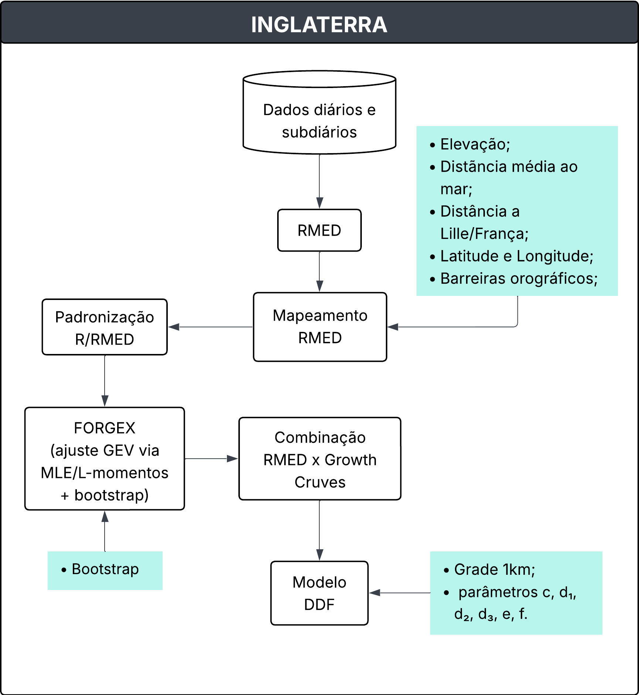
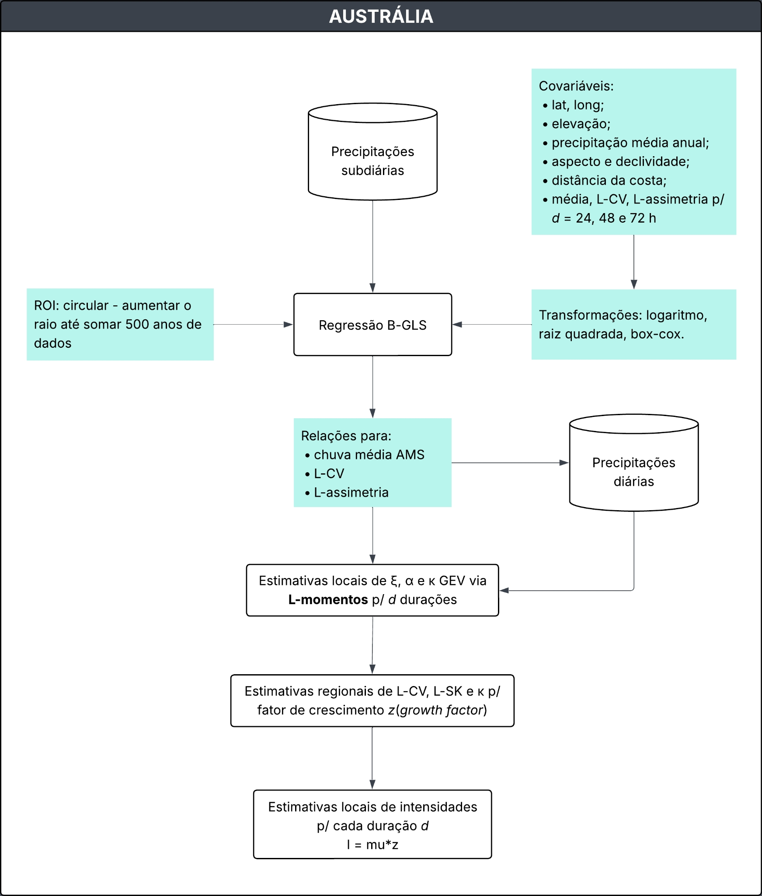
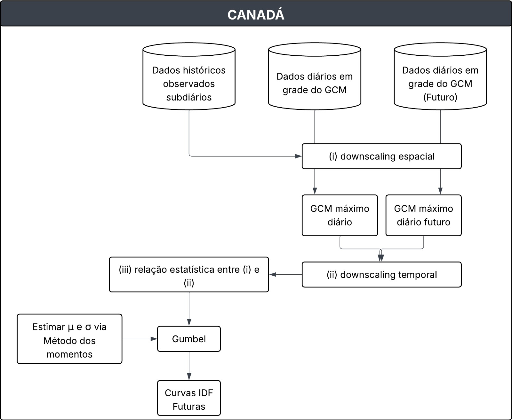
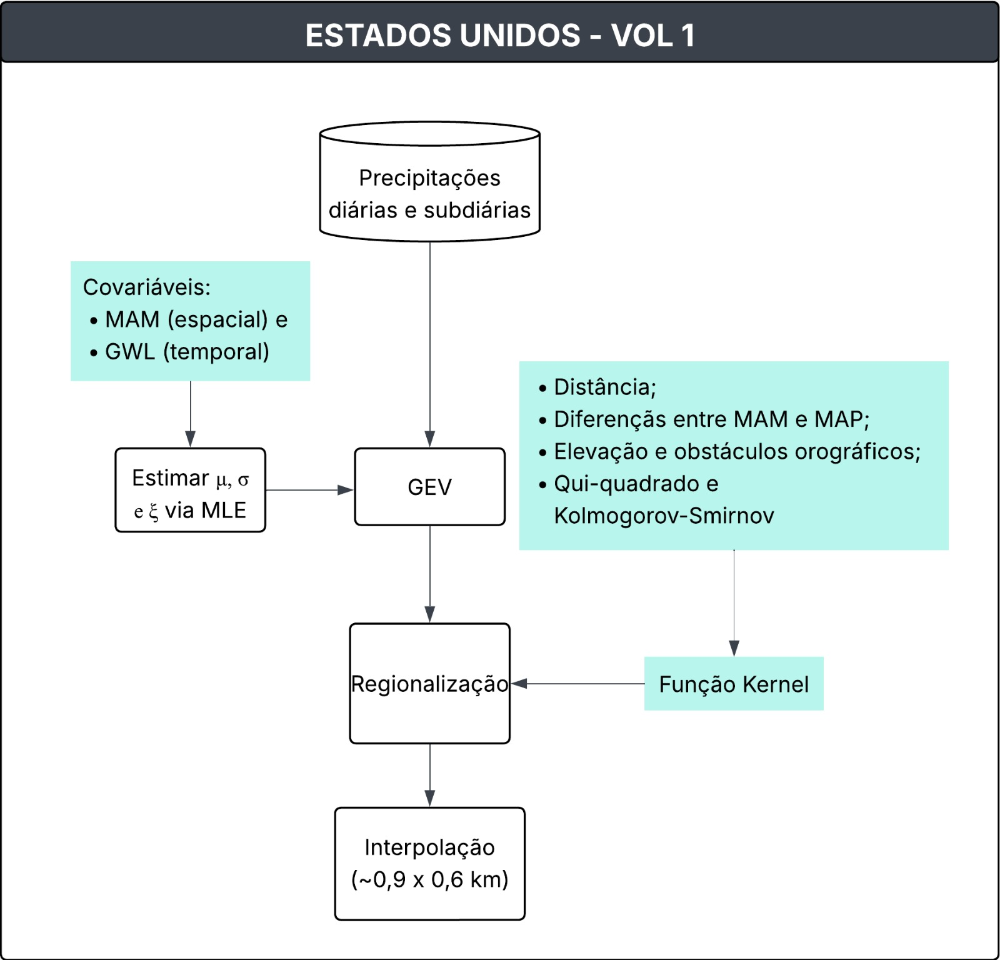
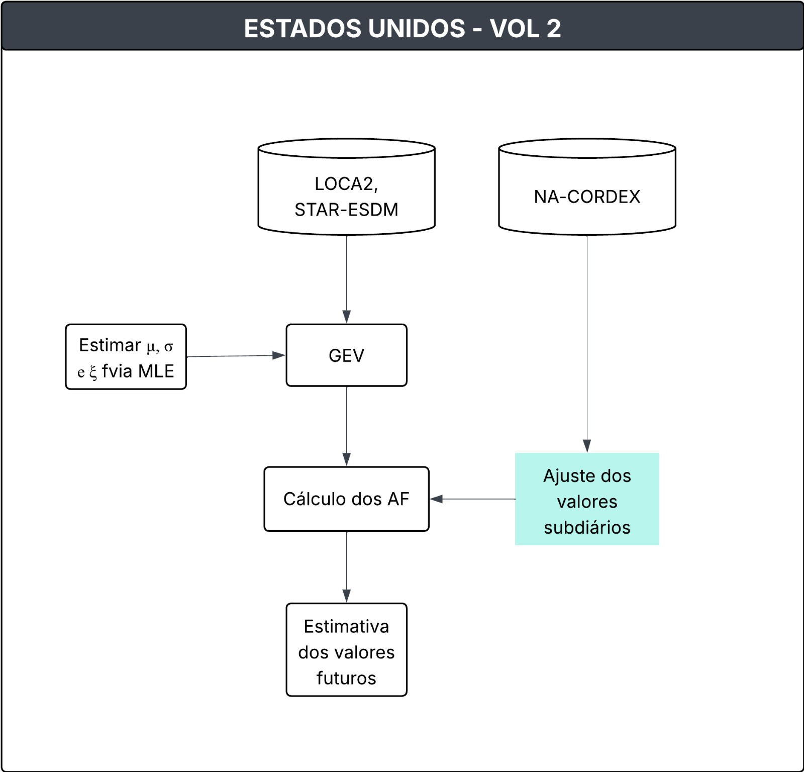

:::::: {style="text-align: justify;"}
**Lista de Abreviações**

-   **AMS**: *Annual Maximum Series*\
-   **RMED**: *Median of the Annual Maximum Series*\
-   **DDF**: *Depth-Duration-Frequency*\
-   **ROI**: *Region Of Influence*\
-   **FEH**: *Flood Estimation Handbook*\
-   **FORGEX**: *Focused Rainfall Growth Curve Extension*\
-   **IDF**: *Intensity-Duration-Frequency*\
-   **NOAA**: *National Oceanic and Atmospheric Administration*\
-   **GEV**: *Generalized Extreme Value Distribution*\
-   **PMP**: *Probable Maximum Precipitation*\
-   **ARR**: *Australian Rainfall and Runoff*\
-   **GPA**: *Generalised Pareto*\
-   **BGLSR**: *Bayesian Generalised Least Squares Regression*\
-   **GCMs**: *Modelos Climáticos Globais*\
-   **AMP**: *Annual Maximum Precipitation*\
-   **EQM**: *Equidistant Quantile Matching*\
-   **PF** : *Frequência da Precipitação*\
-   **MAM**: *Média Anual Máxima\|*\
-   **GWL**: *Global Warming Level*\
-   **RCMs**: *Modelos Climáticos Regionais*\
-   **AF**: *Fatores de Ajuste*\
-   **MLE**: *Máxima Verossimilhança*\
-   **PDS**: *Série de Duração Parcial*\

Aqui serão descritas as metodologias adotadas para a estimativa de chuvas extremas na Inglaterra, Austrália, Canadá e Estados Unidos. Os estudos foram desenvolvidos em diferentes contextos e consolidaram diretrizes nacionais para a análise desses eventos em cada país. As metodologias contemplam desde a seleção e o tratamento de dados pluviométricos até a derivação de modelos paramétricos, integrando técnicas estatísticas e métodos de interpolação espacial.

**INGLATERRA**

Documento: ***Flood Estimation Handbook. Vol 2: Rainfall Frequency estimation, (1999)***.

**1. Descrição da Metodologia**

O estudo apresenta a metodologia adotada para a estimativa da frequência de chuvas intensas no Reino Unido, abrangendo diferentes durações (de 1 hora a 8 dias) e períodos de retorno (de 2 a 1000 anos).

**1.1. Dados utilizados**

Os dados pluviométricos foram obtidos junto a diferentes instituições, incluindo o *Met Office, Environment Agency, Scottish Environmental Protection Agency, Department of Agriculture for Northern Ireland* (DANI), *Irish Met Service* e a base de dados do PEPR do *Institute of Hydrology*.\*

A base de dados utilizada compreendeu: - 6106 estações com registros diários, cada uma com pelo menos 10 anos de dados; - 375 estações com registros subdiários (horários), provenientes de pluviômetros automáticos *tipping bucket* e de sifão inclinável, cada uma com no mínimo 9 anos de séries de máximos anuais.

Foram descartados os anos em que mais de 25% dos registros apresentavam falhas. Além disso, alguns máximos anuais foram corrigidos ou excluídos devido a erros de leitura, falhas técnicas ou dados suspeitos (por exemplo: acumulações indevidas em pluviômetros de balde, períodos de falha do equipamento ou totais inconsistentes com estações vizinhas).

**1.2 Série de máximos anuais e índice de referência**

A partir dos registros foram extraídas as séries de máximos anuais (AM) em diferentes duraçõe (1h, 2h, 6, 12, 1d, 2, 4d e 8d). Essas séries constituíram a base para a análise estatística.

A mediana da série AM (RMED) foi definida como índice de referência (*Index Rainfall*) e calculada separadamente para cada duração.

**1.3 Mapeamento da RMED**

O RMED foi interpolado em uma malha regular de 1 km sobre o território do Reino Unido, utilizando-se o método de geo-regressão.

Esse procedimento combina:

-   Uma regressão múltipla entre RMED e variáveis fisiográficas (elevação, distância média ao mar, barreiras orográficas, continentalidade – distância a Lille/França, latitude, longitude);

-   Seguida pela aplicação de krigagem dos resíduos para capturar padrões locais não explicados pela regressão.

As séries de AM foram padronizadas pela razão entre o valor observado e o RMED local, o que permitiu a comparação entre estações e a análise em escala regional.

**1.4 Derivação das curvas de crescimento (*Growth Curves*)**

A obtenção das curvas de crescimento foi realizada por meio do método FORGEX (*Focused Rainfall Growth Curve Extension*), desenvolvido especificamente para o FEH. O FORGEX deriva empiricamente as curvas de crescimento a partir das séries de máximos anuais padronizadas pela razão R/RMED, representadas na escala reduzida de Gumbel.

O método utiliza a divisão dos dados em faixas de retorno (y-slices) e ajusta segmentos lineares por mínimos quadrados, aplicando suavização para garantir consistência entre diferentes períodos de retorno.

Diferentemente de abordagens paramétricas (como GEV ou Gumbel), o FORGEX não assume uma distribuição de probabilidade fixa; a curva é construída de forma a seguir o comportamento observado nos dados.

A incerteza foi avaliada por meio de reamostragem bootstrap, gerando intervalos de confiança para as curvas resultantes.

**1.5 Construção do Modelo DDF (*Depth-Duration-Frequency*)**

A integração do RMED com as curvas de crescimento deu origem a um modelo empírico-paramétrico DDF, que relaciona profundidade de chuva, duração e frequência.

$$
\ln R(D,y) =
\begin{cases}
(cy + d_1)\ln D + (ey+f), & D \leq 12h \\\\
\ln R_{12} + (cy + d_2)(\ln D - \ln 12), & 12h < D \leq 48h \\\\
\ln R_{48} + (cy + d_3)(\ln D - \ln 48), & D > 48h
\end{cases}
\tag{3}
$$

O modelo DDF é parametrizado por 6 parâmetros (c, d₁, d₂, d₃, e, f) ajustados separadamente paracada ponto da grade de 1 km.

A incerteza associada às curvas de crescimento foi avaliada por reamostragem *bootstrap*, permitindo a construção de intervalos de confiança para diferentes períodos de retorno e durações.

**1.6 Saídas**

A metodologia resultou na elaboração de:

-   Mapas nacionais de RMED para diferentes durações;

-   Curvas de crescimento regionais;

-   Chuvas de projeto (DDF) consistentes para todo o Reino Unido.

**1.7 Atualizações da Metodologia**

Documentos: *Reservoir Safety – Long Return Period Rainfall Volume 1 Technical Report (Part 1 and 2)*

Em 2013 a *Environment Agency* e o *Departament for Envionment Food and Rural Affairs* publicaram os volumes 1 e 2 do referido documento que possuem atualizações para a metodologia. Assim, destacam-se as seguintes mundanças:

-   Expansão da base de dados de estações horárias de 375 para 968;
-   Novo índice de referência que combina RMED, SAAR (*Standard Average Annual Rainfall*) e *northing* (coordenada N-S), reduzindo a variabilidade espacial residual;
-   No FEH, Vol 2 a depedência espacial era tratada de forma simplificada e constante, sou seja, assumia-se um certo grau de correlação espacial entre pluviômetros, independentemente da raridade do evento. Nos relatórios \|*Long Return Period Rainfall* a dependência entre estações varia com o período de retorno: Para eventos comuns (baixo período de retorno) há uma forte dependência, ou seja, chuvas intensas costumam ocorrer em várias estações próximas ao mesmo tempo; para eventos raros (período de retorno alto) há menor depedência, ou seja, eventos muito extremos são mais localizados e não atingem grandes áreas com a mesma intensidade;
-   As estimativas acima de 1000 anos frequentemente excediam o PMP (*Probable Maximum Precipitation*); na atualização, as curvas foram ajustadas para crescer de forma mais realista, mantendo consistência com o PMP e com eventos observados.

 Figura 1. Fluxograma da metodologia aplicada na Inglaterra (Baseado no FEH, 99)

::: {style="margin-top:1em;"}
:::

**AUSTRÁLIA**

Documento: ***Australian Rainfall and Runoff, 2019***.

**2. Descrição da Metodologia**

O estudo apresenta a metodologia para estimativa das chuvas de projeto na Austrália, no contexto das revisões do *Australian Rainfall and Runoff* (ARR). A abordagem adotada baseia-se em um conjunto integrado de etapas, que incluem a criação de uma base de dados nacional de precipitação, o controle de qualidade dos registros, a extração de séries de valores extremos, a análise de frequência, a regionalização e a interpolação espacial.

**2.1. Construção de uma base de dados nacional**

Foram utilizadas estações pluviométricas diárias e contínuas, operadas pelo *Bureau of Meteorology* e por diversas outras instituições. O conjunto incluiu aproximadamente 8.074 postos de leitura diária e 2.280 postos de registro subdiário, considerando todos os dados disponíveis até 2012. Para serem utilizados deveriam cumprir o critério de comprimento de série (≥30 anos para diárias; \>8 anos para subdiárias). Foi adotado um controle de qualidade automático e manual das séries, incluindo checagem de metadados, remoção de erros grosseiros e ajustes de séries acumuladas. Dois métodos foram aplicados para realização do teste de estacionariedade: (i) análise de tendências nos máximos anuais por posto, e (ii) abordagem regional de médias por área. Desta forma, concluiu-se que era aceitável assumir estacionariedade e usar o período completo de dados.

**2.2. Extração das séries de extremos**

A série de máximos anuais (AMS) foi usado para chuvas frequentes e infrequentes (até 1% da AEP) e a série de duração parcial (PDS) foi utilizado para chuvas muito frequentes (Período de retorno \< que 1 ano).

**2.3. Análise de frequência**

A distribuição GEV foi selecionada para ajustar a AMS, sendo os parâmetros da distribuição estimados por meio do L-momentos. O *Generalised Pareto* (GPA) foi adotado somente para eventos PDS, ajustado também por L-momentos. A *Bayesian Generalised Least Squares Regression* (BGLSR) foi aplicado para os dados subdiários.

**2.4. Estimativa de L-momentos (média, L-CV, L-assimetria)**

Na GEV, para cada série AMS, calcularam-se os três primeiros momentos: média, L-CV e L-assimetria. Esses três valores foram usados para ajustar os parâmetros da GEV (local, escala e forma). A partir do L-assimetria estima-se o parâmetro de forma (k) e, depois, os parâmetros de escala ($\alpha$) e de forma ($\xi$ξ) são obtidos a partir da média e do L-CV. No caso das chuvas PDS, também foram calculados a média, L-CV e L-assimetria da série de excedências (eventos acima do limiar). Esses momentos foram usados para obter os parâmetros da GPA de forma semelhante à GEV.

Para os postos subdiários (≥ 8 anos), os L-momentos foram calculados diretamente da AMS sub-diária. Entretanto, para os postos de leitura diária (≥ 30 anos), onde faltavam registros sub-diários, o BGLSR foi aplicado para predizer os L-momentos das durações menores que 24h, a partir de variáveis explicativas (latitude, longitude, elevação, distância da costa, precipitação média anual etc.). Esses L-momentos estimados foram então usados para definir os parâmetros da GEV sub-diária.

**2.5. Regionalização**

Foi utilizado o método da Região de Influência (em inglês “*Region Of Influence*” - ROI), no qual cada estação possui sua própria região definida com base em semelhanças geográficas e climáticas. O tamanho da região foi ajustado para garantir uma quantidade mínima de informação: em média, 8 estações ou 500 anos de dados eram incluídos por região. Assim, dentro de cada ROI, calcularam-se os valores regionais de L-CV e L-assimetria (usando média ponderada pelo comprimento da série em cada estação). Esse procedimento permitiu calcular de forma mais confiável os parâmetros de escala e forma da GEV, a partir de informações combinadas de várias estações.

**2.6. Interpolação espacial**

Os parâmetros da GEV foram interpolados em grade nacional usando ANUSPLIN (*splines*) com latitude, longitude e elevação (a escala de altitude foi exagerada por um fator de 100 para representar a importância que a altitude tem nos padrões de precipitação). Para disponibilizar resultados em locais não monitorados, os parâmetros regionalizados da GEV foram interpolados por meio do *software* ANUSPLIN, que aplica *splines* de suavização em função da latitude, longitude e altitude. Essa etapa produziu superfícies contínuas de parâmetros, permitindo estimar curvas IDF em qualquer ponto do território australiano.

**2.7. Atualização**

Em 2024, houve revisões do *Australian Rainfall and Runoff* (ARR, 2019), principalmente no capítulo que aborda questões relacionadas às mudanças climáticas. O capítulo 6 do livro 1,  fornece uma base científica e prática para que a engenharia australiana incorpore a não estacionariedade climática em seus projetos de drenagem, barragens, infraestrutura urbana e planejamento de riscos. Ele recomenda atualizações constantes à medida que novas evidências se consolidem, defende a adaptação das soluções ao contexto local e reforça a necessidade de explicitar as incertezas envolvidas (ARR, 2024).

Assim, um dos pontos centrais é a ampliação das incertezas. Se os modelos hidrológicos já envolvem margens de erro significativas, a mudança climática as amplia, tornando essencial a análise de cenários múltiplos, a avaliação de sensibilidade e a comunicação clara dessas incertezas nos estudos e relatórios. Para auxiliar os profissionais, o capítulo apresenta tabelas com fatores de ajuste para diferentes durações de chuva e parâmetros de escoamento, além de cenários de aquecimento global baseados no IPCC. Exemplos práticos ilustram como aplicar esses ajustes na elaboração de projetos (ARR, 2024).

O documento sugere o uso da equação abaixo para o estimativa da produndidade ou intensidade do prepitiação do projeto:

$$
I_p = I \times \left( 1 + \frac{\alpha}{100} \right)^{\Delta T}
\tag{4}
$$

Onde, $I_p$ é a profundidade ou intensidade projetada (atual ou futura) da precipitação de projeto; $\alpha$ (taxas recomendadas de mudança e incerteza associada derivadas de Wasko et al. (2024), apresentadas por grau de mudança na temperatura global (%/°C), ver Tabela 1.6.1 do ARR, 2024; $I$ é a profundidade ou intensidade histórica da precipitação de projeto (por exemplo, do portal IFD 2016 ou estimativas históricas do PMP); $ΔT$ é a estimativa mais atualizada da projeção da temperatura global (terra e oceano) para o período de projeto de interesse e cenário climático selecionado em relação a um período de tempo de referência, ver Tabela 1.6.2 do ARR, 2024.

 Figura 2. Fluxograma da metodologia aplicada na Austrália

::: {style="margin-top:1em;"}
:::

**CANADÁ**

Documento: ***A web-based tool for the development of Intensity Duration Frequency curves under changing climate***

*Environmental Modelling & Software. Simonović et al., 2016.*

**3. Descrição da Metodologia**

O estudo apresenta a ferramenta IDF_CC, desenvolvida com o objetivo de atualizar curvas Intensidade-Duração-Frequência (IDF) considerando os efeitos das mudanças climáticas. A metodologia envolve técnicas de ajuste estatístico de extremos e métodos de *downscaling* espacial e temporal aplicados às projeções de modelos climáticos globais (GCMs).

**3.1 Curvas de Intensidade-Duração-Frequência**

Inicialmente, destaca-se que foram utilizados dados subdiários de precipitação das estações pluviométricas de diferentes intervalos de tempo (5, 10, 15 e 30 minutos e 1, 2, 6, 12 e 24 horas). A ferramenta IDF_CC adota a distribuição Gumbel para ajustar a precipitação máxima anual (AMP) em todo o Canadá. O método dos momentos foi utilizado para estimar os parâmetros da distribuição Gumbel.

**3.2. *Downscaling* espacial e temporal da precipitação**

Para atualizar as curvas IDF foi adotado o método *Equidistant Quantile Matching* (EQM), desenvolvido por Srivastav et al. (2014b). Esse método realiza o *downscaling temporal* (a distribuição das mudanças entre o período de tempo projetado e o período de linha de base), além do *downscaling espacial* da precipitação máxima anual (AMP derivada dos dados do GCM e dos dados subdiários observados).

O EQM é aplicado diretamente à AMP para estabelecer as relações estatísticas entre as AMPs dos dados de precipitação gerados pelo GCM e os dados observados (históricos) subdiários em vez de usar registros completos de precipitação diária.

O processo de EQM ocorre em três etapas principais:

1.  *Downscaling* espacial;

2.  *Downscaling* temporal; e

3.  Atualização das curvas IDF: Combinação das duas relações anteriores para gerar as curvas IDF ajustadas aos cenários climáticos futuros.

**3.3 Descrição do método EQM**

A descrição, aqui inserida, é a mesma encontrada no anexo do artigo de Simonović et al., 2016.

(i) Extrair máximos subdiários dos dados observados em um determinado local (ou seja, máximos de 5 minutos, 10 minutos, 15 minutos, 1 hora, 2 horas, 6 horas, 12 horas, 24 horas de dados de precipitação):

$$
X_{\max}^{STN} =
\begin{bmatrix}
x_{1,\max}^{STN,5\min} & x_{1,\max}^{STN,10\min} & \cdots & x_{1,\max}^{STN,24hr} \\
x_{2,\max}^{STN,5\min} & x_{2,\max}^{STN,10\min} & \cdots & x_{2,\max}^{STN,24hr} \\
x_{3,\max}^{STN,5\min} & x_{3,\max}^{STN,10\min} & \cdots & x_{3,\max}^{STN,24hr} \\
\vdots & \vdots & \ddots & \vdots \\
x_{N,\max}^{STN,5\min} & x_{N,\max}^{STN,10\min} & \cdots & x_{N,\max}^{STN,24hr}
\end{bmatrix}
\tag{5}
$$

Onde, $x_{i,\max}^{STN,j}$ é a precipitação máxima subdiária em uma estação (STN)para a j-ésima duração no i-ésimo ano; e N é o número total de anos.

(ii) Extrair os máximos diários (24 horas) para o período base histórico do modelo GCM selecionado

$$
X^{GCM}_{\text{max}} =
\begin{bmatrix}
X^{GCM}_{1,\text{max}} \\
X^{GCM}_{2,\text{max}} \\
X^{GCM}_{3,\text{max}} \\
\vdots \\
X^{GCM}_{N,\text{max}}
\end{bmatrix}
\tag{6}
$$

Onde, $X_{i,\max}^{GCM}$ representa a precipitação diária máxima do modelo GCM no i-ésimo ano e $N$ é o número total de anos (é utilizado o mesmo intervalo de tempo dos dados históricos/observados).

(iii) Extrair máximos diários dos Cenários RCP (i, (iii) Extrair máximos diários dos Cenários RCP (ou seja, RCP2.6, RCP4.5, RCP8.5) para o modelo GCM selecionado:

$$
X^{GCM,Fut}_{\text{max}} =
\begin{bmatrix}
X^{GCM,RCP26}_{1,\text{max}} & X^{GCM,RCP45}_{1,\text{max}} & X^{GCM,RCP85}_{1,\text{max}} \\
X^{GCM,RCP26}_{2,\text{max}} & X^{GCM,RCP45}_{2,\text{max}} & X^{GCM,RCP85}_{2,\text{max}} \\
X^{GCM,RCP26}_{3,\text{max}} & X^{GCM,RCP45}_{3,\text{max}} & X^{GCM,RCP85}_{3,\text{max}} \\
\vdots & \vdots & \vdots \\
X^{GCM,RCP26}_{N_F,\text{max}} & X^{GCM,RCP45}_{N_F,\text{max}} & X^{GCM,RCP85}_{N_F,\text{max}}
\end{bmatrix}
\tag{7}
$$

Onde, $X_{\max}^{GCM,Fut}$ representa a precipitação diária máxima para os cenários futuros considerad; e $N_F$ é o número total de anos considerados para o período futuro

(iv) Ajustar uma distribuição de probabilidade aos máximos diários do modelo GCM (cada uma das séries de máximos subdiários para os dados observados e máximos diários para os cenários futuros).

$$
PDF^{GCM} = f(\theta^{GCM}/X_{max}^{GCM})
\tag{8}
$$

$$
PDF_{j}^{STN} = f(\theta^{STN_,j}/X_{max}^{STN_,j})
\tag{9}
$$

$$
PDF^{GCM_,Fut} = f(\theta^{GCM}/X_{max}^{GCM_,Fut})
\tag{10}
$$

Onde, $PDF$ representa a função de distribuição de probabilidade, \$f()% é a função, $\theta$ é o parâmetro da distribuição ajustada.

(v) A distribuição de probabilidade cumulativa do GCM e da série subdiária são equiparadas para estabelecer uma relação estatística entre elas e obter a série subdiária modelada pelo GCM $Y_{max,j}^{GCM}$ usando o princípio do mapeamento baseado em quantis. Trata-se de um *downscalig* espacial dos dados dos máximos diários do GCM para os máximos subdiários observados:

$$
Y_{max,j}^{STN} = CDF((invCDF(X_{max}^{GCM}/\theta^{GCM}))/\theta^{STN,j})
\tag{11}
$$

Onde, $Y_{max,j}^{STN}$ é uma série máxima subdiária estatisticamente reduzida para a j-ésima duração; $CDF$ significa função de distribuição de probabilidade cumulativa; e $invCDF$ significa CDF inversa.

(vi) Estabelecer uma relação estatística semelhante de mapeamento quantílico que modele a mudança entre os máximos atuais do GCM e os máximos futuros do GCM. Trata-se de um *downscaling* temporal dos dados das simulações projetadas do GCM dos máximos diários para o GCM diário de referência:

$$
Y_{max}^{GCM,Fut} = CDF((invCDF(X_{max}^{GCM}/\theta^{GCM}))/\theta^{GCM,Fut})
\tag{12}
$$

Onde, $Y_{max}^{GCM,Fut}$ é a correspondência quantílica entre o período de referência e o período de projeção.

(vii) Encontre uma função apropriada para relacionar $Y_{max,j}^{STN}$ e $X_{max}^{GCM}$. A literatura sugere que, na maioria dos casos, a relação observada é linear. É evidente a partir da CDF de Gumbel que isso resulta em uma equação linear quando se igualam as duas CDFs. É importante observar que não há garantia de que o uso de outras funções de distribuição resultaria em equações lineares de primeira ordem semelhantes:

$$
Y_{max,j}^{STN} = f(X_{max}^{GCM})
\tag{13}
$$

$$
Y_{max,j}^{STN} = a_{1} \times X_{max}^{GCM} +b_{1}
\tag{14}
$$

(viii) Encontre uma função apropriada para relacionar $Y_{max}^{GCM,Fut}$ e $X_{max}^{GCM}$:

$$
Y_{max}^{GCM,Fut} = f(X_{max}^{GCM})
\tag{15}
$$

$$
Y_{max}^{GCM,Fut} = a_{2} \times X_{max}^{GCM} +b_{2}
\tag{16}
$$

(ix) Para gerar dados subdiários máximos futuros, combine as equações acima em:

$$
X^{STN, future}_{\max,j} 
= a_{1} \times 
\left[ 
\frac{X^{GCM, future}_{\max} - b_{2}}{a_{2}} 
\right] 
+ b_{1} 
\tag{17}
$$

(x) Gerar curvas IDF para os dados subdiários futuros e comparar as mesmas com as curvas IDF observadas historicamente para obter a variação nas intensidades.

 Figura 3. Fluxograma da metodologia aplicada no Canadá

**3.4 Interface Web do IDF_CC Tool**

A ferramenta está dividida em três principais eixos: interface do usuário, modelos matemáticos e banco de dados. O sistema de gerenciamento de banco de dados (DBMS) utilizado é a versão mais recente do Microsoft SQL Server™ (MSSQL).

É necessário um cadastro simples para ter acesso a todas as funcionalidades da ferramenta. Após o login, o usuário pode escolher se deseja criar a IDF para uma região ou selecionar uma estação meteorológica específica. Após essa escolha, é exibida uma nova aba com os dados básicos da região ou da estação (ID, número de anos, arquivos complementares). Nessa nova aba, pode-se optar por criar a IDF com base em dados históricos ou sob mudanças climáticas.

No primeiro caso, o gráfico de IDF é gerado a partir de uma distribuição GEV ou Gumbel, a critério do usuário, sendo possível acessar a tabela com os dados gerados e as equações de interpolação (ou seja, os coeficientes A, B, C e t₀ para o cálculo da intensidade). No caso da IDF sob mudanças climáticas, o usuário deve escolher um intervalo de tempo de, no mínimo, 30 anos, entre 2015 e 2100, e selecionar entre as distribuições GEV e Gumbel. Em seguida, é necessário escolher o modelo climático, entre o CMIP6 e o CMIP5.

Para cada modelo, é possível selecionar o conjunto de multimodelo (selecionando todos ou personalizando). Após essas escolhas, basta clicar no botão "Continuar" para acessar as curvas IDF's, tabelas, equações de interpolação e o boxplot das incertezas para os três cenários de emissão e concentração (SSP1.26, SSP2.45 e SSP5.85).

::: {style="margin-top:1em;"}
:::

**ESTADOS UNIDOS**

Documento: ***NOAA Atlas 15 Pilot: Technical Report***

O relatório é dividido em duas partes: (1) Volume 1 que fornece estimativas de Frequência da Precipitação (PF) que levam em conta tendências temporais em observações históricas e (2) Volume 2 que fornece estimativas de PF projetadas para o futuro, sob diferentes cenários de emissões de carbono, com base em projeções de modelos climáticos.

**4. Metodologia do Volume 1 - Estimativas históricas não estacionárias**

**4.1. Conjunto de dados relevantes**

O relatório utilizou dados produzidos e/ou adquiridos a partir do Atlas 14 (Vol. 12):

-   Metadados para estações diárias e subdiárias em Montana e um buffer aproximado de 30 km;
-   Dados de precipitação: Série Máxima Anual (AMS) com controle de qualidade, durante períodos de 60 minutos, 6 horas, 24 horas, 4 dias e 10 dias para essas estações;
-   Dados de Precipitação: Média Anual Máxima (MAM) e precipitação média anual em grade com resolução de 30 segundos de arco, originalmente obtidos do Grupo PRISM (*Parameter-Elevation Regressions on Independent Slopes Model*) da Universidade Estadual do Oregon.

Além disso, foram coletados os seguintes dados:

-   Anomalias anuais da temperatura global próxima à superfície para 1850-2023 dos Centros Nacionais de Informação Ambiental da NOAA;
-   Grades do modelo digital de elevação (DEM) da Missão Topográfica do Radar *Shuttle* (SRTM90) de 90 metros da NASA.

**4.2. Distribuição estatística**

A distribuição Generalizada de Valores Extremos (GEV) foi utilizada em uma abordagem regional, com parâmetros estimados pelo método verossimilhança (MLE). A distribuição Kappa de quatro parâmetros também foi testada como alternativa, mas a GEV foi selecionada para compor os produtos finais do NOAA Atlas 15

A função de distribuição de probabilidade GEV não estacionária:

$$
f(x,t) = \frac{1}{\sigma(x,t)} 
\left\{ 1 - \xi(x)\,\frac{x - \mu(x,t)}{\sigma(x,t)} \right\}^{(\tfrac{1}{\xi(x)} - 1)}
\exp\!\left( -\left\{ 1 - \xi(x)\,\frac{x - \mu(x,t)}{\sigma(x,t)} \right\}^{\tfrac{1}{\xi(x)}} \right)
\tag{18}
$$

onde $\mu$, $\sigma$, e $\xi$, são parâmetros de localização, escala e forma, respectivamente, 𝑥 é uma coordenada espacial e 𝑡 representa o tempo (ano). Para cada região os parâmetros são definidos da seguinte forma:

$$
\text{Localização:} \quad \mu(x,t) = a_{1} \times MAM(x)\,[1+a_{2} \times GWL(t)]
\tag{19}
$$

$$ 
\text{Escala: } \quad \sigma(x,t) = b_{1} \times MAM(x)\,[1+b_{2} \times GWL(t)]
\tag{20}
$$

$$
\text{Forma:} \quad \xi(x) = C_{0}
\tag{21}
$$

Os parâmetros de posição e escala variam em função de uma covariável espacial (MAM) e de uma covariável temporal (GWL - *Global Warming Level*). A forma da distribuição foi mantida constante (parâmetro $\xi$ fixo) para evitar instabilidade.

**4.3. Regionalização**

Como o número de estações diárias e subdiárias varia significativamente, a regionalização foi realizada separadamente para durações inferiores a 24 horas e para durações iguais ou superiores a 24 horas. Para cada estação dentro da área do projeto (estação-alvo), foram identificadas todas as estações dentro de um raio de 160 km (estações regionais).

As estações foram agrupadas considerando semelhanças de atributos como:

-   Distância;
-   Diferenças de valores entre MAM e MAP;
-   Elevação e obstáculos orográficos (se uma estação regional está separada da estação alvo por um terreno complexo); e
-   Testes estatísticos entre distribuições (os testes Qui-quadrado e Kolmogorov-Smirnov de duas amostras foram usados para avaliar o grau de similaridade nas distribuições entre as estações alvo e regionais).

Foi aplicado um esquema de pesos com função Kernel para atribuir relevância a cada estação regional. Onde, 0 indica nenhuma semelhança entre as estações e 1 indica que estão geograficamente perto e que possuem semelhanças nos atributos da preciptação.

**4.4. Covariáveis espaciais e temporais**

As covariáveis espaciais e temporais foram utilizadas para calcular os parâmetros de localização e escala da distribuição GEV. Foram testadas várias covariáveis espacias em grade (elevação, MAP, MAM, dentre outras), o MAM teve o melhor desempenho em todas as durações. Para o Volume 1, o GWL foi selecionado como a covariável temporal, definida como a anomalia da temperatura global média móvel de 30 anos em relação ao período pré-industrial (1851 – 1900).

**4.5. Interpolação para grade**

As estimativas em estações foram interpoladas para uma grade de 30 segundos de arco (\~0,9 x 0,6 km) usando interpolação cúbica monotônica baseada na razão entre precipitação e MAM. As estimativas de MAM em grade são então multiplicadas pelas razões em grades correspondentes para criar estimativas de frequência de precipitação em grade. Para garantir a consistência nas estimativas em todas as durações e frequências (por exemplo, a estimativa de 24 horas deve ser igual ou superior à estimativa de 12 horas), foram realizadas verificações de consistência internas baseadas na duração e, em casos raros, ajustadas conforme necessário.

**4.6. Intervalos de confiança**

Foi utilizada uma simulação de Monte Carlo que considera a dependência entre estações para estimar intervalos de confiança de 90% em curvas de frequência de precipitação baseadas em AMS. O método consiste em adicionar perturbações aos parâmetros da distribuição GEV-MLE com base na variabilidade regional. O processo é repetido mil vezes, permitindo capturar incertezas estatísticas e estocásticas. Os limites inferior e superior do intervalo de confiança são definidos pelos percentis de 5% e 95% das distribuições simuladas. É destacado no texto que essa abordagem é semelhante à usada nos volumes do NOAA Atlas 14, porém com duas diferenças principais: 1) as estimativas do intervalo de confiança do Atlas 15 levam em conta a incerteza nos parâmetros GEV-MLE, enquanto as estimativas do Atlas 14 levam em conta a incerteza nos L-momentos; 2) a dependência entre estações para cada região foi expressa como uma função da distância no Atlas 15, em contraste com o Atlas 14, onde foi assumido que era uniforme em toda a região.

**4.7. Avaliação do modelo**

Foi realizada uma comparação entre modelos estacionário e não estacionário usando AICs e teste de razão de verossimilhança. A não estacionariedade mostrou melhor desempenho em regiões com tendências de mudança nas chuvas extremas.

**4.8. Saídas**

Estimativa de precipitação e IC 90% em grade para todas as durações e AEP's para o ano base de 2023.

 Figura 4. Fluxograma da metodologia do Volume 1 do NOAA 15

**5. Metodologia do Volume 2 - Projeções futuras com modelos climáticos**

**5.1. Conjunto de dados relevantes**

Dois conjuntos de dados gerados por *downscaling* estatístico, LOCA2 e STAR-ESDM, foram utilizados para derivar fatores de ajuste aplicáveis a durações diárias de precipitação em cenários futuros. Ambos são baseados em projeções do CMIP6 (*Coupled Model Intercomparison Project Phase 6*). Para os dados subdiários foi utilizado o conjunto NA-CORDEX, que reúne simulações CMIP5 com *downscaling* dinâmico, para investigar a relação entre fatores de ajuste diários e subdiários. Foram analisadas sete simulações, combinando quatro modelos climáticos globais (GCMs) do CMIP5 com três modelos climáticos regionais (RCMs) selecionados.

**5.2. Fatores de ajuste**

Os parâmetros de distribuição GEV para o Volume 2 foram estimados usando valores AMS em grade extraídos do LOCA2 e do STAR-ESDM. Os parâmetros de localização, escala e forma, que são calculados de maneira semelhante ao Volume 1, são, portanto, identificados para cada célula da grade dentro do domínio e para cada um dos 32 conjuntos para durações diárias e mais longas durante o período de 1950 a 2100. As distribuições GEV resultantes foram usadas para gerar estimativas de frequência de precipitação em resoluções de células de grade nativas para cada modelo estatístico. Assim, enquanto as estimativas do Volume 1 se originam em locais de estações, com um valor por duração e AEP, as estimativas do Volume 2 se originam em uma grade, com 32 valores (um de cada conjunto de modelos) por duração e AEP. Uma vez obtidas as estimativas absolutas de frequência de precipitação para cada GWL (1,5 - 5 °C), suas mudanças, em relação ao ano base de 2023, foram computadas. As estimativas de frequência de precipitação são geradas para o presente (2023) e, em seguida, novamente para um momento futuro quando os GCMs atingirem 3 °C. Para cada nível de aquecimento, calcular:

$$
AF = \frac{PF_{fut} - PF_{2023}}{PF_{2003}} \times 100\%
\tag{22}
$$

**5.3. Revisão dos fatores de ajuste subdiários**

Devido ao tamanho reduzido das amostras subdiárias, em vez de utilizar diretamente os fatores de ajuste extraídos das simulações de modelos climáticos dinâmicos, foram aplicadas suas relações relativas com os fatores diários, que possuem amostras mais robustas. Isso permitiu aproveitar os processos físicos dos modelos de alta resolução, como os do NA-CORDEX, mantendo a consistência entre diferentes durações e evitando distorções que poderiam surgir do uso direto dos dados subdiários

**5.4. Aplicação dos fatores de ajuste**

Uma vez calculados os fatores de ajuste diários e subdiários na estrutura GWL, estes foram transferidos para a estrutura de cenários, mapeando-os para décadas individuais entre 2030 e 2100, segundo os modelos SSP2-4.5 e SSP5-8.5. Para esse mapeamento, foram obtidos os GWLs médios multimodelo por década em cada cenário. Os fatores de ajuste e seus intervalos de confiança em grade foram identificados nos dois GWLs mais próximos de cada década e cenário, sendo os valores intermediários obtidos por interpolação temporal.

Em seguida, espacialmente, os fatores foram suavizados por meio de um filtro gaussiano para reduzir ruídos locais e, posteriormente, foram interpolados em grade contínua com interpolação cúbica monótonica, assegurando transições suaves e consistentes entre células vizinhas.

As estimativas de frequência de precipitação futura (PFVOL2) foram finalmente desenvolvidas aplicando esses fatores de ajuste (AFs) resultantes, conforme definidos tanto na estrutura GWL quanto na estrutura de cenários, às estimativas do Volume 1 (PFVOL1). Especificamente, para cada duração:

$$
PF_{VOL2}(x,t) = \big(1 + 0.01 \times AF(x,t)\big) \times PF_{VOL1}(x)
\tag{23}
$$

Onde, os valores de AF são funções do espaço 𝑥 e do tempo 𝑡, dependentes do GWL, dos cenários de emissões e do AEP.

O termo multiplicativo é baseado em um fator de ajuste que expressa (em unidades percentuais) a mudança relativa no futuro a partir da linha de base do PFVOL1, que representa o ano de 2023. Assim, os valores finais do PFVOL2 representam estimativas futuras de precipitação para as mesmas durações e AEPs do PFVOL1, mas também são funções da temperatura global (estrutura do GWL) e do tempo.

 Figura 5. Fluxograma da metodologia do Volume 2 do NOAA 15. ::::
::::::
