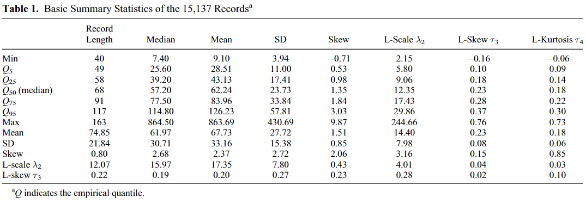

```{r}
# Pacotes
if(!require(pacman)) install.packages("pacman")
pacman::p_load(pacman, tidyverse, ggplot2, arrow)
```

O objetivo deste script é calcular algumas estatísticas descritivas relevantes para o conjunto de dados subdiários de interesse. Em "scripts/funcoes" foi criada uma função `fun_filter_set.R`, que combina a função `fun_fill_dates.R` -- que preenche as datas das séries -- e a funçãõ `fun_filter_set()` definida no script `script_leitura_subdiario.qmd` -- que filtra as estações, mantendo somente aquelas que atendam os critérios de tolerância de falhas e mínimo de anos.

```{r importar e filtrar dados}
# Critérios p/ filtrar séries
na_accept <- 0.2
min_years <- 8

# Importar
df_data <- arrow::read_parquet("base/gerados/df_subdaily_data.parquet")
source("scripts/funcoes/fun_filter_set.R")

# Aplicar funções
df_data <- fun_filter_set(data = df_data,
                          na_accept = na_accept,
                          min_years = min_years); gc()
```

@Papalexiou.2013 apresentam o seguinte conjunto de estatísticas descritivas básicas:

```{r estatisticas papalexiou}
#| label: fig-papalexiou-estatisticas
#| fig-cap: Estatísticas descritivas básicas de @Papalexiou.2013.

```
